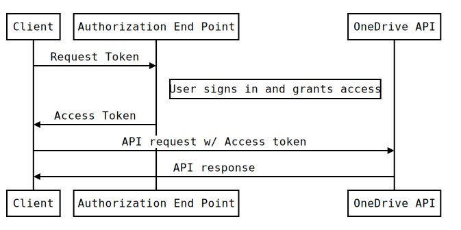
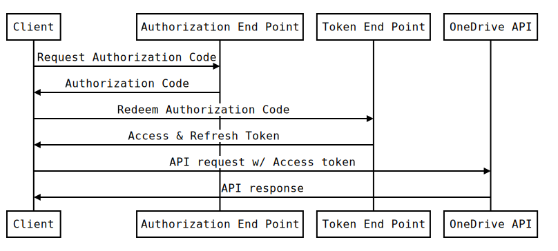

# Authentication and Sign-in

To use the OneDrive API, you need to have an access token that authenticates
the your application to a particular set of permissions for a user.

## Registering your application
Before your application can authenticate with the OneDrive API, you need to
register your application with Microsoft and provide some details about
your application.

### To register your app

1. Go to the [Live SDK app management site][app-portal].
2. When prompted, sign in with your Microsoft account credentials.
3. Click **Create application**
4. Type in your app's display name and select the app's primary language
5. Read the **Live Connect terms of use** and the **Privacy and Cookies**
statement and then click **I accept** to accept the terms of use for the service.

After completing these steps, a client ID and client secret are created for your
application. Click on App Settings to view the values associated with your application.

**Important** You must treat the values of Client ID and CLient secret the same
as you would a user's password. These are the keys to your application and if
made available can be used to impersonate your application.

On the API Settings page, you can configure details about your application,
for example if your application is a mobile or desktop application or a website.
For mobile or desktop applications, change the setting **Mobile or desktop
client app** to **Yes**.

For website applications, you can configure the **Redirect URLs** that are available
for your application to use during the login process. All of the redirect URLs
must be on the same root domain for security purposes.

## Signing In
Before using the REST API, your app must initiate the sign-in process by contacting the
Microsoft account authorization web service and receive an access token. The flow
follows standard OAuth 2.0 authentication flows and requires calls from a web browser
or web-browser control.

There are two authentication flows that you can choose from.
* [token](#Token%20flow)
* [code](#Code%20flow)

## Authentication Scopes

All scopes support single sign on on the web, which means that if a user is already signed into OneDrive, then the user can skip the authentication flow and go straight to the authorization flow.


Scope Name          | Description
------------------- | -----------
onedrive.info       | Grants read access to a user's basic OneDrive details including the list of all OneDrive the current user has access to
onedrive.offline    | Allows your application to access the user's data even when they are not using your app. This scope is required to get a refresh token.
onedrive.appfolder  | Grants read and write access within a folder dedicated to your app in the user's OneDrive. Your application will have read and write access to all contents under this folder and read access to the app folder object itself.
onedrive.full       | Grants read and write access to the user's entire OneDrive. Requires your app to be provisioned for this scope after OneDrive approval and scenario justification
onedrive.read       | Grants read access to the user's entire OneDrive. Requires your app to be provisioned for this scope after OneDrive approval and scenario justification

## Token flow
The easiest authentication flow is the token flow. This flow is useful for quickly
obtaining an access token to use the APIs in an interactive fashion. This flow
does not provide a refresh token, so it cannot be used for long term access to the
API.



To start the sign-in process with the token flow, use a web browser or web-browser
control to load this URL request:

```
GET https://login.live.com/oauth20_authorize.srf?client_id={client_id}&scope={scope}
    &response_type=token&redirect_uri={redirect_uri}
```

### Required Query String Parameters
Parameter Name | Value | Description
--- | --- | ---
`client_id` | `string` | The Client ID value created for your application.
`scope` | `string` | A space-separated list of scopes your application requires.
`redirect_uri` | `string` | The redirect URL that the browser is sent to when authentication is complete.

For mobile and desktop applications, you should use the redirect URL
`https://login.live.com/oauth20_desktop.srf`.

### Response

Upon successful authentication and authorizing of your application, the web browser
will be redirected to your redirect URL with additional parameters added to the URL.

```
https://login.live.com/oauth20_authorize.srf#access_token=EwC...EB
	&authentication_token=eyJ...3EM&token_type=bearer&expires_in=3600
	&scope=onedrive.info%20onedrive.full&user_id=3626...1d
```

Values for `access_token`, `authentication_token`, and `user_id` have been truncated
for documentation purposes. The values for `access_token` and `authentication_token`
are quite long in practice.

You can use the value of `access_token` to make requests with the API.

## Code flow
The code flow for authentication requires separate calls to authenticate and authorize
the application and to generate an access token to use the REST API. This also
allows your application to receive a refresh token that will enable long term
use of the API in some scenarios to allow access when the user isn't active
with your application.





### 1. Retrieve Authentication Code
To start the sign-in process with the token flow, use a web browser or web-browser
control to load this URL request:

```
GET https://login.live.com/oauth20_authorize.srf?client_id={client_id}&scope={scope}
	&response_type=code&redirect_uri={redirect_uri}
```

#### Required Query String Parameters
Parameter Name | Value | Description
--- | --- | ---
`client_id` | `string` | The Client ID value created for your application.
`scope` | `string` | A space-separated list of scopes your application requires.
`redirect_uri` | `string` | The redirect URL that the browser is sent to when authentication is complete.

#### Response

Upon successful authentication and authorization of your application, the web browser
will be redirected to your redirect URL with additional parameters added to the URL.

```
https://login.live.com/oauth20_authorize.srf?code=df6aa589-1080-b241-b410-c4dff65dbf7c
```

### 2. Redeem Code
Once you have received the `code` value you can redeem this code for a set of
tokens that allow you to authenticate with the API. To redeem the code, your
application needs to make the following request:

```
POST https://login.live.com/oauth20_token.srf
Content-Type: application/x-www-form-urlencoded

client_id={client_id}&redirect_uri={redirect_uri}}&client_secret={client_secret}
&code={code}}&grant_type=authorization_code
```

#### Required Request Body Parameters
The request body must be a properly URL encoded string with the following
parameters:

Parameter Name | Value | Description
--- | --- | ---
`client_id` | `string` | The Client ID value created for your application.
`redirect_uri` | `string` | The redirect URL that the browser is sent to when authentication is complete. This must match exactly the redirect_uri value used in the first request.
`client_secret` | `string` | The Client Secret value created for your application.
`code` | `string` | The authorization code you received in the first authentication request.

**Note**  For web apps, the domain portion of the redirect URI must match the
domain portion of the redirect URI that you specified in the
[Live SDK app management site][app-portal].

#### Response
If the call is successful, the response for the POST request contains a JSON string
that includes several properties including `access_token`, `authentication_token` and
`refresh_token` if you requested the **onedrive.offline** scope.

```
{
    "token_type":"bearer"
    "expires_in":3600,
    "scope":"onedrive.info onedrive.full",
    "access_token":"EwCo...AA==",
    "authentication_token":"eyJh...93G4",
	"refresh_token":"eyJh...9323"
}
```

You can now store and use the `access_token` value provided to make authenticated
requests to the API.

**The values of access_token, authentication_token, and refresh_token in this response
must be treated as securely as a user's password.**

**Note** The access token is valid for only the number of seconds that is
specified in the `expires_in` property. You can request a new access token
by using the refresh token (if available) or by repeating the authentication
request from the beginning.

### 3. Getting a new access token or refresh token
If your app has requested access to **onedrive.offline** the second step will
return a `refresh_token` value that can be used to generate additional access
tokens after the initial token has expired.

To redeem the refresh token for a new access token, make the following request:

```
POST https://login.live.com/oauth20_token.srf
Content-Type: application/x-www-form-urlencoded

client_id={client_id}&redirect_uri={redirect_uri}}&client_secret={client_secret}
&refresh_token={refresh_token}}&grant_type=refresh_token
```

#### Required Request Body Parameters
The request body must be a properly URL encoded string with the following
parameters:

Parameter Name | Value | Description
--- | --- | ---
`client_id` | `string` | The Client ID value created for your application.
`redirect_uri` | `string` | The redirect URL that the browser is sent to when authentication is complete. This must match exactly the redirect_uri value used in the first request.
`client_secret` | `string` | The Client Secret value created for your application.
`refresh_token` | `string` | The refresh token you received previously.

**Note**  For web apps, the domain portion of the redirect URI must match the
domain portion of the redirect URI that you specified in the
[Live SDK app management site][app-portal].

#### Response
If the call is successful, the response for the POST request contains a JSON string
that includes several properties including `access_token`, `authentication_token` and
`refresh_token` if you requested the **onedrive.offline** scope.

```
{
	"token_type":"bearer"
	"expires_in":3600,
	"scope":"onedrive.info onedrive.full",
	"access_token":"EwCo...AA==",
	"authentication_token":"eyJh...93G4",
	"refresh_token":"eyJh...9323"
}
```

You can now store and use the `access_token` value provided to make authenticated
requests to the API.

**The values of access_token, authentication_token, and refresh_token in this response
must be treated as securely as a user's password.**

**Note** The access token is valid for only the number of seconds that is
specified in the `expires_in` property. You can request a new access token
by using the refresh token (if available) or by repeating the authentication
request from the beginning.

## Sign the user out
To sign a user out, make a call to the authorization web service at the following URL.

```
GET https://login.live.com/oauth20_logout.srf?client_id={client_id}&redirect_uri={redirect_uri}
```

### Required Query String Parameters
Parameter Name | Value | Description
--- | --- | ---
`client_id` | `string` | The Client ID value created for your application.
`redirect_uri` | `string` | The redirect URL that the browser is sent to when authentication is complete. This must match exactly the redirect_uri value used in the first request.

## Error Codes
If an error occurs during the request for authentication or authorization the
web browser will be redirected to an error page:

```
https://login.live.com/err.srf?lc=1033#error=unauthorized_client&error_description=The%20client%20does%20not%20exist.%20If%20you%20are%20the%20application%20developer%2c%20configure%20a%20new%20application%20through%20the%20application%20management%20site%20at%20https://manage.dev.live.com/.
```

The URL includes query parameters that you can use to parse the error and respond
accordingly. The page content will always display a generic error message for
the user.

### Query String Parameters

Parameter Name | Value | Description
--- | --- | ---
`lc` | `integer` | Langauge identifier for the client's language.
`error` | `string` | Error code identifying the error that occurred.
`error_description` | `string` | A description of the error.


[app-portal]: http://go.microsoft.com/fwlink/p/?LinkId=193157
