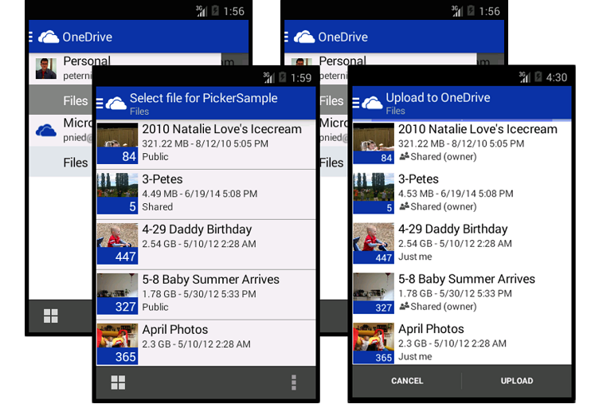

# OneDrive picker for Android
[  ](https://bintray.com/onedrive/Maven/onedrive-picker-android/_latestVersion)
[](https://travis-ci.org/OneDrive/onedrive-picker-android)

The picker is the fastest way to integrate your Android app with OneDrive and OneDrive for Business. It provides a set of Java APIs that your app can use to browse, select, open and save files in your user's OneDrive. When opening files from OneDrive, you can also get shareable links to files - great for sending to friends, coworkers, and relatives - and thumbnails of image and video files so you don't have to build them yourself.

In this guide, we’ll show you how to get your app quickly [opening](#opening-files) and [saving files](#saving-files) to OneDrive. You can also follow along with our [open picker sample app](https://github.com/OneDrive/onedrive-picker-android/tree/master/PickerSample) and [saver sample app](https://github.com/OneDrive/onedrive-picker-android/tree/master/SaverSample).



[Setup](#setup)

[Opening files](#opening-files)

[Saving files](#saving-files)

[Supported Android Versions](#supported-android-versions)


## Setup

## Compile with the source code

The picker for Android is available as open source on GitHub and includes both open and save capabilities. You can either download the latest version directly or clone the repository:

* [Visit the Repository](https://github.com/OneDrive/onedrive-picker-android/)
* [Download zip](https://github.com/OneDrive/onedrive-picker-android/archive/master.zip)
* `git clone https://github.com/OneDrive/onedrive-picker-android.git`

For information on configuring your environment to work with the sample applications or the picker SDK see [Configuring your Android Environment](http://developer.android.com/sdk/index.html).

## Install AAR via Gradle

```gradle
repositories {
    jcenter()
}

dependencies {
    compile ('com.microsoft.onedrivesdk:onedrive-picker-android:v2.0')
}
```

### Get an App Id

Register your app [here](https://account.live.com/developers/applications) to get an App ID (Client ID) to launch the picker.

### Building the library

#### Android Studio
1. Choose **Import Project...** or **Import Module...**, to import into an existing project.
2. Browse to the location where the SDK is saved and select the root *onedrive-picker-android*
3. If not already installed, follow prompts or go to the *Android SDK Manager* to install Android 4.4.2 (API 19) and associated build tools.

#### Eclipse
1. In Eclipse, go to **File** → **Import** → **General** → **Existing Projects into Workspace**.
2. Click **Browse..** to select *onedrive-picker-android*, where you saved the SDK, as your root directory. Make sure at minimum *OneDriveSDK* is checked.
3. If not already installed, from the *Android SDK Manager*, install Android 4.4.2 (API 19).
4. Right-click your project and select **Properties** and go to **Android** in the left side bar.
5. Click **Add..** in *Library* and select *OneDriveSDK* to link it to your project.

## Opening files

Your app needs to give the user a way to start opening files from OneDrive. This example sets up a click handler that launches the open picker from `onClick()`. In this case, the app is requesting a view-only sharing link type using `LinkType.WebViewLink`.

**Be sure to replace APP_ID with your application's identifier**

```java
import android.view.View.OnClickListener;
import com.microsoft.onedrivesdk.picker.*;

// Within the activity's class definition

private IPicker mPicker;
private String ONEDRIVE_APP_ID = "APP_ID"; // Get app id here: https://account.live.com/developers/applications

// The onClickListener that will start the OneDrive picker
private final OnClickListener mStartPickingListener = new OnClickListener() {
    @Override
    public void onClick(final View v) {
        mPicker = Picker.createPicker(ONEDRIVE_APP_ID);
        mPicker.startPicking((Activity)v.getContext(), LinkType.WebViewLink);
    }
};
```

When the `onClick()` method is invoked, the picker is created and configured for the type of link requested by the user. Then the `startPicking()` method is invoked to launch the picking experience. If the user does not have the OneDrive app installed when `startPicking()` is invoked, they will be prompted to download the app and taken to the app store.

### Link Types
The open picker can be configured to return a URL for the selected file in one of these
formats:
* `LinkType.DownloadLink` - A URL is returned that provides access for 1 hour directly to the contents of the file. You can use this URL to download the file into your application.
* `LinkType.WebViewLink` - A sharing link that provides a web preview of the file is created. The link is valid until the user deletes the shared link through OneDrive. Sharing links are not available for OneDrive for Business files.

### Catching the Results
When the user has completed opening a file or has cancelled from the open picker, the `onActivityResult()` method will be called to handle the picker results. In this method you can catch the results and get access to the file selected by the user.

```java
protected void onActivityResult(final int requestCode, final int resultCode, final Intent data) {
    // Get the results from the picker
    IPickerResult result = mPicker.getPickerResult(requestCode, resultCode, data);
    // Handle the case if nothing was picked
    if (result != null) {
        // Do something with the picked file
        Log.d("main", "Link to file '" + result.getName() + ": " + result.getLink());
        return;
    }

    // Handle non-OneDrive picker request
    super.onActivityResult(requestCode, resultCode, data);
}
```

If the user cancels picking a file, the result object will be null.

### Picker Result Object
In addition to the filename and link for the file, you can access several other properties on the `IPickerResult` object that provide more details about the file selected:

```java
public static class IPickerResult {
	// Name of the file with extension
	public String getName();

	// Type of link generated
	public LinkType getLinkType();

	// URI for the file, which varies based on the value of getLinkType()
	public Uri getLink();

	// Size of the file, in bytes
	public int getSize();

	// Set of thumbnail links for various sizes: "small", "medium", and "large"
	public Map<String, Uri> getThumnailLinks();
}
```

Run the [open picker sample app](https://github.com/OneDrive/onedrive-picker-android/tree/master/PickerSample) to see all of this in action.

## Saving Files

Similar to when opening files, your app should provide a way for the user to save a file to OneDrive. In this code sample, a click handler is used to launch the saver from `onClick()`. Your app needs to have a filename and URI to the file on the device to pass into the saver. This sample code creates a placeholder file in the apps local folder named file.txt as an example.

**Be sure to replace APP_ID with your application's identifier**

```java
import android.view.View.OnClickListener;
import com.microsoft.onedrivesdk.saver.*

// Within the activity's class definition

private ISaver mSaver;
private String ONEDRIVE_APP_ID = "APP_ID"; // Get app id here: https://account.live.com/developers/applications

// The onClickListener that will start the OneDrive picker
private final OnClickListener mStartPickingListener = new OnClickListener() {
    @Override
    public void onClick(final View v) {
        // create example file to save to OneDrive
        final String filename = "file.txt";
        final File f = new File(context.getFilesDir(), filename);

        // create and launch the saver
        mSaver = Saver.createSaver(ONEDRIVE_APP_ID);
        mSaver.startSaving((Activity)v.getContext(), filename, Uri.fromFile(f));
    }
};

```
When the `onClick()` method is invoked, the saver is created and then the `startSaving()` method is invoked. This launches the OneDrive saver experience, allowing your users to pick a folder to upload the file. If the user does not have the OneDrive app installed when `startSaving()` is invoked, they will be prompted to download the app from the marketplace.

The saver currently supports the `content://` and `file://` file URI scheme. If a different URI scheme is used, the saver will return a `NoFileSpecified` error. See below for details about the saver response.

### Saver Result

When the user has finished saving a file, or if there was a problem saving, the `onActivityResult()` method will be called to handle the saver result. By using this method, you can check if the file was saved, and if not, you can catch the exception and handle the error.

```java
protected void onActivityResult(final int requestCode, final int resultCode, final Intent data) {
    // check that the file was successfully saved to OneDrive
    try {
        mSaver.handleSave(requestCode, resultCode, data);
    } catch (final SaverException e) {
        // Log error information
        Log.e("OneDriveSaver". e.getErrorType().toString()); // Provides one of the SaverError enum
        Log.d("OneDriveSaver", e.getDebugErrorInfo()); // Detailed debug error message
    }
}

```
The error message provided by `getDebugErrorInfo()` is primarily for development and debugging and can change at any time. When handling errors, you can use `getErrorType()` to determine the general cause of the error.


### Saver Error Types

When the saver is unable to complete saving a file and throws an exception, it provides a `SaverError` through `getErrorType()` that indicates one of a set of possible error types.

```java
public enum SaverError {

    // The error type was not known
    Unknown,

    // The saver was cancelled by the user
    Cancelled,

    // The OneDrive account did not have enough quota available to save the file
    OutOfQuota,

    // The file could not be saved onto OneDrive because it contained
    // unsupported characters
    InvalidFileName,

    // No network connectivity was available when attempting to save the file
    NoNetworkConnectivity,

    // The Uri to the file could not be accessed
    CouldNotAccessFile,

    // No file was specified to be saved, or the file URI scheme was not supported,
    // content:// and file:// are currently supported
    NoFileSpecified

}
```
Run the [saver sample app](https://github.com/OneDrive/onedrive-picker-android/tree/master/SaverSample) to see this all in action.

## Supported Android Versions
The OneDrive picker library is supported at runtime for [Android API revision 14](http://source.android.com/source/build-numbers.html) and greater. To build the picker library you need to install Android API revision 19 or greater.

The picker requires the OneDrive app to be installed, in order to function. If the OneDrive app is not installed, the user will be prompted to download the app when either the `startPicking()` or `startSaving()` method is invoked.


<!--
{
"type": "#page.annotation",
"description": "Use the Android picker SDK to open and save files in Android apps with ease.",
"keywords": "android,onedrive,file,picker,open,save",
"section": "sdks",
"tocPath": "OneDrive SDKs/Android file picker"
}

-->
