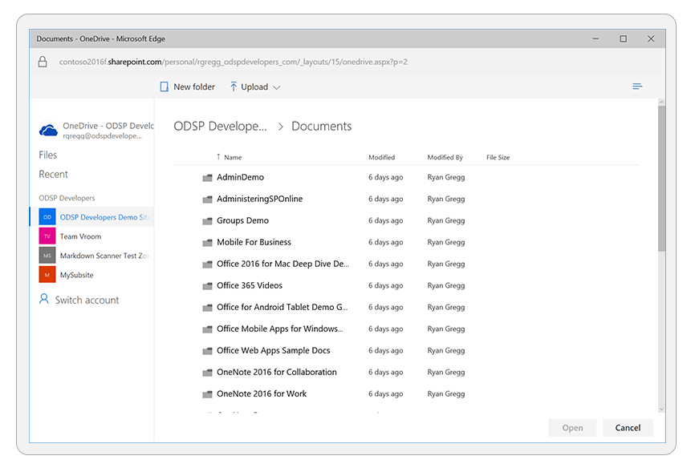

# OneDrive file picker for JavaScript v7.2 overview

The OneDrive file picker makes it easy for your web app to connect to content stored in OneDrive and SharePoint.
Using the file picker you can open, save, and share files stored in OneDrive or SharePoint without writing custom file UI code. 
 
You can use the file picker SDK to integrate with OneDrive and SharePoint in the following ways:

* Open a file and receive a short-lived URL to download the content of the file.
* Create a long-lived sharable link to view or edit a file. These are designed to be sent or shared with co-workers, friends and family, or other individuals.
* Get a direct link to the file which requires end user authorization.
* Get a file or folder ID for a file that can be used with Microsoft Graph to perform actions on the file.
* Save a file to OneDrive or SharePoint team site.

## Setting up

To get started you need to register your application and receive an app ID
from the [Azure App registrations page](https://aka.ms/AppRegistrations).

1. Log in to the [Azure App registrations page](https://aka.ms/AppRegistrations)
   using your Microsoft account, or a work or school account.
2. Click **Add an app** and enter a name for your app.
3. After your application is created, configure it to support the JavaScript picker:
   1. Click **Generate New Password** to create an **Application secret**. While this value is not necessary for the picker, it must have been created.
   2. Click **Add Platform** and then select **Web**.
   3. Enter one or more **URLs** where the picker will be hosted on your website. Each page that hosts the picker needs to have a redirect URL provided.
   4. Click the **Save** button to save your changes.
4. Copy the Application Id for your application and use it in the JavaScript options object you provided to [open](open-file.md) or [save](save-file.md) a file.

### Next Step

Learn more about [opening files with the OneDrive file picker](open-file.md) or
[saving files with the OneDrive file picker SDK](save-file.md).

## Supported browsers

The OneDrive picker and saver supports the following web browsers:

* Internet Explorer Desktop & Mobile 11+
* Microsoft Edge v25+
* Chrome Desktop 5+
* Chrome for Android
* Android Browser 4.1+
* Firefox Desktop & Mobile 8+
* Safari Desktop & Mobile 5+

## License

Copyright (c) Microsoft Corporation. All rights reserved.

Licensed under the [MIT](https://opensource.org/licenses/MIT) License.

## Previous versions

* [File picker SDK v7.0](../js-v7/index.md)
* [File picker SDK v6.0](../js-v6/index.md)
* [File picker SDK v5.0](../js-v5/index.md)

<!-- {
  "type": "#page.annotation",
  "description": "Use the JavaScript picker and saver SDKs to connect your web app to OneDrive.",
  "keywords": "js,javascript,onedrive,picker,saver,open,save,cloud",
  "section": "sdks",
"tocPath": "OneDrive SDKs/File pickers/JavaScript"
} -->
