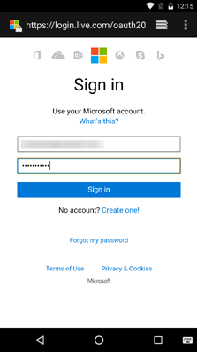

# Get started with Microsoft Graph in an Android app

> **Building apps for enterprise customers?** Your app may not work if your enterprise customer turns on enterprise mobility security features like <a href="https://azure.microsoft.com/en-us/documentation/articles/active-directory-conditional-access-device-policies/" target="_newtab">conditional device access</a>. In this case, you may not know and your customers may experience errors. 

> To support **all enterprise customers** across **all enterprise scenarios**, you must use the Azure AD endpoint and manage your apps using the [Azure portal](https://aka.ms/aadapplist). For more information, see [Deciding between the Azure AD and Azure AD v2.0 endpoints](../concepts/auth_overview.md#deciding-between-the-azure-ad-and-azure-ad-v20-endpoints).

This article describes the tasks required to get an access token from the Azure AD v2.0 endpoint and call Microsoft Graph. It walks you through building the [Connect Sample for Android](https://github.com/microsoftgraph/android-java-connect-sample) and explains the main concepts that you implement to use Microsoft Graph in your app for Android. The article also describes how to access Microsoft Graph by using either the [Microsoft Graph SDK for Android](https://github.com/microsoftgraph/msgraph-sdk-android) or raw REST calls.

To use Microsoft Graph in your app for Android, you need to show the Microsoft sign-in page to your users, as shown in the following screenshot.



<br/>

**Don't feel like building an app?** Get up and running fast by downloading the [Connect Sample for Android](https://github.com/microsoftgraph/android-java-connect-sample) that this article is based on.


## Prerequisites

To get started, you'll need: 

- A [Microsoft account](https://www.outlook.com/) or a [work or school account](https://docs.microsoft.com/en-us/office/developer-program/office-365-developer-program-faq#account-types)
- Android Studio 2.0 or newer version


## Configure a new project

If you have downloaded the [Connect Sample for Android](https://github.com/microsoftgraph/android-java-connect-sample), skip this step. 

Start a new project in Android Studio. You can leave the default values for most of the wizard; just make sure to choose the following options:

- Target Android Devices: **Phone and Tablet**
- Minimum SDK: **API 16: Android 4.1 (Jelly Bean)**
- Add an Activity to Mobile: **Basic Activity**
 
This provides you with an Android project with an activity and a button that you can use to authenticate the user.


## Register the application

You need to register your app on the [Microsoft App Registration Portal](https://apps.dev.microsoft.com/) whether you've downloaded the connect sample or created a new project.

Register an app on the Microsoft App Registration Portal. This generates the app ID that you'll use to configure the app.

1. Sign in to the [Microsoft App Registration Portal](https://apps.dev.microsoft.com/) by using either your personal or work or school account.

2. Select **Add an app**.

	> **Tip:** If you have downloaded the [Connect Sample for Android](https://github.com/microsoftgraph/android-java-connect-sample) and are just creating a registration for it, clear the **Guided Setup** check box before selecting the **Create** button.

3. Enter a name for the app, and then select **Create**. 
	
    For the  **Guided Setup** flow:
 
	a. Select **Mobile and Desktop App** to define the kind of app you are creating.

	b. Select **Android** to define the mobile technology you are using.

	c. Review the introductory topic, and when finished, select the **Setup** button at the end of the page.

	d. Follow the instructions on the **Setup** step to add the MSAL library to your app build.gradle.

	e. Follow the directions on the **Use** step to add MSAL logic to your new project.

	f. On the **Configure** page, the portal has created a unique application ID for you. Use it to configure your app.

    <br/>
    
    For the unguided flow:

	The registration page displays, listing the properties of your app.

	a. Copy the application ID. This is the unique identifier for your app. 

	b. Select **Add Platform** and **Native Application**.

	  > **Note:** 
	  > The Application Registration Portal provides a redirect URI with a value of `msalENTER_YOUR_CLIENT_ID://auth`. Do not use the built-in redirect URIs. The [Connect Sample for Android](https://github.com/microsoftgraph/android-java-connect-sample) implements the MSAL authentication library that requires this redirect URI. If you're using a [supported third-party library](https://docs.microsoft.com/en-us/azure/active-directory/develop/active-directory-v2-libraries#compatible-client-libraries) or the **ADAL** library, you must use the built-in redirect URIs.
	  
      c. Add delegated permissions. You'll need **profile**, **Mail.ReadWrite**, **Mail.Send**, **Files.ReadWrite**, and **User.ReadBasic.All**. 

      d. Select **Save**.


## Authenticate the user and get an access token

> **Note:** If you followed the instructions in the **Guided Setup** flow from the application registration portal to create a new application, you can skip these steps. To learn more about the Graph API, see [Call Microsoft Graph using the Microsoft Graph SDK](#call-microsoft-graph-using-the-microsoft-graph-sdk).

Let's walk through the [Connect Sample for Android](https://github.com/microsoftgraph/android-java-connect-sample) to learn about the MSAL and Microsoft Graph code we've added.

### Add the dependency to app/build.gradle

Open the `build.gradle` file in the app module and find the following dependency:

```gradle
    compile ('com.microsoft.identity.client:msal:0.1.+') {
        exclude group: 'com.android.support', module: 'appcompat-v7'
    }
    compile 'com.android.volley:volley:1.0.0'
```

<br/>

### Start the authentication flow

1. Open the **AuthenticationManager** file and find the **PublicClientApplication** object declaration, and then the instantiation in the **getInstance** method.

   ```java
    private static PublicClientApplication mPublicClientApplication;
    ....

    public static synchronized AuthenticationManager getInstance() {
        if (INSTANCE == null) {
            INSTANCE = new AuthenticationManager();
            if (mPublicClientApplication == null) {
                mPublicClientApplication = new PublicClientApplication(Connect.getInstance());
            }
        }
        return INSTANCE;
    }

   ```

<br/>

2. In the **ConnectActivity** class, locate the event handler for the click event of the **mConnectButton**. Find the **onClick** method and review relevant code.
  
    The **connect** method enables personally identifiable information (PII) logging, gets an instance of the sample helper class **AuthenticationManager**, and gets the MSAL platform object users collection. If there are no users, the new user is taken to the Azure AD authentication and authorization flow. Otherwise, an authentication token is obtained silently.

   ```java
    @Override
    public void onClick(View view) {
        ....
        connect();
    }

        private void connect() {

        if (mEnablePiiLogging) {
            Logger.getInstance().setEnablePII(true);
        } else {
            Logger.getInstance().setEnablePII(false);
        }

        AuthenticationManager mgr = AuthenticationManager.getInstance();

        List<User> users = null;

        try {
            users = mgr.getPublicClient().getUsers();

            if (users != null && users.size() == 1) {
                mUser = users.get(0);
                mgr.callAcquireTokenSilent(mUser, true, this);
            } else {
                mgr.callAcquireToken(
                        this,
                        this);
            }
        } catch (MsalClientException e) {
            Log.d(TAG, "MSAL Exception Generated while getting users: " + e.toString());

        } catch (IndexOutOfBoundsException e) {
            Log.d(TAG, "User at this position does not exist: " + e.toString());
        }
    }

   ```
   
<br/>

3. Find the event handler that processes the Azure AD redirect response generated by Azure AD when the user closes the authentication dialog. This handler is in the **ConnectActivity** class.

   ```java
       /**
     * Handles redirect response from https://login.microsoftonline.com/common and
     * notifies the MSAL library that the user has completed the authentication
     * dialog
     * @param requestCode
     * @param resultCode
     * @param data
     */
    @Override
    protected void onActivityResult(int requestCode, int resultCode, Intent data) {
        super.onActivityResult(requestCode, resultCode, data);
        if (AuthenticationManager
                .getInstance()
                .getPublicClient() != null) {
            AuthenticationManager
                    .getInstance()
                    .getPublicClient()
                    .handleInteractiveRequestRedirect(requestCode, resultCode, data);
        }
    }

   ```  
   
   <br/>

4. Find the authentication callback method that caches the authentication token that is used in Graph API calls.


```java
    /* Callback used for interactive request.  If succeeds we use the access
         * token to call the Microsoft Graph. Does not check cache
         */
    private AuthenticationCallback getAuthInteractiveCallback() {
        return new AuthenticationCallback() {
            @Override
            public void onSuccess(AuthenticationResult authenticationResult) {
            /* Successfully got a token, call graph now */
                Log.d(TAG, "Successfully authenticated");
                Log.d(TAG, "ID Token: " + authenticationResult.getIdToken());

            /* Store the auth result */
                mAuthResult = authenticationResult;
                if (mActivityCallback != null)
                    mActivityCallback.onSuccess(mAuthResult);
            }

            @Override
            public void onError(MsalException exception) {
            /* Failed to acquireToken */
                Log.d(TAG, "Authentication failed: " + exception.toString());
                if (mActivityCallback != null)
                    mActivityCallback.onError(exception);
            }

            @Override
            public void onCancel() {
            /* User canceled the authentication */
                Log.d(TAG, "User cancelled login.");
            }
        };
    }

```

<br/>
   
The connect sample app has a **Connect** button on the main activity. If you select the button, on first use, the app presents an authentication page using the device's browser. The next step is to handle the code that the authorization server sends to the redirect URI and exchange it for an access token.

### Exchange the authorization code for an access token

You need to make your app ready to handle the authorization server response, which contains a code that you can exchange for an access token.

1. You need to tell the Android system that Connect app can handle requests to the redirect URL configured in the application registration. To do this, open the **strings.xml** string resource file and add the following children to the projects  **\<application/\>** element.

   ```xml
   <!DOCTYPE resources [
       <!ENTITY clientId "ENTER_YOUR_CLIENT_ID">
       ]>

    ...
    <string name="client_Id">&clientId;</string>
    <string name="msalPrefix">msal&clientId;</string>
   ```

   <br/>

   The string resources are used in the **AndroidManifest.xml** file. The **MSAL** library reads the client ID at runtime and returns REST responses to the redirect URL defined for the **BrowserTabActivity**.

    ```xml
        <uses-sdk tools:overrideLibrary="com.microsoft.identity.msal" />
        <application ...>
            ...
           <activity
               android:name="com.microsoft.identity.client.BrowserTabActivity">
               <intent-filter>
                   <action android:name="android.intent.action.VIEW" />
                   <category android:name="android.intent.category.DEFAULT" />
                   <category android:name="android.intent.category.BROWSABLE" />
                   <data android:scheme="@string/msalPrefix"
                       android:host="auth" />
               </intent-filter>
           </activity>
           <meta-data
               android:name="https://login.microsoftonline.com/common"
               android:value="authority string"/>
           <meta-data
               android:name="com.microsoft.identity.client.ClientId"
               android:value="@string/client_Id"/>
        </application>
    ```


2. The **MSAL** library needs access to the application Id assigned by the registration portal. **The MSAL library refers to the application Id as the "Client Id"**. It gets the application Id (Client Id) from the application context that you pass in the library constructor. 

   > **Note:** You can also provide the client Id at run-time by passing a string parameter to the constructor. 

3. The activity is invoked when the authorization server sends a response. Request an access token with the response from the authorization server. Go to your **AuthenticationManager** and find the following code in the class.

   ```java
    /**
     * Authenticates the user and lets the user authorize the app for the requested permissions.
     * An authentication token is returned via the getAuthInteractiveCalback method
     * @param activity
     * @param authenticationCallback
     */
    public void connect(Activity activity, final MSALAuthenticationCallback authenticationCallback){
        mActivityCallback = authenticationCallback;
        mPublicClientApplication.acquireToken(
                activity, Constants.SCOPES, getAuthInteractiveCallback());
    }


     /* Callback used for interactive request.  If succeeds we use the access
         * token to call the Microsoft Graph. Does not check cache
         */
    private AuthenticationCallback getAuthInteractiveCallback() {
        return new AuthenticationCallback() {
            @Override
            public void onSuccess(AuthenticationResult authenticationResult) {
            /* Successfully got a token, call graph now */
                Log.d(TAG, "Successfully authenticated");
                Log.d(TAG, "ID Token: " + authenticationResult.getIdToken());

            /* Store the auth result */
                mAuthResult = authenticationResult;
                if (mActivityCallback != null)
                    mActivityCallback.onSuccess(mAuthResult);
            }

            @Override
            public void onError(MsalException exception) {
            /* Failed to acquireToken */
                Log.d(TAG, "Authentication failed: " + exception.toString());
                if (mActivityCallback != null)
                    mActivityCallback.onError(exception);
            }

            @Override
            public void onCancel() {
            /* User canceled the authentication */
                Log.d(TAG, "User cancelled login.");
            }
        };
    }

     /**
     * Returns the access token obtained in authentication
     *
     * @return mAccessToken
     */
    public String getAccessToken() throws AuthenticatorException, IOException, OperationCanceledException {
        return  mAuthResult.getAccessToken();
    }

   ```

<br/>

## Call Microsoft Graph

You can [use the Microsoft Graph SDK](#call-microsoft-graph-using-the-microsoft-graph-sdk) or the [Microsoft Graph REST API](#call-microsoft-graph-using-the-microsoft-graph-rest-api) to call Microsoft Graph.

### Call Microsoft Graph using the Microsoft Graph SDK

The [Microsoft Graph SDK for Android](https://github.com/microsoftgraph/msgraph-sdk-android) provides classes that build requests and process results from Microsoft Graph. Follow these steps to use the Microsoft Graph SDK.

1. Add Internet permissions to your app. Open the **AndroidManifest** file and add the following child to the manifest element.
    
    ```xml
    <uses-permission android:name="android.permission.INTERNET" />
    <uses-permission android:name="android.permission.ACCESS_NETWORK_STATE" />
    <uses-permission android:name="android.permission.READ_EXTERNAL_STORAGE" />
    <uses-permission android:name="android.permission.WRITE_EXTERNAL_STORAGE" />
    ```


2. Add dependencies to the Microsoft Graph SDK and GSON.
   
   ```gradle
    compile 'com.microsoft.graph:msgraph-sdk-android:1.3.2'
    compile 'com.google.code.gson:gson:2.7'
   ```


3. Add authentication token to new requests by using the **AuthenticateRequest** helper method. This method implements the same method from the Microsoft Graph Authentication **IAuthenticationProvider** interface.
    
   ```java
    /**
     * Appends an access token obtained from the {@link AuthenticationManager} class to the
     * Authorization header of the request.
     * @param request
     */
    @Override
    public void authenticateRequest(IHttpRequest request)  {
        try {
            request.addHeader("Authorization", "Bearer "
                    + AuthenticationManager.getInstance()
                    .getAccessToken());
            // This header has been added to identify this sample in the Microsoft Graph service.
            // If you're using this code for your project please remove the following line.
            request.addHeader("SampleID", "android-java-connect-sample");
        } catch (AuthenticatorException e) {
            e.printStackTrace();
        } catch (IOException e) {
            e.printStackTrace();
        }  catch (OperationCanceledException e) {
            e.printStackTrace();
        } catch (NullPointerException e) {
            e.printStackTrace();
        }
    }
   ```


4. Create a draft email and send it by using the following helper methods from the **GraphServiceController** helper class.

   ```java
    /**
     * Creates a draft email message using the Microsoft Graph API on Office 365. The mail is sent
     * from the address of the signed in user.
     *
     * @param senderPreferredName The mail senders principal user name (email addr)
     * @param emailAddress        The recipient email address.
     * @param subject             The subject to use in the mail message.
     * @param body                The body of the message.
     * @param callback            The callback method to invoke on completion of the POST request
     */
    public void createDraftMail(
            final String senderPreferredName,
            final String emailAddress,
            final String subject,
            final String body,
            ICallback<Message> callback
    ) {
        try {
            // create the email message
            Message message = createMessage(subject, body, emailAddress);
            mGraphServiceClient
                    .getMe()
                    .getMessages()
                    .buildRequest()
                    .post(message, callback);

        } catch (Exception ex) {
            showException(ex, "exception on send mail","Send mail failed", "The send mail method failed");
        }
    }

        /**
     * Creates a new Message object 
     */
    Message createMessage(
            String subject,
            String body,
            String address) {

        if (address == null || address.isEmpty()) {
            throw new IllegalArgumentException("The address parameter can't be null or empty.");
        } else {
            // perform a simple validation of the email address
            String addressParts[] = address.split("@");
            if (addressParts.length != 2 || addressParts[0].length() == 0 || addressParts[1].indexOf('.') == -1) {
                throw new IllegalArgumentException(
                        String.format("The address parameter must be a valid email address {0}", address)
                );
            }
        }
        Message message = new Message();
        EmailAddress emailAddress = new EmailAddress();
        emailAddress.address = address;
        Recipient recipient = new Recipient();
        recipient.emailAddress = emailAddress;
        message.toRecipients = Collections.singletonList(recipient);
        ItemBody itemBody = new ItemBody();
        itemBody.content = body;
        itemBody.contentType = BodyType.html;
        message.body = itemBody;
        message.subject = subject;
        return message;
    }
    /**
     * Sends a draft message to the specified recipients
     *
     * @param messageId String. The id of the message to send
     * @param callback
     */
    public void sendDraftMessage(String messageId,
                                 ICallback<Void> callback) {
        try {

            mGraphServiceClient
                    .getMe()
                    .getMessages(messageId)
                    .getSend()
                    .buildRequest()
                    .post(callback);

        } catch (Exception ex) {
            showException(ex, "exception on send draft message ","Send draft mail failed", "The send draft mail method failed");
        }
    }

   ```
  

### Call Microsoft Graph using the Microsoft Graph REST API

The [Microsoft Graph REST API](http://developer.microsoft.com/en-us/graph/docs) exposes multiple APIs from Microsoft cloud services through a single REST API endpoint. Follow these steps to use the REST API.

1. Add Internet permissions to your app. Open the **AndroidManifest** file and add the following child to the manifest element.
    
    ```xml
    <uses-permission android:name="android.permission.INTERNET" />
    ```


2. Add a dependency to the Volley HTTP library.

    ```gradle
    compile 'com.android.volley:volley:1.0.0'
    ```
   

3. Replace the line `String accessToken = tokenResponse.accessToken;` with the following code. Insert your email address in the placeholder marked with **\<YOUR_EMAIL_ADDRESS\>**.
   
   ```java
    final String accessToken = tokenResponse.accessToken;

    final RequestQueue queue = Volley.newRequestQueue(getApplicationContext());
    String url ="https://graph.microsoft.com/v1.0/me/sendMail";
    final String body = "{" +
        "  Message: {" +
        "    subject: 'Sent using the Microsoft Graph REST API'," +
        "    body: {" +
        "      contentType: 'text'," +
        "      content: 'This is the email body'" +
        "    }," +
        "    toRecipients: [" +
        "      {" +
        "        emailAddress: {" +
        "          address: '<YOUR_EMAIL_ADDRESS>'" +
        "        }" +
        "      }" +
        "    ]}" +
        "}";

    final StringRequest stringRequest = new StringRequest(Request.Method.POST, url,
        new Response.Listener<String>() {
            @Override
            public void onResponse(String response) {
                Log.d("Response", response);
            }
        },
        new Response.ErrorListener() {
            @Override
            public void onErrorResponse(VolleyError error) {
                Log.d("ERROR","error => " + error.getMessage());
            }
        }
    ) {
        @Override
        public Map<String, String> getHeaders() throws AuthFailureError {
            Map<String,String> params = new HashMap<>();
            params.put("Authorization", "Bearer " + accessToken);
            params.put("Content-Length", String.valueOf(body.getBytes().length));
            return params;
        }
        @Override
        public String getBodyContentType() {
            return "application/json";
        }
        @Override
        public byte[] getBody() throws AuthFailureError {
            return body.getBytes();
        }
    };

    AsyncTask.execute(new Runnable() {
        @Override
        public void run() {
            queue.add(stringRequest);
        }
    });
   ```


## Run the app
You're ready to try your Android app.

1. Start your Android emulator or connect your physical device to your computer.
2. In Android Studio, press Shift+F10 to run your app.
3. Choose your Android emulator or device from the deployment dialog box.
4. Tap the **Floating Action** button on the main activity.
5. Sign in with your personal or work or school account and grant the requested permissions.
6. In the app selection dialog, tap your app to continue.

Check the Inbox of the email address that you configured in [Call Microsoft Graph](#call-microsoft-graph). You should have an email from the account that you used to sign in to the app.

## Next steps

- Try out the [Microsoft Graph Explorer](https://developer.microsoft.com/graph/graph-explorer).
- Find examples of common operations in the [Snippets Sample for Android](https://github.com/microsoftgraph/android-java-snippets-sample), or explore our other [Android samples](https://github.com/microsoftgraph?utf8=%E2%9C%93&query=android) on GitHub.


## See also

- [Microsoft Graph SDK for Android](https://github.com/microsoftgraph/msgraph-sdk-android) 
- [Get access tokens to call Microsoft Graph](https://developer.microsoft.com/en-us/graph/docs/concepts/auth_overview)
- [Get access on behalf of a user](https://developer.microsoft.com/en-us/graph/docs/concepts/auth_v2_user)
- [Get access without a user](https://developer.microsoft.com/en-us/graph/docs/concepts/auth_v2_service)
