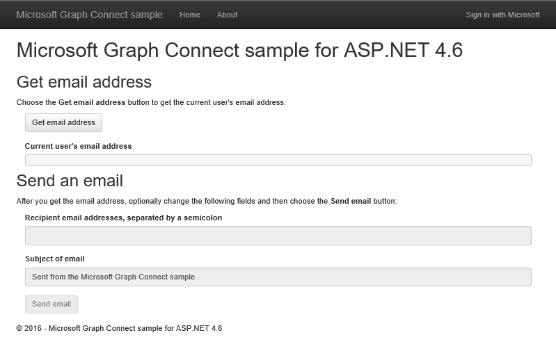

# Get started with Microsoft Graph in an ASP.NET 4.6 MVC app

This article describes the tasks required to get an access token from the Azure AD v2.0 endpoint and call Microsoft Graph. It walks you through building the [Microsoft Graph Connect Sample for ASP.NET 4.6](https://github.com/microsoftgraph/aspnet-connect-sample) and explains the main concepts that you implement to use Microsoft Graph.

The following image shows the app you'll create. 

The [Azure AD v2.0 endpoint](https://azure.microsoft.com/en-us/documentation/articles/active-directory-appmodel-v2-overview) lets users sign in with a Microsoft account (MSA) or a work or school account. The app uses the [ASP.Net OpenID Connect OWIN middleware](https://www.nuget.org/packages/Microsoft.Owin.Security.OpenIdConnect/) and the [Microsoft Authentication Library (MSAL) for .NET](https://www.nuget.org/packages/Microsoft.Identity.Client) for sign in and token management.

**Don't feel like building an app?** Use the [Microsoft Graph quick start](https://developer.microsoft.com/en-us/graph/quick-start) to get up and running fast. Also note that we have a [REST version of this sample](https://github.com/microsoftgraph/aspnet-connect-rest-sample).

## Prerequisites

To get started, you'll need: 

- A [Microsoft account](https://www.outlook.com/) or a [work or school account](https://docs.microsoft.com/en-us/office/developer-program/office-365-developer-program-faq#account-types)
- Visual Studio 2015 
- The [Microsoft Graph Connect Sample for ASP.NET 4.6](https://github.com/microsoftgraph/aspnet-connect-sample). You'll use the **starter-project** folder in the sample files.

## Register the application

In this step, you'll register an app on the Microsoft App Registration Portal. This generates the app ID and password that you'll use to configure the app in Visual Studio.

1. Sign into the [Microsoft App Registration Portal](https://apps.dev.microsoft.com/) using either your personal or work or school account.

2. Choose **Add an app**.

3. Enter a name for the app, and choose **Create application**. 
	
	The registration page displays, listing the properties of your app.

4. Copy the application ID. This is the unique identifier for your app. 

5. Under **Application Secrets**, choose **Generate New Password**. Copy the password from the **New password generated** dialog.

	You'll use the application ID and password to configure the app. 

6. Under **Platforms**, choose **Add platform** > **Web**.

7. Make sure the **Allow Implicit Flow** check box is selected, and enter *http://localhost:55065/* as the Redirect URI. 

	The **Allow Implicit Flow** option enables the OpenID Connect hybrid flow. During authentication, this enables the app to receive both sign-in info (the **id_token**) and artifacts (in this case, an authorization code) that the app uses to obtain an access token.

8. Choose **Save**.

### Configure the project

1. Open the solution file for the starter project in Visual Studio.

2. Open the project's Web.config file.

3. Locate the app configuration keys in the **appSettings** element. Replace the ENTER_YOUR_CLIENT_ID and ENTER_YOUR_SECRET placeholder values with the values you just copied.

The redirect URI is the URL of the project that you registered. The requested [permission scopes](https://developer.microsoft.com/en-us/graph/docs/concepts/permission_scopes) allow the app to get user profile information and send an email.

## Call Microsoft Graph

In this step, you'll focus on the **SDKHelper**, **GraphService**, and **HomeController** classes. 

 - **SDKHelper** intializes an instance of the **GraphServiceClient** from the library before each call to the Microsoft Graph. This is when the access token is added to the request. 
 - **GraphService** builds and sends requests to the Microsoft Graph using the library, and processes the responses.
 - **HomeController** contains actions that initiate the calls to the library in response to UI events.

The starter project already declares a dependency for the Microsoft Graph .NET Client Library NuGet package:  *Microsoft.Graph*.

1. Right-click the **Helpers** folder and choose **Add** > **Class**. 

1. Name the new class *SDKHelper* and choose **Add**.

1. Replace the contents with the following code.

        using System.Net.Http.Headers;
        using Microsoft.Graph;

        namespace Microsoft_Graph_SDK_ASPNET_Connect.Helpers
        {
            public class SDKHelper
            {   
                private static GraphServiceClient graphClient = null;

                // Get an authenticated Microsoft Graph Service client.
                public static GraphServiceClient GetAuthenticatedClient()
                {
                    GraphServiceClient graphClient = new GraphServiceClient(
                        new DelegateAuthenticationProvider(
                            async (requestMessage) =>
                            {
                                string accessToken = await SampleAuthProvider.Instance.GetUserAccessTokenAsync();

                                // Append the access token to the request.
                                requestMessage.Headers.Authorization = new AuthenticationHeaderValue("bearer", accessToken);
                            }));
                    return graphClient;
                }

                public static void SignOutClient()
                {
                    graphClient = null;
                }
            }
        }

  Note the call to **SampleAuthProvider** to get the token when the client is initialized.

1. In the **Models** folder, open GraphService.cs. The service uses the library to interact with the Microsoft Graph.

1. Add the following **using** statement.

        using Microsoft.Graph;

1. Replace *// GetMyEmailAddress* with the following method. This gets the current user's email address. 

        // Get the current user's email address from their profile.
        public async Task<string> GetMyEmailAddress(GraphServiceClient graphClient)
        {

            // Get the current user. 
            // The app only needs the user's email address, so select the mail and userPrincipalName properties.
            // If the mail property isn't defined, userPrincipalName should map to the email for all account types. 
            User me = await graphClient.Me.Request().Select("mail,userPrincipalName").GetAsync();
            return me.Mail ?? me.UserPrincipalName;
        }

  Note the **Select** segment, which requests only the **mail** and **userPrinicipalName** to be returned. You can use **Select** and **Filter** to reduce the size of the response data payload.

1. Replace *// SendEmail* with the following methods to build and send the email.

        // Send an email message from the current user.
        public async Task SendEmail(GraphServiceClient graphClient, Message message)
        {
            await graphClient.Me.SendMail(message, true).Request().PostAsync();
        }

        public async Task<Message> BuildEmailMessage(GraphServiceClient graphClient, string recipients, string subject)
        {

            // Get current user photo
            Stream photoStream = await GetCurrentUserPhotoStreamAsync(graphClient);

            // If the user doesn't have a photo, or if the user account is MSA, we use a default photo

            if ( photoStream == null)
            {
                photoStream = System.IO.File.OpenRead(System.Web.Hosting.HostingEnvironment.MapPath("/Content/test.jpg"));
            }

            MemoryStream photoStreamMS = new MemoryStream();
            // Copy stream to MemoryStream object so that it can be converted to byte array.
            photoStream.CopyTo(photoStreamMS);

            DriveItem photoFile = await UploadFileToOneDrive(graphClient, photoStreamMS.ToArray());

            MessageAttachmentsCollectionPage attachments = new MessageAttachmentsCollectionPage();
            attachments.Add(new FileAttachment
            {
                ODataType = "#microsoft.graph.fileAttachment",
                ContentBytes = photoStreamMS.ToArray(),
                ContentType = "image/png",
                Name = "me.png"
            });

            Permission sharingLink = await GetSharingLinkAsync(graphClient, photoFile.Id);

            // Add the sharing link to the email body.
            string bodyContent = string.Format(Resource.Graph_SendMail_Body_Content, sharingLink.Link.WebUrl);

            // Prepare the recipient list.
            string[] splitter = { ";" };
            string[] splitRecipientsString = recipients.Split(splitter, StringSplitOptions.RemoveEmptyEntries);
            List<Recipient> recipientList = new List<Recipient>();
            foreach (string recipient in splitRecipientsString)
            {
                recipientList.Add(new Recipient
                {
                    EmailAddress = new EmailAddress
                    {
                        Address = recipient.Trim()
                    }
                });
            }

            // Build the email message.
            Message email = new Message
            {
                Body = new ItemBody
                {
                    Content = bodyContent,
                    ContentType = BodyType.Html,
                },
                Subject = subject,
                ToRecipients = recipientList,
                Attachments = attachments
            };
            return email;
        }

        // Gets the stream content of the signed-in user's photo. 
        // This snippet doesn't work with consumer accounts.
        public async Task<Stream> GetCurrentUserPhotoStreamAsync(GraphServiceClient graphClient)
        {
            Stream currentUserPhotoStream = null;

            try
            {
                currentUserPhotoStream = await graphClient.Me.Photo.Content.Request().GetAsync();

            }

            // If the user account is MSA (not work or school), the service will throw an exception.
            catch (ServiceException)
            {
                return null;
            }

            return currentUserPhotoStream;

        }

        // Uploads the specified file to the user's root OneDrive directory.
        public async Task<DriveItem> UploadFileToOneDrive(GraphServiceClient graphClient, byte[] file)
        {
            DriveItem uploadedFile = null;

            try
            {
                MemoryStream fileStream = new MemoryStream(file);
                uploadedFile = await graphClient.Me.Drive.Root.ItemWithPath("me.png").Content.Request().PutAsync<DriveItem>(fileStream);

            }

            catch (ServiceException)
            {
                return null;
            }

            return uploadedFile;
        }

        public static async Task<Permission> GetSharingLinkAsync(GraphServiceClient graphClient, string Id)
        {
            Permission permission = null;

            try
            {
                permission = await graphClient.Me.Drive.Items[Id].CreateLink("view").Request().PostAsync();
            }

            catch (ServiceException)
            {
                return null;
            }

            return permission;
        }

1. In the **Controllers** folder, open HomeController.cs.

1. Add the following **using** statement.

        using Microsoft.Graph;
  
1. Replace *// Controller actions* with the following actions.

        [Authorize]
        // Get the current user's email address from their profile.
        public async Task<ActionResult> GetMyEmailAddress()
        {
            try
            {

                // Initialize the GraphServiceClient.
                GraphServiceClient graphClient = SDKHelper.GetAuthenticatedClient();

                // Get the current user's email address. 
                ViewBag.Email = await graphService.GetMyEmailAddress(graphClient);
                return View("Graph");
            }
            catch (ServiceException se)
            {
                if (se.Error.Message == Resource.Error_AuthChallengeNeeded) return new EmptyResult();
                return RedirectToAction("Index", "Error", new { message = Resource.Error_Message + Request.RawUrl + ": " + se.Error.Message });
            }
        }

        [Authorize]
        // Send mail on behalf of the current user.
        public async Task<ActionResult> SendEmail()
        {
            if (string.IsNullOrEmpty(Request.Form["email-address"]))
            {
                ViewBag.Message = Resource.Graph_SendMail_Message_GetEmailFirst;
                return View("Graph");
            }

            try
            {

                // Initialize the GraphServiceClient.
                GraphServiceClient graphClient = SDKHelper.GetAuthenticatedClient();

                // Build the email message.
                Message message = await graphService.BuildEmailMessage(graphClient, Request.Form["recipients"], Request.Form["subject"]);

                // Send the email.
                await graphService.SendEmail(graphClient, message);

                // Reset the current user's email address and the status to display when the page reloads.
                ViewBag.Email = Request.Form["email-address"];
                ViewBag.Message = Resource.Graph_SendMail_Success_Result;
                return View("Graph");
            }
            catch (ServiceException se)
            {
                if (se.Error.Code == Resource.Error_AuthChallengeNeeded) return new EmptyResult();
                return RedirectToAction("Index", "Error", new { message = Resource.Error_Message + Request.RawUrl + ": " + se.Error.Message });
            }
        }

Now you're ready to [run the app](#run-the-app).

## Run the app
1. Press F5 to build and run the app. 

2. Sign in with your personal or work or school account and grant the requested permissions.

3. Choose the **Get email address** button. When the operation completes, the email address of the signed-in user is displayed on the page.

4. Optionally edit the recipient list and email subject, and then choose the **Send email** button. When the mail is sent, a Success message is displayed below the button.

## Next steps
- Try out the REST API using the [Graph explorer](https://developer.microsoft.com/graph/graph-explorer).
- Find examples of common operations in the [Microsoft Graph Snippets Sample for ASP.NET 4.6](https://github.com/microsoftgraph/aspnet-snippets-sample), or explore our other [ASP.NET samples](http://aka.ms/aspnetgraphsamples) on GitHub.

## See also
- [Microsoft Graph .NET Client Library](https://github.com/microsoftgraph/msgraph-sdk-dotnet)
- [Web application to web API authentication scenario](https://azure.microsoft.com/en-us/documentation/articles/active-directory-authentication-scenarios/#web-application-to-web-api)
- [Integrate Microsoft identity and the Microsoft Graph into a web application using OpenID Connect](https://azure.microsoft.com/en-us/documentation/samples/active-directory-dotnet-webapp-openidconnect-v2/)
- [Azure AD v2.0 protocols](https://azure.microsoft.com/en-us/documentation/articles/active-directory-v2-protocols/)
- [Azure AD v2.0 tokens](https://azure.microsoft.com/en-us/documentation/articles/active-directory-v2-tokens/)
