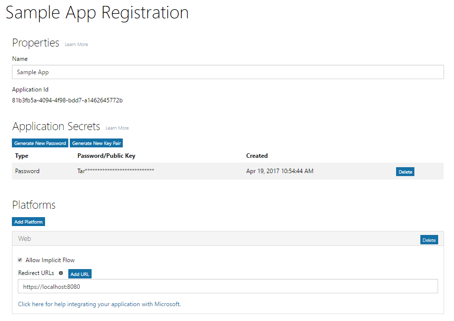

# Register your app with the Azure AD v2.0 endpoint

Your app must be registered with Azure AD. Registering your app establishes a unique application ID and other values that your app uses to authenticate with Azure AD and get tokens. For the Azure AD v2.0 endpoint, you register your app with the [Microsoft App Registration Portal](https://apps.dev.microsoft.com). You can use either a Microsoft account or a work or school account to register your app. Depending on the type of app you are developing, you will need to copy one or more properties during registration to use when you configure authentication and authorization for your app. 

> **Note:** This article primarily covers registering apps with the Azure AD v2.0 endpoint. For information about registering your app with the Azure AD endpoint, see [Azure AD endpoint considerations](#azure-ad-endpoint-considerations) below.
> 
> Also, be aware that if you've previously registered apps in the Microsoft Azure portal, those apps will not be listed in the App Registration Portal. Manage those apps in the Azure portal. 

The following screenshot shows an example web app registration that has been configured with a password and implicit flow. 

To register your app, follow these steps; be sure to copy the indicated values to use when configuring authorization for your app:

1. Sign into the [Microsoft App Registration Portal](https://apps.dev.microsoft.com/).
   
    You can sign in with either a Microsoft account or a work or school account. 

2. Choose **Add an app**.
    > Note: If you signed in with a work or school account, select the **Add an app** button for **Converged applications**. 

3. Enter a name for the app and choose **Create application**.

	The registration page displays, listing the properties of your app.

4. Copy the application ID. This is the unique identifier for your app.

	You'll use the application ID to configure the app.

5. Under **Platforms**, choose **Add Platform**, and select the appropriate platform for your app:
	
	**For native or mobile apps**:

	1. Select **Native Application**.

	2. Copy the **Built-in redirect URI** value. You'll need this to configure your app.

		The redirect URI is a unique URI provided for your application to ensure that messages sent to that URI are only sent to that application. 

	**For web apps**:

	1. Select **Web**.

	2. Depending on the type of authentication flow you're using, you may have to make sure the **Allow Implicit Flow** check box is selected. 
		
		The **Allow Implicit Flow** option enables the OpenID Connect hybrid and implicit flows. The hybrid flow enables the app to receive both sign-in info (the id token) and artifacts (in this case, an authorization code) that the app uses to obtain an access token. The hybrid flow is the default flow used by the OWIN OpenID Connect middleware. For single page apps (SPA), the implicit flow enables the app to receive sign-in info and the access token. 

	3. Specify a Redirect URL.
		
		The redirect URL is the location in your app that the Azure AD v2.0 endpoint calls when it has processed the authentication request.

	4. Under **Application Secrets**, choose **Generate New Password**. Copy the app secret from the **New password generated** dialog box.
		> **Important** You must copy the app secret before you close the **New password generated** dialog. After you close the dialog, you cannot retrieve the secret. 
			
6. Choose **Save**.

The following table shows the properties that you need to configure and copy for different kinds of apps. _Assigned_ means that you should use the value assigned by Azure AD.

| App type | Platform | Application ID | Application Secret | Redirect URI/URL | Implicit Flow 
| --- | --- | --- | --- | --- | --- |
| Native/Mobile | Native | Assigned  | No | Assigned | No |
| Web App | Web | Assigned | Yes | Yes | Optional  Open ID Connect middleware uses hybrid flow by default (Yes) | 
| Single Page App (SPA) | Web | Assigned | Yes | Yes | Yes   SPAs use Open ID Connect implicit Flow |
| Service/Daemon | Web | Assigned | Yes | Yes | No |

Apps that provide an administrator consent experience may need an additional Redirect URL for Azure AD to return the response to.

For more detail about the App Registration Portal and the properties you can configure for your App, see [App registration reference](https://docs.microsoft.com/en-us/azure/active-directory/develop/active-directory-v2-registration-portal).  

## Azure AD endpoint considerations

You use the [Azure portal](https://aka.ms/aadapplist) to register your app for the Azure AD endpoint. You configure the same basic properties like Application ID, Application Secret, and Redirect URI/URL, as you would for the v2.0 endpoint; however, there are some important differences to be aware of: 

- You can only use a work or school account to register an app.
- Your app will require a different Application ID for each platform.
- If your app is a multi-tenant app, you must explicitly configure it to be multi-tenant at the portal.
- You must pre-configure all the permissions (including Microsoft Graph permissions) that your app needs at the portal. 

For guidance on using the Azure portal to add an app, see [Integrating applications with Azure Active Directory: Adding an application](https://docs.microsoft.com/azure/active-directory/develop/active-directory-integrating-applications#adding-an-application).
