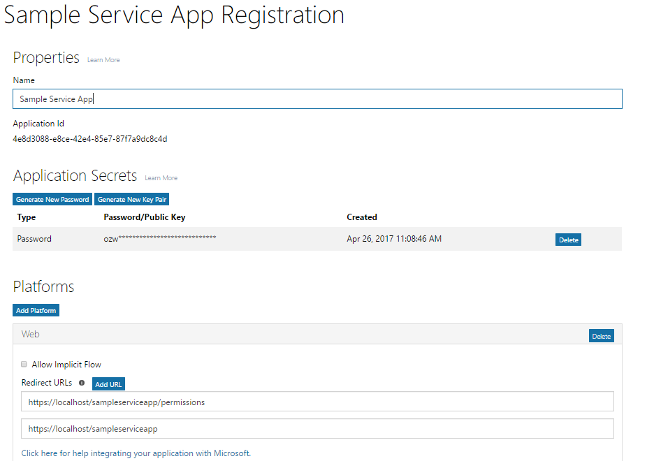
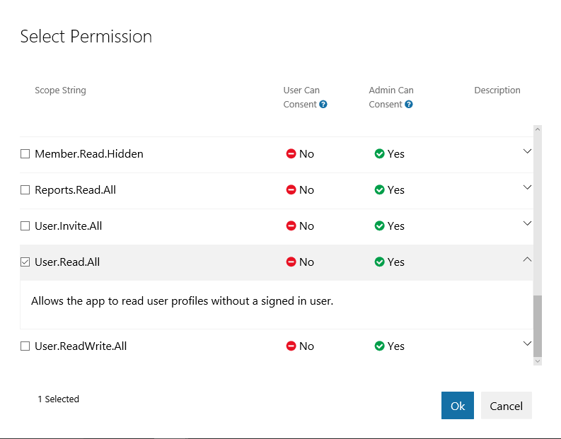
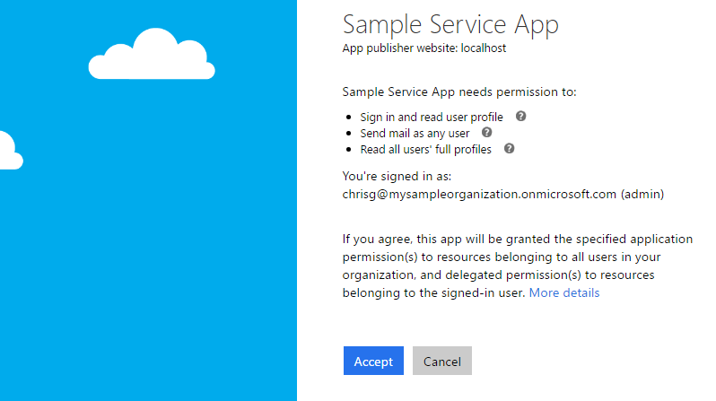

# Get access without a user

Some apps call Microsoft Graph with their own identity and not on behalf of a user. In many cases, these are background services or daemons that run on a server without the presence of a signed-in user. An example of such an app might be an email archival service that wakes up and runs overnight. In some cases, apps that have a signed-in user present may also need to call Microsoft Graph under their own identity. For example, an app may need to use functionality that requires more elevated privileges in an organization than those carried by the signed-in user.  

Apps that call Microsoft Graph with their own identity use the OAuth 2.0 client credentials grant flow to get access tokens from Azure AD. In this topic, we will walk through the basic steps to configure a service and use the OAuth client credentials grant flow to get an access token. 

## Authentication and authorization steps

The basic steps required to configure a service and get a token from the Azure AD v2.0 endpoint that your service can use to call Microsoft Graph under its own identity are:

1. Register your app.
2. Configure permissions for Microsoft Graph on your app.
3. Get administrator consent.
4. Get an access token.
5. Use the access token to call Microsoft Graph.

## 1. Register your app

To authenticate with the Azure v2.0 endpoint, you must first register your app at the [Microsoft App Registration Portal](https://apps.dev.microsoft.com/). You can use either a Microsoft account or a work or school account to register your app. 

The following screenshot shows a web app registration that has been configured for a background service.


For a service that will call Microsoft Graph under its own identity, you need to register your app for the Web platform and copy the following values:

- The Application ID assigned by the app registration portal.
- An Application Secret, either a password or a public/private key pair (certificate).
- A Redirect URL for your service to receive token responses from Azure AD.
- A Redirect URL for your service to receive admin consent responses if your app implements functionality to request administrator consent.  

For steps on how to configure an app using the Microsoft App Registration Portal, see [Register your app](./auth_register_app_v2.md).

With the OAuth 2.0 client credentials grant flow, your app authenticates directly at the Azure AD v2.0 `/token` endpoint using the Application ID assigned by Azure AD and the Application Secret that you create using the portal. 

## 2. Configure permissions for Microsoft Graph

For apps that call Microsoft Graph under their own identity, Microsoft Graph exposes application permissions. (Microsoft Graph also exposes delegated permissions for apps that call Microsoft Graph on behalf of a user.) You pre-configure the application permissions your app needs when you register your app. Application permissions always require administrator consent. An administrator can either consent to these permissions using the [Azure portal](https://portal.azure.com) when your app is installed in their organization, or you can provide a sign-up experience in your app through which administrators can consent to the permissions you configured. Once administrator consent is recorded by Azure AD, your app can request tokens without having to request consent again. For more detailed information about the permissions available with Microsoft Graph, see the [Permissions reference](./permissions_reference.md)

To configure application permissions for your app in the [Microsoft App Registration Portal](https://apps.dev.microsoft.com/): under **Microsoft Graph**, choose **Add** next to **Application Permissions** and then select the permissions your app requires in the **Select Permissions** dialog.

The following screenshot shows the **Select Permissions** dialog for Microsoft Graph application permissions. 



> **Note**: We recommend configuring the least privileged set of permissions required by your app. This provides a much more comfortable experience for administrators than having to consent to a long list of permissions.

## 3. Get administrator consent

You can rely on an administrator to grant the permissions your app needs at the [Azure portal](https://portal.azure.com); however, often, a better option is to provide a sign-up experience for administrators by using the Azure AD v2.0 `/adminconsent` endpoint. 

> **Important**: Any time you make a change to the configured permissions, you must also repeat the Admin Consent process. Changes made in the app registration portal will not be reflected until consent has been reapplied by the tenant's administrator.

### Request

```
// Line breaks are for legibility only.

GET https://login.microsoftonline.com/{tenant}/adminconsent
?client_id=6731de76-14a6-49ae-97bc-6eba6914391e
&state=12345
&redirect_uri=http://localhost/myapp/permissions
```

| Parameter     | Condition   | Description 
|:--------------|:------------|:------------
| tenant        | Required    | The directory tenant that you want to request permission from. This can be in GUID or friendly name format. If you don't know which tenant the user belongs to and you want to let them sign in with any tenant, use `common`. 
| client_id     | Required    | The Application ID that the [Application Registration Portal](https://apps.dev.microsoft.com/) assigned to your app. 
| redirect_uri  | Required    | The redirect URI where you want the response to be sent for your app to handle. It must exactly match one of the redirect URIs that you registered in the portal, except that it must be URL encoded, and it can have additional path segments. 
| state         | Recommended | A value that is included in the request that also is returned in the token response. It can be a string of any content that you want. The state is used to encode information about the user's state in the app before the authentication request occurred, such as the page or view they were on. 

### Administrator consent experience

With requests to the `/adminconsent` endpoint, Azure AD enforces that only a tenant administrator can sign in to complete the request. The administrator will be asked to approve all the application permissions that you have requested for your app in the app registration portal. 

The following is an example of the consent dialog that Azure AD presents to the administrator:



### Response

If the administrator approves the permissions for your application, the successful response looks like this:

```
// Line breaks are for legibility only.

GET http://localhost/myapp/permissions
?tenant=a8990e1f-ff32-408a-9f8e-78d3b9139b95&state=state=12345
&admin_consent=True
```

| Parameter     | Description 
|:--------------|:------------
| tenant        | The directory tenant that granted your application the permissions that it requested, in GUID format. 
| state         | A value that is included in the request that also is returned in the token response. It can be a string of any content that you want. The state is used to encode information about the user's state in the app before the authentication request occurred, such as the page or view they were on. 
| admin_consent | Set to **true**. 


> **Try**: You can try this for yourself by pasting the following request in a browser. If you sign in as a Global administrator for an Azure AD tenant, you will be presented with the administrator consent dialog box for the app. (This will be a different app than that in the consent dialog box screenshot shown earlier.)
> 
> https://login.microsoftonline.com/common/adminconsent?client_id=6731de76-14a6-49ae-97bc-6eba6914391e&state=12345&redirect_uri=http://localhost/myapp/permissions 

## 4. Get an access token

In the OAuth 2.0 client credentials grant flow, you use the Application ID and Application Secret values that you saved when you registered your app to request an access token directly from the Azure AD v2.0 `/token` endpoint.

You specify the pre-configured permissions by passing `https://graph.microsoft.com/.default` as the value for the `scope` parameter in the token request. See the `scope` parameter description in the token request below for details.

### Token request

You send a POST request to the `/token` v2.0 endpoint to acquire an access token:

```
// Line breaks are for legibility only.

POST /{tenant}/oauth2/v2.0/token HTTP/1.1
Host: login.microsoftonline.com
Content-Type: application/x-www-form-urlencoded

client_id=535fb089-9ff3-47b6-9bfb-4f1264799865
&scope=https%3A%2F%2Fgraph.microsoft.com%2F.default
&client_secret=qWgdYAmab0YSkuL1qKv5bPX
&grant_type=client_credentials
```

| Parameter     | Condition | Description 
|:--------------|:----------|:------------
| tenant        | Required  | The directory tenant that you want to request permission from. This can be in GUID or friendly name format. 
| client_id     | Required  | The Application ID that the [Microsoft App Registration Portal](https://apps.dev.microsoft.com) assigned when you registered your app. 
| scope         | Required  | The value passed for the `scope` parameter in this request should be the resource identifier (Application ID URI) of the resource you want, affixed with the `.default` suffix. For Microsoft Graph, the value is `https://graph.microsoft.com/.default`. This value informs the v2.0 endpoint that of all the application permissions you have configured for your app, it should issue a token for the ones associated with the resource you want to use. 
| client_secret | Required  | The Application Secret that you generated for your app in the app registration portal. 
| grant_type    | Required  | Must be `client_credentials`. 

#### Token response

A successful response looks like this:

```json
{
  "token_type": "Bearer",
  "expires_in": 3599,
  "access_token": "eyJ0eXAiOiJKV1QiLCJhbGciOiJSUzI1NiIsIng1dCI6Ik1uQ19WWmNBVGZNNXBP..."
}
```

| Parameter     | Description 
|:--------------|:------------
| access_token  | The requested access token. Your app can use this token in calls to Microsoft Graph. 
| token_type    | Indicates the token type value. The only type that Azure AD supports is `bearer`. 
| expires_in    | How long the access token is valid (in seconds). 

## 5. Use the access token to call Microsoft Graph

After you have an access token, you can use it to call Microsoft Graph by including it in the `Authorization` header of a request. The following request gets the profile of a specific user. Your app must have the _User.Read.All_ permission to call this API.

```
GET https://graph.microsoft.com/v1.0/users/12345678-73a6-4952-a53a-e9916737ff7f 
Authorization: Bearer eyJ0eXAiO ... 0X2tnSQLEANnSPHY0gKcgw
Host: graph.microsoft.com
```
A successful response will look similar to this (some response headers have been removed):

```http
HTTP/1.1 200 OK
Content-Type: application/json;odata.metadata=minimal;odata.streaming=true;IEEE754Compatible=false;charset=utf-8
request-id: f45d08c0-6901-473a-90f5-7867287de97f
client-request-id: f45d08c0-6901-473a-90f5-7867287de97f
OData-Version: 4.0
Duration: 309.0273
Date: Wed, 26 Apr 2017 19:53:49 GMT
Content-Length: 407
```

```json
{
    "@odata.context":"https://graph.microsoft.com/v1.0/$metadata#users/$entity",
    "id":"12345678-73a6-4952-a53a-e9916737ff7f",
    "businessPhones":[
        "+1 555555555"
    ],
    "displayName":"Chris Green",
    "givenName":"Chris",
    "jobTitle":"Software Engineer",
    "mail":null,
    "mobilePhone":"+1 5555555555",
    "officeLocation":"Seattle Office",
    "preferredLanguage":null,
    "surname":"Green",
    "userPrincipalName":"ChrisG@contoso.onmicrosoft.com"
}
```

## Supported app scenarios and resources

Apps that call Microsoft Graph under their own identity fall into one of two categories:

- Background services (daemons) that run on a server without a signed-in user.
- Apps that have a signed-in user but also call Microsoft Graph with their own identity; for example, to use functionality that requires more elevated privileges than those of the user.

Apps that call Microsoft Graph with their own identity use the OAuth 2.0 client credentials grant to authenticate with Azure AD and get a token. For the v2.0 endpoint, you can explore this scenario further with the following resources:

- For a more complete treatment of the client credentials grant flow that also includes error responses, see [Azure Active Directory v2.0 and the OAuth 2.0 client credentials flow](https://docs.microsoft.com/azure/active-directory/develop/active-directory-v2-protocols-oauth-client-creds). 
- For a sample that calls Microsoft Graph from a service, see the [v2.0 daemon sample](https://github.com/Azure-Samples/active-directory-dotnet-daemon-v2) on GitHub.
- For more information about recommended Microsoft and third-party authentication libraries for Azure AD v2.0, see [Azure Active Directory v2.0 authentication libraries](https://docs.microsoft.com/azure/active-directory/develop/active-directory-v2-libraries).

## Azure AD endpoint considerations

If you are using the Azure AD endpoint, there are some differences in the way that you configure your app and the way that it signs in to Azure AD:

- You use the [Azure portal](https://portal.azure.com) to configure your app. For more information about configuring apps with the Azure portal, see [Integrating applications with Azure Active Directory: Adding an application](https://docs.microsoft.com/azure/active-directory/develop/active-directory-integrating-applications#adding-an-application)
- If your app is a multi-tenant app, you must explicitly configure it to be multi-tenant at the [Azure portal](https://portal.azure.com).
- There is no admin consent endpoint (`/adminconsent`), instead, your app can request administrator consent during runtime by adding the `prompt=admin_consent` parameter to an authorization request. For more information, see **Triggering the Azure AD consent framework at runtime** in [Integrating applications with Azure Active Directory](https://docs.microsoft.com/azure/active-directory/develop/active-directory-integrating-applications).
- The parameters in authorization and token requests are different. For example, there is no `scope` parameter in Azure AD endpoint requests; instead, the `resource` parameter is used to specify the URI of the resource (`resource=https://graph.microsoft.com`) that authorization (for administrator consent) or a token is being requested for.

For the Azure AD endpoint, you can explore this scenario further with the following resources:

- For quick links to an overview, samples, and a detailed treatment of the client credentials grant flow, see **Service-to-Service** in the **Getting Started section** in [Azure Active Directory for Developers](https://docs.microsoft.com/azure/active-directory/develop/active-directory-developers-guide).
- For the Azure AD endpoint, you can use the Azure Active Directory Authentication Library (ADAL) to get tokens from Azure AD. ADAL is available for several platforms including .NET, iOS, Android, JavaScript, Java, and Node.js. For more information about ADAL and other Microsoft authentication libraries for the Azure AD endpoint, see [Azure Active Directory Authentication Libraries](https://docs.microsoft.com/azure/active-directory/develop/active-directory-authentication-libraries). 

 
