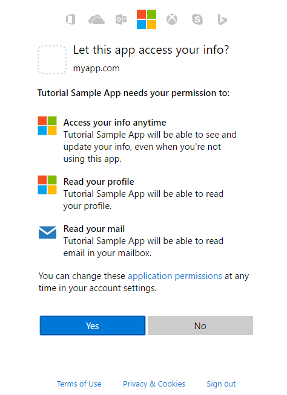

# Get access on behalf of a user
To use Microsoft Graph to read and write resources on behalf of a user, your app must get an access token from Azure AD and attach the token to requests that it sends to Microsoft Graph. The exact authentication flow that you will use to get access tokens will depend on the kind of app you are developing and whether you want to use OpenID Connect to sign the user in to your app. One common flow used by native and mobile apps and also by some Web apps is the OAuth 2.0 authorization code grant flow. In this topic, we will walk through an example using this flow. 

## Authentication and Authorization steps

The basic steps required to use the OAuth 2.0 authorization code grant flow to get an access token from the Azure AD v2.0 endpoint are:

1. Register your app with Azure AD. 
2. Get authorization. 
3. Get an access token.
4. Call Microsoft Graph with the access token.
5. Use a refresh token to get a new access token.

## 1. Register your app
To use the Azure v2.0 endpoint, you must register your app at the [Microsoft App Registration Portal](https://apps.dev.microsoft.com/). You can use either a Microsoft account or a work or school account to register an app. 

The following screenshot shows an example Web app registration.


To configure an app to use the OAuth 2.0 authorization code grant flow, you'll need to save the following values when registering the app:

- The Application ID assigned by the app registration portal.
- An Application Secret, either a password or a public/private key pair (certificate). This is not required for native apps. 
- A Redirect URL for your app to receive responses from Azure AD.

For steps on how to configure an app using the Microsoft App Registration Portal, see [Register your app](./auth_register_app_v2.md).

## 2. Get authorization
The first step to getting an access token for many OpenID Connect and OAuth 2.0 flows is to redirect the user to the Azure AD v2.0 `/authorize` endpoint. Azure AD will sign the user in and ensure their consent for the permissions your app requests. In the authorization code grant flow, after consent is obtained, Azure AD will return an authorization_code to your app that it can redeem at the Azure AD v2.0 `/token` endpoint for an access token.

### Authorization request 
The following shows an example request to the `/authorize` endpoint. 

With the Azure AD v2.0 endpoint, permissions are requested using the `scope` parameter. In this example, the Microsoft Graph permissions requested are for _User.Read_ and _Mail.Read_, which will allow the app to read the profile and mail of the signed-in user. The _offline\_access_ permission is requested so that the app can get a refresh token, which it can use to get a new access token when the current one expires. 

```
// Line breaks for legibility only

https://login.microsoftonline.com/{tenant}/oauth2/v2.0/authorize?
client_id=6731de76-14a6-49ae-97bc-6eba6914391e
&response_type=code
&redirect_uri=http%3A%2F%2Flocalhost%2Fmyapp%2F
&response_mode=query
&scope=offline_access%20user.read%20mail.read
&state=12345
```
| Parameter |  | Description |
| --- | --- | --- |
| tenant |required |The `{tenant}` value in the path of the request can be used to control who can sign into the application.  The allowed values are `common` for both Microsoft accounts and work or school accounts, `organizations` for work or school accounts only, `consumers` for Microsoft accounts only, and tenant identifiers such as the tenant ID or domain name.  For more detail, see [protocol basics](https://docs.microsoft.com/azure/active-directory/develop/active-directory-v2-protocols#endpoints). |
| client_id |required |The Application ID that the registration portal ([apps.dev.microsoft.com](https://apps.dev.microsoft.com/?referrer=https://azure.microsoft.com/documentation/articles&deeplink=/appList)) assigned your app. |
| response_type |required |Must include `code` for the authorization code flow. |
| redirect_uri |recommended |The redirect_uri of your app, where authentication responses can be sent and received by your app.  It must exactly match one of the redirect_uris you registered in the app registration portal, except it must be URL encoded.  For native and mobile apps, you should use the default value of `https://login.microsoftonline.com/common/oauth2/nativeclient`. |
| scope |required |A space-separated list of the Microsoft Graph permissions that you want the user to consent to. This may also include OpenID scopes. |
| response_mode |recommended |Specifies the method that should be used to send the resulting token back to your app.  Can be `query` or `form_post`. |
| state |recommended |A value included in the request that will also be returned in the token response.  It can be a string of any content that you wish.  A randomly generated unique value is typically used for [preventing cross-site request forgery attacks](http://tools.ietf.org/html/rfc6749#section-10.12).  The state is also used to encode information about the user's state in the app before the authentication request occurred, such as the page or view they were on. |

> **Important**: Microsoft Graph exposes two kinds of permissions: application and delegated. For apps that run with a signed-in user, you request delegated permissions in the `scope` parameter. These permissions delegate the privileges of the signed-in user to your app, allowing it to act as the signed-in user when making calls to Microsoft Graph. For more detailed information about the permissions available through Microsoft Graph, see the [Permissions reference](./permissions_reference.md).
 
### Consent experience

At this point, the user will be asked to enter their credentials to authenticate with Azure AD. The v2.0 endpoint will also ensure that the user has consented to the permissions indicated in the `scope` query parameter.  If the user has not consented to any of those permissions and if an administrator has not previously consented on behalf of all users in the organization, Azure AD will ask the user to consent to the required permissions.  

Here is an example of the consent dialog presented for a Microsoft account:



> **Try** If you have a Microsoft account or an Azure AD work or school account, you can try this for yourself by clicking on the link below. After signing in, your browser should be redirected to `https://localhost/myapp/` with a `code` in the address bar.
> 
> <a href="https://login.microsoftonline.com/common/oauth2/v2.0/authorize?client_id=6731de76-14a6-49ae-97bc-6eba6914391e&response_type=code&redirect_uri=http%3A%2F%2Flocalhost%2Fmyapp%2F&response_mode=query&scope=offline_access%20user.read%20mail.read&state=12345" target="_blank">https://login.microsoftonline.com/common/oauth2/v2.0/authorize...</a>

### Authorization response
If the user consents to the permissions your app requested, the response will contain the authorization code in the `code` parameter. Here is an example of a successful response to the request above. Because the `response_mode` parameter in the request was set to `query`, the response is returned in the query string of the redirect URL.

```
GET http://localhost/myapp/?
code=M0ab92efe-b6fd-df08-87dc-2c6500a7f84d
&state=12345
```
| Parameter | Description |
| --- | --- |
| code |The authorization_code that the app requested. The app can use the authorization code to request an access token for the target resource.  Authorization_codes are very short lived, typically they expire after about 10 minutes. |
| state |If a state parameter is included in the request, the same value should appear in the response. The app should verify that the state values in the request and response are identical. |

## 3. Get a token
Your app uses the authorization `code` received in the previous step to request an access token by sending a `POST` request to the `/token` endpoint.

### Token request
```
// Line breaks for legibility only

POST /common/oauth2/v2.0/token HTTP/1.1
Host: https://login.microsoftonline.com
Content-Type: application/x-www-form-urlencoded

client_id=6731de76-14a6-49ae-97bc-6eba6914391e
&scope=user.read%20mail.read
&code=OAAABAAAAiL9Kn2Z27UubvWFPbm0gLWQJVzCTE9UkP3pSx1aXxUjq3n8b2JRLk4OxVXr...
&redirect_uri=http%3A%2F%2Flocalhost%2Fmyapp%2F
&grant_type=authorization_code
&client_secret=JqQX2PNo9bpM0uEihUPzyrh    // NOTE: Only required for web apps
```

| Parameter |  | Description |
| --- | --- | --- |
| tenant |required |The `{tenant}` value in the path of the request can be used to control who can sign into the application.  The allowed values are `common` for both Microsoft accounts and work or school accounts, `organizations` for work or school accounts only, `consumers` for Microsoft accounts only, and tenant identifiers such as the tenant ID or domain name.  For more detail, see [protocol basics](https://docs.microsoft.com/azure/active-directory/develop/active-directory-v2-protocols#endpoints). |
| client_id |required |The Application ID that the registration portal ([apps.dev.microsoft.com](https://apps.dev.microsoft.com/?referrer=https://azure.microsoft.com/documentation/articles&deeplink=/appList)) assigned your app. |
| grant_type |required |Must be `authorization_code` for the authorization code flow. |
| scope |required |A space-separated list of scopes.  The scopes requested in this leg must be equivalent to or a subset of the scopes requested in the first (authorization) leg.  If the scopes specified in this request span multiple resource servers, then the v2.0 endpoint will return a token for the resource specified in the first scope. |
| code |required |The authorization_code that you acquired in the first leg of the flow. |
| redirect_uri |required |The same redirect_uri value that was used to acquire the authorization_code. |
| client_secret |required for web apps |The application secret that you created in the app registration portal for your app.  It should not be used in a native app, because client_secrets cannot be reliably stored on devices.  It is required for web apps and web APIs, which have the ability to store the client_secret securely on the server side. |

### Token response
Although the access token is opaque to your app, the response contains a list of the permissions that the access token is good for in the `scope` parameter. 

```
{
    "token_type": "Bearer",
    "scope": "user.read%20Fmail.read",
    "expires_in": 3600,
    "access_token": "eyJ0eXAiOiJKV1QiLCJhbGciOiJSUzI1NiIsIng1dCI6Ik5HVEZ2ZEstZnl0aEV1Q...",
    "refresh_token": "AwABAAAAvPM1KaPlrEqdFSBzjqfTGAMxZGUTdM0t4B4..."
}
```
| Parameter | Description |
| --- | --- |
| token_type |Indicates the token type value. The only type that Azure AD supports is Bearer |
| scope |A space separated list of the Microsoft Graph permissions that the access_token is valid for. |
| expires_in |How long the access token is valid (in seconds). |
| access_token |The requested access token. Your app can use this token to call Microsoft Graph. |
| refresh_token |An OAuth 2.0 refresh token. Your app can use this token to acquire additional access tokens after the current access token expires.  Refresh tokens are long-lived, and can be used to retain access to resources for extended periods of time.  For more detail, refer to the [v2.0 token reference](https://docs.microsoft.com/azure/active-directory/develop/active-directory-v2-tokens). |

## 4. Use the access token to call Microsoft Graph

Once you have an access token, you can use it to call Microsoft Graph by including it in the `Authorization` header of a request. The following request gets the profile of the signed-in user.

```
GET https://graph.microsoft.com/v1.0/me 
Authorization: Bearer eyJ0eXAiO ... 0X2tnSQLEANnSPHY0gKcgw
Host: graph.microsoft.com

```
A successful response will look similar to this (some response headers have been removed):

```
HTTP/1.1 200 OK
Content-Type: application/json;odata.metadata=minimal;odata.streaming=true;IEEE754Compatible=false;charset=utf-8
request-id: f45d08c0-6901-473a-90f5-7867287de97f
client-request-id: f45d08c0-6901-473a-90f5-7867287de97f
OData-Version: 4.0
Duration: 727.0022
Date: Thu, 20 Apr 2017 05:21:18 GMT
Content-Length: 407

{
    "@odata.context":"https://graph.microsoft.com/v1.0/$metadata#users/$entity",
    "id":"12345678-73a6-4952-a53a-e9916737ff7f",
    "businessPhones":[
        "+1 555555555"
    ],
    "displayName":"Chris Green",
    "givenName":"Chris",
    "jobTitle":"Software Engineer",
    "mail":null,
    "mobilePhone":"+1 5555555555",
    "officeLocation":"Seattle Office",
    "preferredLanguage":null,
    "surname":"Green",
    "userPrincipalName":"ChrisG@contoso.onmicrosoft.com"
}
```

## 5. Use the refresh token to get a new access token

Access tokens are short lived, and you must refresh them after they expire to continue accessing resources.  You can do so by submitting another `POST` request to the `/token` endpoint, this time providing the `refresh_token` instead of the `code`.

### Request
```
// Line breaks for legibility only

POST /common/oauth2/v2.0/token HTTP/1.1
Host: https://login.microsoftonline.com
Content-Type: application/x-www-form-urlencoded

client_id=6731de76-14a6-49ae-97bc-6eba6914391e
&scope=user.read%20mail.read
&refresh_token=OAAABAAAAiL9Kn2Z27UubvWFPbm0gLWQJVzCTE9UkP3pSx1aXxUjq...
&redirect_uri=http%3A%2F%2Flocalhost%2Fmyapp%2F
&grant_type=refresh_token
&client_secret=JqQX2PNo9bpM0uEihUPzyrh      // NOTE: Only required for web apps
```

| Parameter |  | Description |
| --- | --- | --- |
| client_id |required |The Application ID that the registration portal ([apps.dev.microsoft.com](https://apps.dev.microsoft.com/?referrer=https://azure.microsoft.com/documentation/articles&deeplink=/appList)) assigned your app. |
| grant_type |required |Must be `refresh_token`. |
| scope |required |A space-separated list of permissions (scopes).  The permissions requested must be equivalent to or a subset of the permissions requested in the original authorization_code request. |
| refresh_token |required |The refresh_token that you acquired during the token request. |
| redirect_uri |required |The same redirect_uri value that was used to acquire the authorization_code. |
| client_secret |required for web apps |The application secret that you created in the app registration portal for your app.  It should not be used in a native app, because client_secrets cannot be reliably stored on devices.  It is required for web apps and web APIs, which have the ability to store the client_secret securely on the server side. |

### Response
A successful token response will look similar to the following.

```
{
    "access_token": "eyJ0eXAiOiJKV1QiLCJhbGciOiJSUzI1NiIsIng1dCI6Ik5HVEZ2ZEstZnl0aEV1Q...",
    "token_type": "Bearer",
    "expires_in": 3599,
    "scope": "user.read%20mail.read",
    "refresh_token": "AwABAAAAvPM1KaPlrEqdFSBzjqfTGAMxZGUTdM0t4B4...",
}
```
| Parameter | Description |
| --- | --- |
| access_token |The requested access token. The app can use this token in calls to Microsoft Graph. |
| token_type |Indicates the token type value. The only type that Azure AD supports is Bearer |
| expires_in |How long the access token is valid (in seconds). |
| scope |The permissions (scopes) that the access_token is valid for. |
| refresh_token |A new OAuth 2.0 refresh token. You should replace the old refresh token with this newly acquired refresh token to ensure your refresh tokens remain valid for as long as possible. |

## Supported app scenarios and additional resources
You can call Microsoft Graph on behalf of a user from the following kinds of apps: 

- Native/Mobile apps 
- Web apps
- Single page apps (SPA)
- Back-end Web APIs: For example, in scenarios where a client app, like a native app, implements functionality in a Web API back end. With the Azure AD v2.0 endpoint, both the client app and the back-end Web API must have the same Application ID. 

For more information about supported app types with the Azure AD v2.0 endpoint, see [Types of apps](https://docs.microsoft.com/azure/active-directory/develop/active-directory-v2-flows).

> **Note**: Calling Microsoft Graph from a [standalone web API](https://docs.microsoft.com/azure/active-directory/develop/active-directory-v2-limitations#restrictions-on-app-types) is not currently supported by the Azure AD v2.0 endpoint. For this scenario, you need to use the Azure AD endpoint.

For more information about getting access to Microsoft Graph on behalf of a user from the Azure AD v2.0 endpoint:

- For links to protocol documentation and getting started articles for different kinds of apps, see the [Azure AD v2.0 endpoint documentation](https://docs.microsoft.com/azure/active-directory/develop/active-directory-appmodel-v2-overview). 
- For detailed explanations of authentication flows, see [v2.0 protocols](https://docs.microsoft.com/azure/active-directory/develop/active-directory-v2-protocols).
- For more information about recommended Microsoft and third-party authentication libraries and server middleware for Azure AD v2.0, see [Azure Active Directory v2.0 authentication libraries](https://docs.microsoft.com/azure/active-directory/develop/active-directory-v2-libraries).

## Azure AD endpoint considerations
There are several differences between using the Azure AD endpoint and the Azure AD v2.0 endpoint. For example:

- You use the [Azure portal](https://portal.azure.com) to configure your app. For more information about configuring apps with the Azure portal, see [Integrating applications with Azure Active Directory: Adding an application](https://docs.microsoft.com/azure/active-directory/develop/active-directory-integrating-applications#adding-an-application)
- Your app will require a different application ID (client ID) for each platform.
- If your app is a multi-tenant app, you must explicitly configure it to be multi-tenant at the [Azure portal](https://portal.azure.com).
- With the Azure AD endpoint, all permissions that your app needs must be configured by the developer. The Azure AD endpoint does not support dynamic (incremental) consent.
- The Azure AD endpoint uses a `resource` parameter in authorization and token requests to specify the resource, such as Microsoft Graph, for which it wants permissions. The endpoint does not support the `scope` parameter. 
- The Azure AD endpoint does not expose a specific endpoint for administrator consent. Instead apps use the `prompt=admin_consent` parameter in the authorization request to obtain administrator consent for an organization. For more information, see **Triggering the Azure AD consent framework at runtime** in [Integrating applications with Azure Active Directory](https://docs.microsoft.com/azure/active-directory/develop/active-directory-integrating-applications).

For more information about getting access to Microsoft Graph on behalf of a user from the Azure AD endpoint:

- For information about using the Azure AD endpoint with different kinds of apps, see the **Get Started** links in the [Azure Active Directory developers guide](https://docs.microsoft.com/azure/active-directory/develop/active-directory-developers-guide). The guide contains links to overview topics, code walk-throughs, and protocol documentation for different kinds of app supported by the Azure AD endpoint.
- For information about the Active Directory Authentication Library (ADAL) and server middleware available for use with the Azure AD endpoint, see [Azure Active Directory Authentication Libraries](https://docs.microsoft.com/azure/active-directory/develop/active-directory-authentication-libraries).

