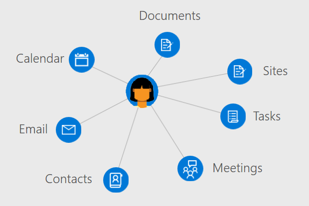

# Overview of users in Microsoft Graph

Users are the representation of an Azure Active Directory (Azure AD) work or school user account or a Microsoft account in Microsoft Graph. The **user** resource in Microsoft Graph is a hub from which you can access the relationships and resources that are relevant to your users.

## Develop user-centric applications

You can use Microsoft Graph to access the relationships, documents, contacts, and preferences that are contextually relevant to the signed-in user. The **user** resource provides straightforward way for you to access and manipulate user resources without having to perform additional calls, look up specific authentication information, and directly issue queries against other Microsoft Graph resources.

To access a user's information and data, you'll need to [get access on their behalf](https://developer.microsoft.com/graph/docs/concepts/auth_v2_user). Authenticating your application with [admin consent](https://developer.microsoft.com/en-us/graph/docs/concepts/permissions_reference) enables you to work with and update a wider range of entities associated with a user.

### Manage your organization

Create new users in your organization or update the resources and relationships for existing users. You can use Microsoft Graph to perform the following user management tasks: 

- Create or delete users in your Azure AD organization.
- List a user's group memberships and determine whether a user is a member of a group.
- List the users who report to a user and assign managers to a user.
- Upload or retrieve a photo for the user.

### Work with calendars and tasks

You can view, query, and update user calendar and calendar groups associated with a user, including:

- List and create events on a users calendar.
- View tasks assigned to a user.
- Find free meeting times for a set of users.
- Get a list of reminders set on a user's calendar.

### Administer mail and handle contacts

You can configure user mail settings and contact lists and send mail on a user's behalf, including:

- List mail messages and send new mail.
- Create and list user contacts and organize contacts in folders.
- Retrieve and update mailbox folders and settings.

### Enrich your app with user insights

Maximize relevance in your application by promoting recently used or trending documents and contacts associated with a user. You can use Microsoft Graph to:

- Return documents recently viewed and modified by a user.
- Return documents and sites trending around a user's activity.
- List documents shared with a user through email or OneDrive for Business.

## Next steps

- Learn more about how to [work with users](../api-reference/v1.0/resources/users.md).
- Explore your own data from the **user** resource in the [Graph Explorer](https://developer.microsoft.com/graph/graph-explorer).
- Authenticate with Microsoft Graph [on behalf of a user](auth_v2_user.md) or [as a daemon or service by consent of an administator](auth_v2_service.md).
- Set access control and policies for users with the [Azure AD API](../api-reference/v1.0/resources/azure_ad_overview.md).
- Review the [permissions](permissions_reference.md) your app will need to access user data. 
<!-- This isn't really a next step; let's remove to keep the list of links concise.>
- Stay up to date with the Microsoft Graph [changelog](https://developer.microsoft.com/graph/docs/concepts/changelog).
-->
