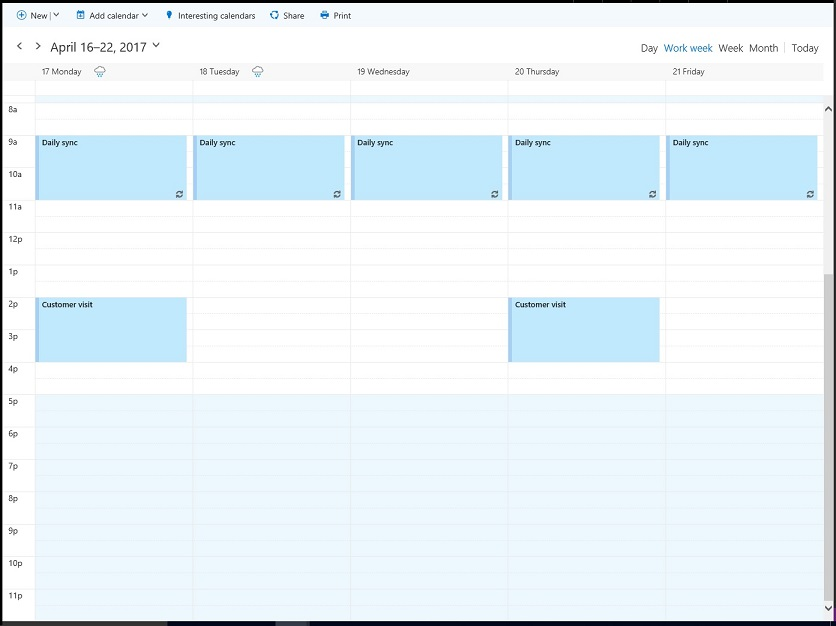
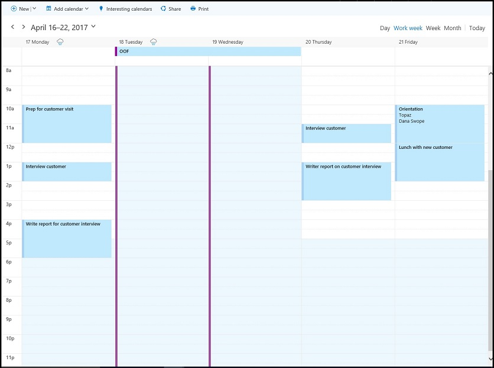

# Find possible meeting times on the Outlook calendar

In a workplace or school, looking for a common time and place to meet often incurs overhead. Microsoft Graph applications can use 
[findMeetingTimes](../api/user_findmeetingtimes.md) to identify any possible meeting times that satisfy time, location, and other constraints.   

The **findMeetingTimes** action lets you specify conditions such as the meeting date/time range, duration, optional or required attendees, and
nature of the activity (**activityDomain**). The action takes into account the attendees' and organizer's normal work schedules and free/busy status, and suggests 
times that are appropriate for the participants and type of activity. For instance, suggestions for a work-related activity always occur 
during the work hours of the organizer and attendees, and suggestions where required attendees are available are ordered higher up in the suggested list.

In Office 365, work hours and time zones are configurable per mailbox. The **findMeetingTimes** action handles time zone variations among the organizer 
and attendees. By default, **findMeetingTimes** returns suggestions in UTC. You can use the following request header to have **findMeetingTimes** return suggestions 
expressed in a specific time zone.
```
Prefer: outlook.timezone="{time-zone-string}}"
```

Especially useful for larger meetings, you can specify a percentage (**minimumAttendeePercentage**) for a quorum and have **findMeetingTimes** return suggestions 
only if that minimum attendee availability is met.

If **findMeetingTimes** cannot suggest any meeting times, it indicates a specific reason (**emptySuggestionsReason**), such as the organizer or a required attendee not available.
Based on this value, you can better adjust the parameters and call **findMeetingTimes** again.

>**Note** The **findMeetingTimes** action is currently available to Office 365 work or school mailboxes, but not personal, outlook.com mailboxes.

## Example

The following example shows how to use **findMeetingTimes** to return possible times for 2 users to meet for a couple of hours, taking into 
account the users' free/busy and work schedules, and the attendee being away for part of the time. Because there are only 2 users for this meeting, suggestions 
require 100% attendance. The following shows the users' free/busy schedule.

### Organizer's calendar



### Attendee's calendar



The example makes 2 calls to **findMeetingTimes**:

1. The first call looks in the date range of April 18-20.
As the attendee is out-of-office on April 18-19, and there is no commonly available time on April 20, the first call returns no suggestions 
with the reason (**emptySuggestionsReason**) that attendees are not available.
2. The second call looks for availability on April 21 and returns a suggestion of 2-4pm.

The two calls to **findMeetingTimes** include the following parameters. All [parameters](../api/user_findmeetingtimes.md#request-body) for **findMeetingTimes** are optional.

- **attendees**: one attendee, Samantha Booth, set as `required` for the **type** property
- **locationConstraint**: does not require any location suggestion
- **timeConstraint**: the first call looks in the date/time range of April 18, 9am to April 20, 5pm; after the first call fails to suggest any times, the second call looks at April 21, 9am to 5pm
- **meetingDuration**: two hours
- **returnSuggestionReasons**: this example requires a reason for each suggestion
- **minimumAttendeePercentage**: 100%, as the attendee must be able to attend for any suggested time

### First request

Look for a 2-hour free time slot for both users over April 18-20.

<!-- {
  "blockType": "ignored",
  "name": "findmeetingtimes_example_first"
}-->
```http
POST https://graph.microsoft.com/v1.0/me/findMeetingTimes
Prefer: outlook.timezone="Pacific Standard Time"
Content-type: application/json

{ 
  "attendees": [ 
    { 
      "type": "required",  
      "emailAddress": { 
        "name": "Samantha Booth",
        "address": "samanthab@contoso.onmicrosoft.com" 
      } 
    }
  ],  
  "locationConstraint": { 
    "isRequired": false,  
    "suggestLocation": false,  
    "locations": [ 
      { 
        "resolveAvailability": false,
        "displayName": "Conf room Hood" 
      } 
    ] 
  },  
  "timeConstraint": {
    "activityDomain":"work", 
    "timeslots": [ 
      { 
        "start": { 
          "dateTime": "2017-04-18T09:00:00",  
          "timeZone": "Pacific Standard Time" 
        },  
        "end": { 
          "dateTime": "2017-04-20T17:00:00",  
          "timeZone": "Pacific Standard Time" 
        } 
      } 
    ] 
  },  
  "meetingDuration": "PT2H",
  "returnSuggestionReasons": true,
  "minimumAttendeePercentage": 100
}
```

### First response
There is no 2-hour time slot during the work hours of April 18-20 when both users are available.
<!-- {
  "blockType": "ignored",
  "truncated": true,
  "@odata.type": "microsoft.graph.meetingTimeSuggestionsResult",
  "isCollection": false
} -->
```http
HTTP/1.1 200 OK
Content-type: application/json
Preference-Applied: outlook.timezone="Pacific Standard Time"
Content-Length: 184

{
    "@odata.context":"https://graph.microsoft.com/v1.0/$metadata#microsoft.graph.meetingTimeSuggestionsResult",
    "emptySuggestionsReason":"AttendeesUnavailable",
    "meetingTimeSuggestions":[

    ]
}
```

### Second request
Look for a 2-hour time slot on April 21.
<!-- {
  "blockType": "ignored",
  "name": "findmeetingtimes_example_second"
}-->
```http
POST https://graph.microsoft.com/v1.0/me/findMeetingTimes
Prefer: outlook.timezone="Pacific Standard Time"
Content-type: application/json

{ 
  "attendees": [ 
    { 
      "type": "required",  
      "emailAddress": { 
        "name": "Samantha Booth",
        "address": "samanthab@contoso.onmicrosoft.com" 
      } 
    }
  ],  
  "locationConstraint": { 
    "isRequired": false,  
    "suggestLocation": false,  
    "locations": [ 
      { 
        "resolveAvailability": false,
        "displayName": "Conf room Hood" 
      } 
    ] 
  },  
  "timeConstraint": {
    "activityDomain":"work", 
    "timeslots": [ 
      { 
        "start": { 
          "dateTime": "2017-04-21T09:00:00",  
          "timeZone": "Pacific Standard Time" 
        },  
        "end": { 
          "dateTime": "2017-04-21T17:00:00",  
          "timeZone": "Pacific Standard Time" 
        } 
      } 
    ] 
  },  
  "meetingDuration": "PT2H",
  "returnSuggestionReasons": true,
  "minimumAttendeePercentage": 100
}
```

### Second response
The second **findMeetingTimes** request suggests April 21, 2-4pm for both users to meet.
<!-- {
  "blockType": "ignored",
  "truncated": true,
  "@odata.type": "microsoft.graph.meetingTimeSuggestionsResult",
  "isCollection": false
} -->
```http
HTTP/1.1 200 OK
Content-type: application/json
Preference-Applied: outlook.timezone="Pacific Standard Time"
Content-Length: 714

{
    "@odata.context":"https://graph.microsoft.com/v1.0/$metadata#microsoft.graph.meetingTimeSuggestionsResult",
    "emptySuggestionsReason":"",
    "meetingTimeSuggestions":[
        {
            "confidence":100.0,
            "organizerAvailability":"free",
            "suggestionReason":"Suggested because it is one of the nearest times when all attendees are available.",
            "meetingTimeSlot":{
                "start":{
                    "dateTime":"2017-04-21T14:00:00.0000000",
                    "timeZone":"Pacific Standard Time"
                },
                "end":{
                    "dateTime":"2017-04-21T16:00:00.0000000",
                    "timeZone":"Pacific Standard Time"
                }
            },
            "attendeeAvailability":[
                {
                    "availability":"free",
                    "attendee":{
                        "type":"required",
                        "emailAddress":{
                            "address":"samanthab@contoso.onmicrosoft.com"
                        }
                    }
                }
            ],
            "locations":[
                {
                    "displayName":"Conf room Hood"
                }
            ]
        }
    ]
}
```


## Next steps

There are times when not all attendees can attend a meeting. You can have **findMeetingTimes** suggest a time if the _confidence_ for attendance reaches a certain percentage,
by specifying the **minimumAttendeePercentage** optional parameter. Learn more about the 
[confidence of a meeting suggestion](../api/user_findmeetingtimes.md#the-confidence-of-a-meeting-suggestion)
and other [parameters](../api/user_findmeetingtimes.md#request-body), and apply them as appropriate for meetings of larger sizes.

After getting meeting time suggestions, you may want to:

1. [Create an event and send it as a meeting request](../api/user_post_events.md).
2. [Add an attachment](../api/event_post_attachments.md) to the event.

Find out more about [integrating with Outlook calendar](outlook-calendar-concept-overview.md).
