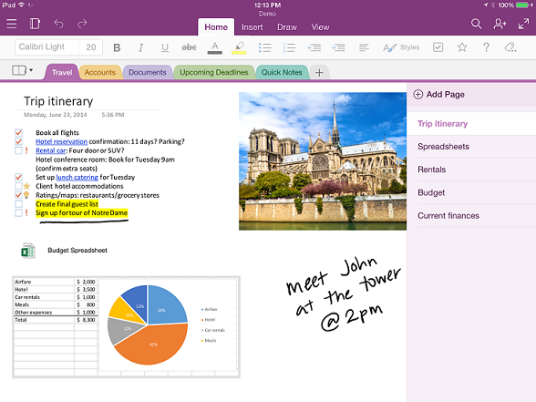

# OneNote API overview

OneNote is a digital notebook that lets customers track ideas and notes for home, school, or work, by typing, sketching, or voice, on the web, phone, tablet, or desktop. They can freely organize notes, switch devices and pick up where they leave off, and collaborate on notes with others in real time.

## Why integrate with OneNote?

By integrating your apps with OneNote, you can create empowering experiences across multiple platforms that reach millions of users worldwide. You can use Microsoft Graph to access notebooks, sections, and pages in OneNote to create solutions that help your users plan and organize ideas and information.

### Collect and organize notes and ideas  
Use OneNote as a canvas where users can add and arrange their content. Microsoft Graph makes it easy to write apps that enable students to take notes and do research, families to share plans and ideas, or shoppers to share pictures. Your app can grab the information people want, send it to OneNote, and then help them organize it.

### Capture information in many formats
Capture HTML, embed images (sourced locally or at a public URL), video, audio, email messages, and other common file types. OneNote can even render webpages and PDF files as snapshots. Microsoft Graph supports a set of standard HTML and CSS for OneNote page layout, so you can use tables, inline images, and basic formatting to get the look you want. 

### Use the OneNote ecosystem to enhance your core scenarios
Tap into other powerful OneNote features. The OneNote APIs in Microsoft Graph run OCR on images, support full-text search, auto-syncs clients, process images, and extract business card captures and online product and recipe listings. Use OneNote as your digital memory store in the cloud for notes and lightweight media, or as a data feed for domain-specific data. 

### Reach millions of OneNote users on all major platforms
Use OneNote to increase your app usage. OneNote is preinstalled on new Windows devices, and is available for most platforms, online, and as part of Office 365. When you publish apps that use the feature-rich OneNote environment, you have access to broad cross-platform market potential.

<!-- Might be good to show a few examples of Microsoft Graph API calls here, similar to what we have in the featured scenarios topic: https://developer.microsoft.com/en-us/graph/docs/concepts/featured_scenarios. You could have an H2 section called "What can I do with OneNote APIs in Microsoft Graph?"-->

## What can I do with OneNote APIs in Microsoft Graph?

The following are some of the most popular requests for working with OneNote resources.

|Operation|URL|
|:--------|:--|
|GET my notebooks|[https://graph.microsoft.com/v1.0/me/onenote/notebooks](https://developer.microsoft.com/en-us/graph/graph-explorer?request=me/onenote/notebooks&version=1.0)|
|GET my sections|[https://graph.microsoft.com/v1.0/me/onenote/sections](https://developer.microsoft.com/en-us/graph/graph-explorer?request=me/onenote/sections&version=1.0)|
|GET my pages|[https://graph.microsoft.com/v1.0/me/onenote/pages](https://developer.microsoft.com/en-us/graph/graph-explorer?request=me/onenote/pages&version=1.0)|

## Learn more about OneNote APIs

Take an in-depth look at Microsoft Graph APIs to learn about the OneNote content updating capabilities. The topics in the following list show you how to create new OneNote pages and update existing pages with new content. You'll also learn about best practices in using Microsoft Graph to update OneNote notebooks. 

**Work with OneNote**

* [Use the OneNote REST API](../resources/onenote-api-overview.md)
* [Best practices](onenote_best_practices.md)
* [Branding guidelines](onenote-branding.md)
* [Open the OneNote client](open_onenote_client.md)
* [Use note tags in OneNote pages](onenote-note-tags.md)
* [Error codes for OneNote APIs in Microsoft Graph](onenote_error_codes.md)

**Work with OneNote pages**

* [Input and output HTML in OneNote pages](onenote_input_output_html.md)
* [Get OneNote content and structure with Microsoft Graph](onenote-get-content.md)
* [Create OneNote pages](onenote-create-page.md)
* [Update OneNote page content](onenote_update_page.md)

**Work with OneNote page content**

* [Create absolute positioned elements in OneNote pages](onenote-abs-pos.md)
* [Add images, videos, and files to OneNote pages](onenote_images_files.md)
* [Use OneNote API div tags to extract data from captures](onenote-extract-data.md)

## Explore the OneNote APIs
Use the [Microsoft Graph Explorer](https://developer.microsoft.com/en-us/graph/graph-explorer) to try out the OneNote APIs with your own OneNote notebooks.

To make OneNote API calls from the Graph Explorer, choose **Show more samples** in the column on the left. Use the menu to toggle OneNote **On**. You will also need to enable the appropriate permissions. Under your account name in the menu on the left, choose **modify permissions**. For more information about OneNote permissions, see [Notes permissions](permissions_reference.md#notes-permissions).

To get started with OneNote APIs in Microsoft Graph, see the [OneNote reference content](../resources/onenote-api-overview.md).
