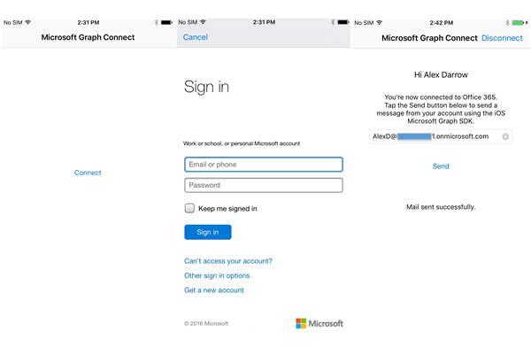

# Get started with Microsoft Graph in a Swift iOS App

> **Building apps for enterprise customers?** Your app may not work if your enterprise customer turns on enterprise mobility security features like <a href="https://azure.microsoft.com/en-us/documentation/articles/active-directory-conditional-access-device-policies/" target="_newtab">conditional device access</a>. In this case, you may not know and your customers may experience errors. 

> To support **all enterprise customers** across **all enterprise scenarios**, you must use the Azure AD endpoint and manage your apps using the [Azure portal](https://aka.ms/aadapplist). For more information, see [Deciding between the Azure AD and Azure AD v2.0 endpoints](../concepts/auth_overview.md#deciding-between-the-azure-ad-and-azure-ad-v20-endpoints).

This article describes the tasks required to get an access token from the [Azure AD v2.0 endpoint](https://developer.microsoft.com/en-us/graph/docs/concepts/converged_auth) and call Microsoft Graph. It walks you through the code inside the [Office 365 Connect Sample for iOS (REST)](https://github.com/microsoftgraph/ios-swift-connect-rest-sample) to explain the main concepts that you implement in an app that uses Microsoft Graph. It describes how to access Microsoft Graph by using REST operations in an asynchronous **Promise chain** pattern.  Promises in the sample are implemented by using the [mxcl/PromiseKit 4.5.2](https://github.com/mxcl/PromiseKit/blob/master/README.md) CocoaPod. 

The sample was created using **XCode 9.2** and **Swift 3.2**.

You can download the version of the app that you'll create from this GitHub repo:

* [Office 365 Connect Sample for iOS Using the Microsoft Graph SDK](https://github.com/microsoftgraph/ios-swift-connect-rest-sample)

The following image shows the app you'll create.




The workflow authenticates and authorizes the sample to access  Microsoft Graph resources, signs in with your work or personal account, and finally sends a mail to a recipient.

**Don't feel like building an app?** Use the [Microsoft Graph quick start](https://developer.microsoft.com/en-us/graph/quick-start) to get up and running fast.

## Prerequisites

To get started, you'll need: 

* [Xcode](https://developer.apple.com/xcode/downloads/) from Apple
* Installation of [CocoaPods](https://guides.cocoapods.org/using/using-cocoapods.html) as a dependency manager
* Installation of [Carthage](https://github.com/Carthage/Carthage) to import and build the **MSAL** library.
* Installation of the [PromiseKit 4.5.2](https://github.com/mxcl/PromiseKit/blob/master/Documentation/Installation.md) Cocoapod. 
* A [Microsoft account](https://www.outlook.com/) or a [work or school account](https://docs.microsoft.com/en-us/office/developer-program/office-365-developer-program-faq#account-types)

## Register the app
 
1. Sign into the [App Registration Portal](https://apps.dev.microsoft.com/) using either your personal or work or school account.
2. Select **Add an app**.
3. Enter a name for the app, and select **Create application**.
	
	The registration page displays, listing the properties of your app.
 
4. Under **Platforms**, select **Add platform**.
5. Select **Native platform**.
6. Copy the Client Id to the clipboard. You'll need to enter this value into the sample app.

	The app id is a unique identifier for your app. 

7. Select **Save**.

## Importing the project dependencies

1. Clone this repository, [Office 365 Connect Sample for iOS Using the Microsoft Graph SDK](https://github.com/microsoftgraph/ios-swift-connect-rest-sample). 


2. Use CocoaPods to import the PromiseKit dependencies. This sample app already contains a podfile that will get the pods into the project. Navigate to the root folder of the project in the **Terminal** app, and from **Terminal** run:

        pod install

   You will receive confirmation that the pods have been imported into the project. For more information, see [CocoaPods](https://guides.cocoapods.org/using/using-cocoapods.html)

## Install the MSAL authentication framework

The preview version of MSAL is distributed as header and symbol files using Carthage. To install MSAL in the project, do these steps:

1. Open the Bash terminal and go to the app root folder.
2. Create a **cartfile**: Copy `echo "github \"AzureAD/microsoft-authentication-library-for-objc\" \"master\"" > Cartfile`  into the terminal and run the command.
3. Build the MSAL library: Copy `carthage update` into the terminal and run the command.


## Enable keychain sharing
 
For Xcode8, you need to add the keychain group or your app will fail to access keychain. 
To add the keychain group:
 
1. Select the project on the project manager panel in XCode. (⌘ + 1).
 
2. Select the **O365-iOS-Microsoft-Graph-Connect-swift** target.

3. On the **General** tab and **Signing** section, verify that **Automatically manage signing** is checked and you have a valid signing certificate.
 
3. On the **Capabilities** tab, enable **Keychain Sharing**.
 
4. If **com.microsoft.O365-iOS-Microsoft-Graph-Connect-Swift-REST** is not in the list of Keychain Groups, add it.

## Authenticating with Microsoft Graph

The UI workflow is as follows: The app asks the user to authenticate. After authentication, the user can send a mail to another user. To make requests against Microsoft Graph, the sample uses the **MSAL** authentication library to authenticate HTTPS requests with an appropriate OAuth 2.0 bearer token. In the sample project the **AuthenticationClass.swift.** class imports the **MSAL** library and acquires the access token needed for Microsoft Graph REST operations.

1. Open the **XCode** project workspace (**Graph-iOS-Swift-Connect.xcworkspace**), and open the class file **AuthenticationClass.swift** Find the following code in that class.


  ```swift
     /**
     Authenticates to Microsoft Graph.
     If a user has previously signed in before and not disconnected, silent log in
     will take place.
     If not, authentication will ask for credentials
     */
    func connectToGraph(scopes: [String],
                        completion:@escaping (_ error: ApplicationConstants.MSGraphError?, _ accessToken: String) -> Bool)  {
        do {
            if let initError = self.lastInitError {
                if initError.lengthOfBytes(using: String.Encoding.ascii) > 1 {
                    throw NSError.init(domain: initError, code: 0, userInfo: nil)
                }
            }
            // We check to see if we have a current logged in user. If we don't, then we need to sign someone in.
            // We throw an interactionRequired so that we trigger the interactive signin.
            if  try authenticationProvider.users().isEmpty {
                throw NSError.init(domain: "MSALErrorDomain", code: MSALErrorCode.interactionRequired.rawValue, userInfo: nil)
            } else {
                // Acquire a token for an existing user silently
                try authenticationProvider.acquireTokenSilent(forScopes: scopes, user: authenticationProvider.users().first) { (result, error) in
                    if error == nil {
                        self.accessToken = (result?.accessToken)!
                        _ = completion(nil, self.accessToken);
                    } else {
                        //"Could not acquire token silently: \(error ?? "No error information" as! Error )"
                       var _ = completion(ApplicationConstants.MSGraphError.nsErrorType(error: error! as NSError), "");
                    }
                }
            }
        }  catch let error as NSError {
            // interactionRequired means we need to ask the user to sign-in. This usually happens
            // when the user's Refresh Token is expired or if the user has changed their password
            // among other possible reasons.
            if error.code == MSALErrorCode.interactionRequired.rawValue {
                authenticationProvider.acquireToken(forScopes: scopes) { (result, error) in
                    if error == nil {
                        self.accessToken = (result?.accessToken)!
                        var _ = completion(nil, self.accessToken);
                    } else  {
                        var _ = completion(ApplicationConstants.MSGraphError.nsErrorType(error: error! as NSError), "");
                    }
                }
            } else {
                var _ = completion(ApplicationConstants.MSGraphError.nsErrorType(error: error as NSError), error.localizedDescription);

            }
        } catch {
            // This is the catch all error.
            var _ = completion(ApplicationConstants.MSGraphError.nsErrorType(error: error as NSError), error.localizedDescription);
        }
    }

  ```


2. We'll call the **connectToGraph** function from **ConnectViewController.swift**. This controller is the default view that the app loads with a single button named **Connect** that the user taps to start authenticating. 

  ```swift
// MARK: Authentication
private extension ConnectViewController {
    func authenticate() {
        loadingUI(show: true)
        let scopes = ApplicationConstants.kScopes
        AuthenticationClass.sharedInstance?.connectToGraph( scopes: scopes) {
            (result: ApplicationConstants.MSGraphError?, accessToken: String) -> Bool  in
            defer {self.loadingUI(show: false)}
            if let graphError = result {
                switch graphError {
                case .nsErrorType(let nsError):
                    print(NSLocalizedString("ERROR", comment: ""), nsError.userInfo)
                    self.showError(message: NSLocalizedString("CHECK_LOG_ERROR", comment: ""))
                }
                return false
            }
            else {
                // run on main thread!!
                DispatchQueue.main.async {
                    self.performSegue(withIdentifier: "sendMail", sender: nil)
                }
                return true
            }
        }
    }
}

  ```

## Send an email with Microsoft Graph

After connecting the user to Microsoft Graph, the sample gets the authenticated user's email address, display name, and profile photo. The sample uploads the profile photo to the user's OneDrive root folder and asks OneDrive for the sharing Url of the picture. Finally, the sample posts a REST request to Microsoft Graph to send a mail message to the provided email address. 

The message body contains the picture sharing link and the picture itself as an attached image file. The default recipient is the authenticated user, but the sample allows the user to provide the email address of any other user. 

The code we'll work with here is in the class **SendMailViewController_WithPromise.swift.** The `viewDidLoad()` function reads the `self.emailTextField.text` value to get the mail recipient's email address and then starts a **promise chain** to get the authenticated user's profile picture. If the promise is rejected, the `sendMailButton` is not enabled.

1. Open **SendMailViewController_WithPromise.swift.** and find the `viewDidLoad` function. The `self.userPictureWork` function is called to start the promise chain.

   ```swift
    override func viewDidLoad() {
        super.viewDidLoad()
        //Get user state values before creating mail message to be sent
        do
        {
            try self.userName = AuthenticationClass.sharedInstance?.authenticationProvider.users()[0].name!
            try self.emailTextField.text = AuthenticationClass.sharedInstance?.authenticationProvider.users()[0].displayableId
            self.userEmailAddress = self.emailTextField.text
            self.headerLabel.text = "Hi, \(self.userName! )"
            
            updateUI(showActivityIndicator: true, statusText: "Getting picture", sendMail: true)

            //Important: Break out of async promise chain by declaring result returns Void
            _ = self.userPictureWork().then{
                result -> Void in
                    self.userPictureUrl = (result[1] as! String)
                    self.userProfilePicture = (result[0] as! UIImage)
                    self.updateUI(showActivityIndicator: false, statusText: "", sendMail: true)

            }.catch{err -> Void  in
                self.updateUI(showActivityIndicator: false, statusText: "", sendMail: false)

            }
        } catch _ as NSError{
            self.updateUI(showActivityIndicator: false,
                          statusText: "Error getting user profile picture.", sendMail: false)
        }
    }
  
   ```

   

1. Find the mail request creation helper function in the class:

   ```swift
    /**
     Prepare mail content by loading the JSON request payload template and HTML message body template from resources and replacing placeholders in the templates with appropriate values.
     */
    func mailContent() -> Data? {
        if let emailFilePath = Bundle.main.path(forResource: "EmailPostContent", ofType: "json"),
            let emailBodyFilePath = Bundle.main.path(forResource: "EmailBody", ofType: "html")
        {
            do {
                // Prepare upload content
                let emailContent = try String(contentsOfFile: emailFilePath, encoding: String.Encoding.utf8)
                let emailBodyRaw = try String(contentsOfFile: emailBodyFilePath, encoding: String.Encoding.utf8)
                // Request doesn't accept a single quotation mark("), so change it to the acceptable form (\")
                var emailValidBody: String;
                emailValidBody = emailBodyRaw.replacingOccurrences(of: "\"", with: "\\\"")
                emailValidBody = emailValidBody.replacingOccurrences(of: "a href=%s", with: ("a href=" + self.userPictureUrl!))
                let imageData: NSData = UIImagePNGRepresentation(self.userProfilePicture!)! as NSData;
                let emailPostContent = emailContent.replacingOccurrences(of: "<EMAIL>", with: self.emailTextField.text!)
                    .replacingOccurrences(of: "<CONTENTTYPE>", with: "HTML")
                    .replacingOccurrences(of: "<CONTENT>", with: emailValidBody)
                    .replacingOccurrences(of: "<ODATA.TYPE>", with: "#microsoft.graph.fileAttachment")
                    .replacingOccurrences(of: "<IMAGE.TYPE>", with: "image\\/png")
                    .replacingOccurrences(of: "<CONTENTBYTES>", with: imageData.base64EncodedString())
                    .replacingOccurrences(of: "<NAME>", with: "me.png")
                // Return JSON payload with mail body as HTML string and attached picture as a file attachment of type NSData
                return emailPostContent.data(using: String.Encoding.utf8)
            }
            catch {
                // Error handling in case file loading fails.
                return nil
            }
        }
        // Error handling in case files aren't present.
        return nil
    }

   ```
2. Find the following helper functions for getting the user's profile picture,  uploading the photograph to OneDrive, and requesting a sharing link for the picture:

   ```swift
    /**
      Async func. Get user's profile photo, upload photo to OneDrive, and get sharing link
     - returns:
        Promise<UIImage>. The user's profile picture
     */
    func getUserPicture()->Promise<UIImage?>{
        return Promise{ fulfill, reject in
            let urlRequest = self.buildRequest(operation: "GET", resource: "photo/$value") as URLRequest
            let task = URLSession.shared.dataTask(with:urlRequest){ data , res , err in
                if let err:Error = err {
                    print(err.localizedDescription)
                    return reject(err)
                }
                if ((self.checkResult(result: res!)) != HTTPError.NoError) {
                    return fulfill(self.getDefaultPicture())
                }
                if let data = data {
                    if let userImage: UIImage = UIImage(data:data) {
                        self.userProfilePicture = userImage
                        return fulfill(userImage)
                    } else {
                        return reject("no image" as! Error)
                    }
                } else {
                    return fulfill(self.getDefaultPicture())
                }
            }
            task.resume()
        }
    }
    
    /**
     Async func. Uploads a UIImage object to the signed in user's OneDrive root folder
     - Returns:
        A Promise encapsulating an array of AnyObject. Element 0 contains the user profile photo obtained in the previous chained async call
        Element 1 contains the web sharing URL of the photo in OneDrive as a String
     - Parameters:
     - UIImage: The image to upload to OneDrive
     */
    func uploadPicture(photo: UIImage) -> Promise<[AnyObject]> {
        return Promise<[AnyObject]>{ fulfill, reject in
            let uploadRequestUrl = self.buildRequest(operation: "PUT", resource: "drive/root:/me.jpg:/content", content: UIImageJPEGRepresentation(photo, 1.0)!) as URLRequest
            let task = URLSession.shared.dataTask(with:uploadRequestUrl){ data, res, err in
                if let err = err{
                    return reject(err)
                }
                if ((self.checkResult(result: res!)) != HTTPError.NoError) {
                    return reject(HTTPError.InvalidRequest)
                }
                //data can be serialized to a DriveItem object
                //https://developer.microsoft.com/en-us/graph/docs/api-reference/v1.0/resources/driveitem
                var itemId: String = "";
                if let responseContent = data {
                    itemId = self.getValueFromResponse(json: responseContent, key: "id" )
                    var returnValues = [AnyObject]();
                    returnValues.append(photo as AnyObject)
                    returnValues.append(itemId as AnyObject)
                    return fulfill(returnValues)
                }
            }
            task.resume()
        }
    }

    /**
     Async func. Requests a new sharing link for the OneDrive item specified by the item id.
     - returns:
     - Promise<String: AnyObject>. The new sharing link and the image wrapped in a Promise
     */
    func createSharingLink(itemId: String, image: UIImage) ->Promise<[AnyObject]>{
        return Promise<[AnyObject]>{ fulfill, reject in
            //Create Data object for the JSON payload
            if let sharingLinkFilePath = Bundle.main.path(forResource: "CreateSharingLink", ofType: "json")
            {
                do {
                    let sharingLinkcontent = try String(contentsOfFile: sharingLinkFilePath, encoding: String.Encoding.utf8)
                    let jsonPayload: Data = sharingLinkcontent.data(using: String.Encoding.utf8)!
                    let uploadRequestUrl = self.buildRequest(
                        operation: "POST", resource: "drive/items/"+itemId+"/createLink", content: jsonPayload) as URLRequest
                    let task = URLSession.shared.dataTask(with:uploadRequestUrl){ data, res, err in
                        if let err = err{
                            return reject(err)
                        }
                        if ((self.checkResult(result: res!)) != HTTPError.NoError) {
                            return reject(HTTPError.InvalidRequest)
                        }
                        //data can be serialized to a DriveItem object
                        //https://developer.microsoft.com/en-us/graph/docs/api-reference/v1.0/resources/driveitem
                        var sharingLink: String = "";
                        if let responseContent = data {
                            do {
                                let resultJson = try JSONSerialization.jsonObject(
                                    with: responseContent, options: []) as? [String:AnyObject]
                                sharingLink = (OneDriveFileLink.init(json:resultJson!)?.webUrl)!

                            } catch let error as NSError {
                                print(error)
                            }
                            var returnValues = [AnyObject]();
                            returnValues.append(image as AnyObject)
                            returnValues.append(sharingLink as AnyObject)
                            return fulfill(returnValues)
                        }
                    }
                    task.resume()

                }
            }
        }
   ```

3. Find the following send mail function in the class.  
 
   ```swift
    /**
     POSTS a new message to the sendmail resource
     - parameters:
        - Data: The body of the message
     */
    func sendMailRESTWithContent(_ content: Data) {
        let _ = self.sendCRUDMessage(resource: "microsoft.graph.sendmail",
                                     operation: "POST",
                                     content: content)
    }
    
    /**
     Send a create, read, update, delete (CRUD) message.
     Create= POST, Update= PUT, Delete= DELETE.
     Read= GET. Use sendGETMessage(resource: String) to read Graph contents
     - returns:
     JSON response as Data
     - parameters:
        - String: The REST resource receiving the CRUD request
        - String: the REST operation requested
        - Data: The json (as Data) representing the values to update
     */
    func sendCRUDMessage(resource: String, operation:String, content: Data)->Data  {
        var returnData: Data;
        returnData = Data.init();
        if  (self.connectToGraph()){
            if (operation == "GET") {
                return self.sendGETMessage(resource: resource)
            }
            let request = self.buildRequest(operation: operation, resource: resource, content:content);
            let task = URLSession.shared.dataTask(with:request as URLRequest, completionHandler:{ data, res, err in
                if let err = err{
                    self.updateUI(showActivityIndicator: false,
                             statusText: "Error assembling the mail content." + err.localizedDescription, sendMail: false)
                }
                let nttpError = self.checkResult(result: res!)
                if (nttpError != HTTPError.NoError) {
                    self.updateUI(showActivityIndicator: false,
                                  statusText: "Error sending the mail.", sendMail: false)
                }
                else {
                    self.updateUI(showActivityIndicator: false, statusText: "", sendMail: true)
                }
            }) // let task
             task.resume()
        }
        return returnData;
    }

   ```


## Run the app
1. Before running the sample you'll need to supply the client ID you received from the registration process in the section **Register the app.** Open **Info.plist** as source code. 

   - Replace  `ENTER_CLIENT_ID_HERE` with the **ClientID** from the registration process. Be sure that `msal` is not replaced. After you replace the string, the array string value looks like `msal48d31887-5fad-4d73-a9f5-3c356e68a038` where the GUID portion is **your** client Id:  

   For example, 

  ```xml
    <key>CFBundleURLTypes</key>
    <array>
        <dict>
            <key>CFBundleTypeRole</key>
            <string>Editor</string>
            <key>CFBundleURLName</key>
            <string>$(PRODUCT_BUNDLE_IDENTIFIER)</string>
            <key>CFBundleURLSchemes</key>
            <array>
                <string>msalENTER_CLIENT_ID_HERE</string>
                <string>auth</string>
            </array>
        </dict>
    </array>
  ```

     becomes... 

  ```xml
    <key>CFBundleURLTypes</key>
    <array>
        <dict>
            <key>CFBundleTypeRole</key>
            <string>Editor</string>
            <key>CFBundleURLName</key>
            <string>$(PRODUCT_BUNDLE_IDENTIFIER)</string>
            <key>CFBundleURLSchemes</key>
            <array>
                <string>msal48d31887-5fad-4d73-a9f5-3c356e68a038</string>
                <string>auth</string>
            </array>
        </dict>
    </array>
  ```

> **Note:** You'll notice that the following permission scopes have been configured for this project: `["https://graph.microsoft.com/Mail.ReadWrite","https://graph.microsoft.com/Mail.Send","https://graph.microsoft.com/Files.ReadWrite","https://graph.microsoft.com/User.ReadBasic.All"]`
. 
The service calls used in this project, sending a mail to your mail account and retrieving some profile information (Display Name, Email Address), and writing to the user's OneDrive root require these permissions for the app to run without a permissions error.

2. Run the sample, tap **Connect,** sign in with your personal or work or school account, and grant the requested permissions.

3. Choose the **Send email** button. When the mail is sent, a success message is displayed below the button.

## Next steps
- Try out the REST API using the [Graph explorer](https://graph.microsoft.io/graph-explorer).
- Find examples of common operations for SDK operations in the [Microsoft Graph iOS Objective C Snippets Sample](https://github.com/microsoftgraph/ios-objectiveC-snippets-sample).

## See also
- [Azure AD v2.0 protocols](https://azure.microsoft.com/en-us/documentation/articles/active-directory-v2-protocols/)
- [Azure AD v2.0 tokens](https://azure.microsoft.com/en-us/documentation/articles/active-directory-v2-tokens/)
