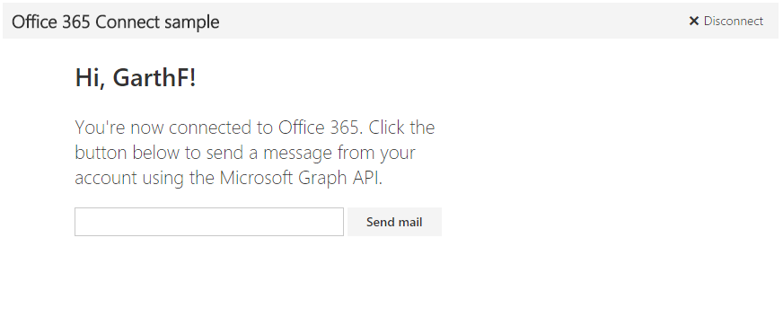

# Get started with Microsoft Graph in a Node.js app

This article describes the tasks required to get an access token from the Azure AD v2.0 endpoint and call Microsoft Graph. It walks you through building the [Microsoft Connect sample for Node.js](https://github.com/microsoftgraph/nodejs-connect-rest-sample) and explains the main concepts that you implement to use Microsoft Graph. The article describes how to access the Microsoft Graph API by using raw REST calls. If you're interested in building a Node.js app that connects to Microsoft Graph with the JavaScript SDK, see our [Microsoft Graph SDK-based Node.js Connect sample](https://github.com/microsoftgraph/nodejs-connect-sample).

The following image shows is the app you'll create. 

**Don't feel like building an app?** Use the [Microsoft Graph quick start](https://graph.microsoft.io/en-us/getting-started) to get up and running fast.

To download a version of the Connect sample that uses the Azure AD endpoint, see [Microsoft Graph Connect Sample for Node.js](https://github.com/microsoftgraph/nodejs-connect-rest-sample/releases/tag/last_v1_auth).

## Prerequisites

To get started, you'll need: 

- A [Microsoft account](https://www.outlook.com/) or a [work or school account](https://docs.microsoft.com/en-us/office/developer-program/office-365-developer-program-faq#account-types)
- [Node.js with npm](https://nodejs.org/en/download/) 
- The [Microsoft Connect sample for Node.js](https://github.com/microsoftgraph/nodejs-connect-rest-sample). You'll use the **starter-project** folder in the sample files for this walkthrough.

## Register the application
Register an app on the Microsoft App Registration Portal. This generates the app ID and password that you'll use to configure the app in Visual Studio.

1. Sign into the [Microsoft App Registration Portal](https://apps.dev.microsoft.com/) using either your personal or work or school account.

2. Choose **Add an app**.

3. Enter a name for the app, and choose **Create application**. 
	
	The registration page displays, listing the properties of your app.

4. Copy the application ID. This is the unique identifier for your app. 

5. Under **Application Secrets**, choose **Generate New Password**. Copy the password from the **New password generated** dialog.

	You'll use the application ID and application password (secret) to configure the app. 

6. Under **Platforms**, choose **Add platform** > **Web**.

7. Enter *http://localhost:3000/token* as the Redirect URI. 

8. Choose **Save**.

## Configure the project
1. Open the **starter-project** folder in the sample files.

1. In a command prompt, run the following command in the root directory of the starter project. This installs the project dependencies.

		npm install

1. In the starter project files, open utils\config.js.

1. In the **credentials** field, replace the **ENTER\_YOUR\_CLIENT\_ID** and **ENTER\_YOUR\_SECRET** placeholder values with the values you just copied.

  
## Authenticate the user and get an access token
In this step, you'll add sign-in and token management code. But first, let's take a closer look at the auth flow.

This app uses the authorization code grant flow with a delegated user identity. For a web application, the flow requires the application ID, secret, and redirect URI from the registered app. 

The auth flow can be broken down into these basic steps:

1. Redirect the user for authentication and consent
2. Get an authorization code
3. Redeem the authorization code for an access token
4. Use the refresh token to get a new access token when the access token expires

The app uses the [oauth](https://www.npmjs.com/package/oauth) middleware to authenticate and obtain tokens. It uses the [cookie-parser](https://www.npmjs.com/package/cookie-parser) middleware to cache token information in cookies. The code used to store and access token information is found in the index.js controller.
    
   >**Important** The simple authentication and token handling in this project is for sample purposes only. In a production app, you should construct a more robust way of handling authentication, including validation and secure token handling.

Now you're ready to add code to call Microsoft Graph. 

## Call Microsoft Graph
The app calls Microsoft Graph to get user information and to send an email on the user's behalf. These calls are initiated from the index.js controller in response to UI events.

1. Open utils\graphHelper.js.

1. Replace the **getUserData** function with the following code. This configures and sends the GET request to the */me* endpoint and processes the response.

		function getUserData(accessToken, callback) {
		  request
		   .get('https://graph.microsoft.com/v1.0/me')
		   .set('Authorization', 'Bearer ' + accessToken)
		   .end((err, res) => {
		     callback(err, res);
		   });
		}

1. Replace the **getProfilePhoto** function with the following code. This configures and sends the GET request to the */me/photo/$value* endpoint and processes the response. Note that profile photos aren't currently available for MSA accounts.
	
		function getProfilePhoto(accessToken, callback) {
		  // Get the profile photo of the current user (from the user's mailbox on Exchange Online).
		  // This operation in version 1.0 supports only work or school mailboxes, not personal mailboxes.
		  request
		   .get('https://graph.microsoft.com/v1.0/me/photo/$value')
		   .set('Authorization', 'Bearer ' + accessToken)
		   .end((err, res) => {
		     // Returns 200 OK and the photo in the body. If no photo exists, returns 404 Not Found.
		     callback(err, res.body);
		   });
		}

1. Replace the **uploadFile** function with the following code. This configures and sends the PUT request to the */me/drive/root/children/mypic.jpg/content* endpoint. If the file exists, this requests updates the content. If it doesn't exist, it creates the file and uploads the contents of the profile photo. 

		function uploadFile(accessToken, file, callback) {
		  // This operation only supports files up to 4MB in size.
		  // To upload larger files, see `https://developer.microsoft.com/graph/docs/api-reference/v1.0/api/item_createUploadSession`.
		  request
		   .put('https://graph.microsoft.com/v1.0/me/drive/root/children/mypic.jpg/content')
		   .send(file)
		   .set('Authorization', 'Bearer ' + accessToken)
		   .set('Content-Type', 'image/jpg')
		   .end((err, res) => {
		     // Returns 200 OK and the file metadata in the body.
		     callback(err, res.body);
		   });
		}

1. Replace the **getSharingLink** function with the following code. This configures and sends the GET request to the */me/drive/items/{file id}/createLink* endpoint and processes the result. The result is a sharing link to the file that will be included in the message.

		function getSharingLink(accessToken, id, callback) {
		  request
		   .post('https://graph.microsoft.com/v1.0/me/drive/items/' + id + '/createLink')
		   .send({ type: 'view' })
		   .set('Authorization', 'Bearer ' + accessToken)
		   .set('Content-Type', 'application/json')
		   .end((err, res) => {
		     // Returns 200 OK and the permission with the link in the body.
		     callback(err, res.body.link);
		   });
		}

1. Replace the **postSendMail** function with the following code. This configures and sends the POST request to the */me/sendMail* endpoint and processes the response.

		function postSendMail(accessToken, message, callback) {
		  request
		   .post('https://graph.microsoft.com/v1.0/me/sendMail')
		   .send(message)
		   .set('Authorization', 'Bearer ' + accessToken)
		   .set('Content-Type', 'application/json')
		   .set('Content-Length', message.length)
		   .end((err, res) => {
		     // Returns 202 if successful.
		     // Note: If you receive a 500 - Internal Server Error
		     // while using a Microsoft account (outlook.com, hotmail.com or live.com),
		     // it's possible that your account has not been migrated to support this flow.
		     // Check the inner error object for code 'ErrorInternalServerTransientError'.
		     // You can try using a newly created Microsoft account or contact support.
		     callback(err, res);
		   });
		}

1. Open utils\emailer.js.

1. Replace the **wrapEmail** function with the following code. This builds the payload that represents the email message to send.

		function wrapEmail(content, recipient, file) {
		  const attachments = [{
		    '@odata.type': '#microsoft.graph.fileAttachment',
		    ContentBytes: file,
		    Name: 'mypic.jpg'
		  }];
		  const emailAsPayload = {
		    Message: {
		      Subject: 'Welcome to Microsoft Graph development with Node.js and the Microsoft Graph Connect sample',
		      Body: {
		        ContentType: 'HTML',
		        Content: content
		      },
		      ToRecipients: [
		        {
		          EmailAddress: {
		            Address: recipient
		          }
		        }
		      ]
		    },
		    SaveToSentItems: true,
		    Attachments: attachments
		  };
		  return emailAsPayload;
		}

## Run the app

1. In a command prompt, run the following command in the root directory of the starter project.

		npm start

1. In a browser, navigate to *http://localhost:3000* and choose the **Connect to Office 365** button.

1. Sign in and grant the requested permissions. 

1. Optionally edit the recipient's email address, and then choose the **Send mail** button. When the mail is sent, a Success message is displayed below the button. 

## Next steps
- Try out the REST API using the [Graph explorer](https://developer.microsoft.com/graph/graph-explorer).
- Explore our other [Node.js samples](https://github.com/search?utf8=%E2%9C%93&q=node+sample+user%3Amicrosoftgraph&type=Repositories&ref=searchresults) on GitHub.
- Use the [Microsoft Graph TypeScript types](https://github.com/microsoftgraph/msgraph-typescript-typings)
- Try the [Microsoft Graph JavaScript SDK](https://github.com/microsoftgraph/msgraph-sdk-javascript)

## See also
- [Azure AD v2.0 protocols](https://azure.microsoft.com/en-us/documentation/articles/active-directory-v2-protocols/)
- [Azure AD v2.0 tokens](https://azure.microsoft.com/en-us/documentation/articles/active-directory-v2-tokens/)
- [Microsoft Graph JavaScript SDK Node.js Connect sample](https://github.com/microsoftgraph/nodejs-connect-sample)
