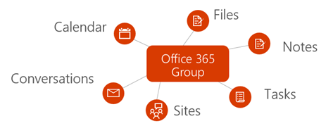
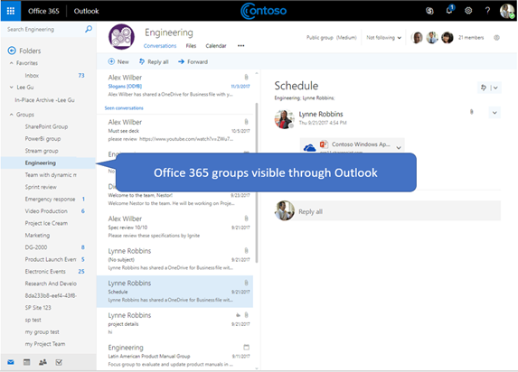

# Overview of Office 365 groups in Microsoft Graph

Office 365 groups provide the foundational membership service for users to share conversations, files, notes, calendars, plans, and many other assets. 

## Why integrate with Office 365 groups?   

Groups form the foundation that enables user collaboration and integration across services to support rich scenarios in task planning, teamwork, education, and more. When you integrate with Office 365 groups, your application can support millions of users as they transition across various experiences in the Office 365 suite and beyond.  
 
### Create groups to facilitate teamwork across services 
 
You can use the Microsoft Graph API to create, manage, or delete groups throughout the lifecycle of collaboration. For example, you can do the following:  
 
- Use the [Create group](../api-reference/v1.0/api/group_post_groups.md) API to provision a new group. The group is then made available in a range of applications, such as Outlook, SharePoint, Microsoft Teams, Planner, and even Microsoft Stream. Microsoft Graph synchronizes across these connected services to seamlessly provide access to all group members.  
 
    **Every Office 365 group is integrated with a default set of Office 365 services**

      

- Enable members to indicate that a group is one of their [favorites](../api-reference/v1.0/api/group_addfavorite.md), or [remove it from their favorites](../api-reference/v1.0/api/group_removefavorite.md) if they choose. 
- [Create](../api-reference/v1.0/api/group_post_conversations.md), [get](../api-reference/v1.0/api/group_get_conversation.md), or [delete](../api-reference/v1.0/api/group_delete_conversation.md) group conversations from your custom application. 
- Schedule calendar [events](../api-reference/v1.0/resources/event.md) on the group calendar. 
- Get information about the [SharePoint site](../api-reference/v1.0/resources/site.md) that's associated with a group, such as the document library [lists](../api-reference/v1.0/api/list_list.md) or [subsites](../api-reference/v1.0/api/site_list_subsites.md). 
- [Create a plan](../api-reference/v1.0/api/planner_post_buckets.md) in Planner that is owned by a group. The plan provides a visual way to track teamwork by allowing you to [create tasks](../api-reference/v1.0/api/planner_post_tasks.md) that can be [organized across buckets](../api-reference/v1.0/api/planner_post_buckets.md). 
- Access the [OneNote](../api-reference/v1.0/resources/onenote.md) notebook associated with a group, which can be used for collecting meeting notes and organizing ideas. 
  
    **Office 365 groups and conversations in Outlook in the web**

     

- [Enable a group for Microsoft Teams](../api-reference/beta/api/team_put_teams.md) (preview) to allow group members to engage in persistent chat.  
- [Delete groups](../api-reference/v1.0/api/group_delete.md). When a group is deleted, all associated content is also deleted, which prevents orphaned sites, conversations, or plans. 
 
### Manage group membership seamlessly 
 
Office 365 groups are collections of users who share access to resources in Microsoft services or within your app. Because group membership is managed centrally, any changes to membership affect all services associated with the group. You can use Microsoft Graph to perform the following group membership tasks:
 
- [Add](../api-reference/v1.0/api/group_post_members.md) and [remove](../api-reference/v1.0/api/group_delete_members.md) members from an existing group. 
- Get a [list of owners](../api-reference/v1.0/api/group_list_owners.md) or a [list of members](../api-reference/v1.0/api/group_list_members.md) for a group. This helps communicate who has access to group content, or who might need to perform administrative duties, such as renewing the group or approving a join request. 
- Designate groups as **Public**, where group content is visible to anyone in the same organization, or **Private**, where group content is only visible to members, via the [update group](../api-reference/v1.0/api/group_update.md) operation. 
- [Remove owners](../api-reference/v1.0/api/group_delete_owners.md) who are no longer participating in the ownership responsibilities for a particular group from the list of group owners. 
 
### Establish and maintain group policy settings 
 
As the number of groups created within an organization begins to grow, Microsoft Graph supports the ability to govern the usage and lifecycle of the group. You can enforce group policies across all groups within an organization. You can use the Microsoft Graph API to:

- Configure a broad range of [group policy settings](../api-reference/v1.0/resources/groupsetting.md) that help define behaviors, such as automatically deleting groups unless they are renewed by an owner and enforcing naming policies on Office 365 groups. 
- [Renew](../api-reference/v1.0/api/group_renew.md) groups that are about to expire to allow team members to continue with collaboration and accessing content. If the group is not renewed according to the established expiration policy, the group is automatically deleted. 
- [Restore](../api-reference/v1.0/api/directory_deleteditems_restore.md) deleted groups.
 
## Next steps

- Try out some sample API requests in the [Graph Explorer](https://developer.microsoft.com/en-us/graph/graph-explorer). 
- Learn more about how to [use the groups API](../api-reference/v1.0/resources/groups-overview.md) in Microsoft Graph.
