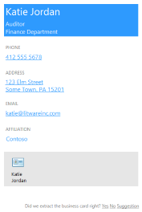
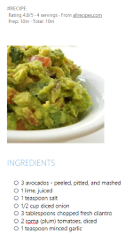

# Use OneNote API div tags to extract data from captures 

*__Applies to:__ Consumer notebooks on OneDrive | Enterprise notebooks on Office 365*

Use the OneNote API to extract business card data from an image, or recipe and product data from a URL.

<a name="attributes"></a>
## Extraction attributes

To extract and transform data, simply include a div that specifies the source content, extraction method, and fallback behavior in your [create-page](onenote-create-page.md) or [update-page](onenote_update_page.md) request. The API renders extracted data on the page in an easy-to-read format. 

```
<div
  data-render-src="image-or-url"
  data-render-method="extraction-method"
  data-render-fallback="fallback-action">
</div>
```

**data-render-src**

The content source. This can be an image of a business card or an absolute URL from many popular recipe or product websites. Required.

For best results when specifying a URL, use the canonical URL defined in the HTML of the source webpage, if one is defined. For example, a canonical URL might be defined in the source webpage like this:

`<link rel="canonical" href="www.domainname.com/page/123/size12/type987" />` 


**data-render-method**

The extraction method to run. Required.

| Value | Description |
|:------|:------|
| extract.businesscard | A business card extraction. |
| extract.recipe | A recipe extraction. |
| extract.product | A product listing extraction. |
| extract | An unknown extraction type. |

For best results, specify the content type (`extract.businesscard`, `extract.recipe`, or `extract.product`) if you know it. If the type is unknown, use the `extract` method and the OneNote API will try to auto-detect the type.

**data-render-fallback**

The fallback behavior if the extraction fails. Defaults to **render** if omitted. 

| Value | Description |
|:------|:------|
| render | Renders the source image or a snapshot of the recipe or product webpage. |
| none | Does nothing.<br />This option is useful if you want to always include a snapshot of the business card or webpage on the page in addition to any extracted content. Be sure to send a separate `img` element in the request, as shown in the examples. |

<a name="biz-card"></a>
## Business card extractions

The OneNote API tries to find and render the following contact information based on an image of a person's or company's business card.


- Name
- Title
- Organization
- Phone and fax numbers
- Mailing and physical addresses
- Email addresses
- Websites
   
  

A vCard (.VCF file) with the extracted contact information is also embedded in the page. The vCard is a convenient way to get the contact information when retrieving page HTML content.

### Common scenarios for business card extractions

**Extract business card information, and also render the business card image**

Specify the `extract.businesscard` method and the `none` fallback. Also send an `img` element with the `src` attribute that also references the image. If the API is unable to extract any content, it renders the business card image only.

```html 
<div
    data-render-src="name:scanned-card-image"
    data-render-method="extract.businesscard"
    data-render-fallback="none">
</div>

```


**Extract business card information, and render the business card image only if the extraction fails**

Specify the `extract.businesscard` method and use the default `render` fallback. If the API is unable to extract any content, it renders the business card image instead.

```html
<div
    data-render-src="name:scanned-card-image"
    data-render-method="extract.businesscard">
</div>
```
 
For business card extractions, the image is sent as a named part in a multipart request. See [Add images and files](onenote_images_files.md) for examples that show how to send an image in a request.


<a name="recipe"></a>
## Recipe extractions

The OneNote API tries to find and render the following information based on a recipe's URL.

- Hero image
- Rating
- Ingredients
- Instructions
- Prep, cook, and total times
- Servings

   

The API is optimized for recipes from many popular sites such as *Allrecipes.com*, *FoodNetwork.com*, and *SeriousEats.com*.

### Common scenarios for recipe extractions

**Extract recipe information, and also render a snapshot of the recipe webpage**

Specify the `extract.recipe` method and the `none` fallback. Also send an `img` element with the `data-render-src` attribute set to the recipe URL. If the API is unable to extract any content, it renders a snapshot of the recipe webpage only.

This scenario potentially provides the most information because the webpage may include additional information, such as customer reviews and suggestions.

```html 
<div
    data-render-src="http://allrecipes.com/recipe/guacamole/"
    data-render-method="extract.recipe"
    data-render-fallback="none">
</div>

```
 

**Extract recipe information, and render a snapshot of the recipe webpage only if the extraction fails**

Specify the `extract.recipe` method and use the default render fallback. If the API is unable to extract any content, it renders a snapshot of the recipe webpage instead.

```html  
<div
    data-render-src="http://www.foodnetwork.com/recipes/alton-brown/creme-brulee-recipe.html"
    data-render-method="extract.recipe">
</div>
```


**Extract recipe information, and also render a link to the recipe**

Specify the `extract.recipe` method and the `none` fallback. Also send an `a` element with the `src` attribute set to the recipe URL (or you can send any other information you want to add to the page). If the API is unable to extract any content, only the recipe link is rendered.

```html  
<div
    data-render-src="http://www.seriouseats.com/recipes/2014/09/diy-spicy-kimchi-beef-instant-noodles-recipe.html"
    data-render-method="extract.recipe"
    data-render-fallback="none">
</div>
<a href="http://www.seriouseats.com/recipes/2014/09/diy-spicy-kimchi-beef-instant-noodles-recipe.html">Recipe URL</a>
``` 


<a name="product"></a>
## Product listing extractions

- Title
- Rating
- Primary image
- Description
- Features
- Specifications</td>

  

The API is optimized for products from many popular sites such as *Amazon.com* and *HomeDepot.com*.

### Common scenarios for recipe extractions

**Extract product information, and also render a snapshot of the product webpage**

Specify the `extract.product` method and the `none` fallback. Also send an `img` element with the `data-render-src` attribute set to the product URL. If the API is unable to extract any content, it renders a snapshot of the product webpage only.

This scenario potentially provides the most information because the webpage may include additional information, such as customer reviews and suggestions.

```html 
<div
    data-render-src="http://www.amazon.com/Microsoft-Band-Small/dp/B00P2T2WVO"
    data-render-method="extract.product"
    data-render-fallback="none">
</div>

```


**Extract product information, and render a snapshot of the product webpage only if the extraction fails**

Specify the `extract.product` method and use the default render fallback. If the API is unable to extract any content, it renders a snapshot of the product webpage instead.

```html 
<div
    data-render-src="http://www.sears.com/craftsman-19hp-42-8221-turn-tight-174-hydrostatic-yard-tractor/p-07120381000P"
    data-render-method="extract.product">
</div>
```
 

**Extract product information, and also render a link to the product**

Specify the `extract.product` method and the `none` fallback. Also send an `a` element with the `src` attribute set to the product URL (or you can send any other information you want to add to the page). If the API is unable to extract any content, only the page link is rendered.

```html 
<div
    data-render-src="http://www.homedepot.com/p/Active-Ventilation-5-Watt-Solar-Powered-Exhaust-Attic-Fan-RBSF-8-WT/204203001"
    data-render-method="extract.product"
    data-render-fallback="none">
</div>
<a href="http://www.homedepot.com/p/Active-Ventilation-5-Watt-Solar-Powered-Exhaust-Attic-Fan-RBSF-8-WT/204203001">Product URL</a>
```


<a name="unknown"></a> 
## Unknown content type extractions

If you don't know the content type (business card, recipe, or product) that you're sending, you can use the unqualified `extract` method and let the OneNote API automatically detect the type. You might want to do this if your app sends different capture types.

> **Note:**
> If you do know the content type that you're sending, you should use the `extract.businesscard`, `extract.recipe`, or `extract.product` method. In some cases, this can help to optimize the extraction results.
 
### Common scenarios for unknown extractions

**Send an image or a URL, and render the supplied image or a snapshot of the webpage if the extraction fails**

Specify the `extract` method so the API automatically detects the content type, and use the default render fallback. If the API is unable to extract any content, it renders the supplied image or snapshot of the webpage instead.

```html 
<div
    data-render-src="some image or url"
    data-render-method="extract">
</div>
```


<a name="request-response-info"></a>
## Response information

| Response data | Description |  
|------|------|  
| Success code | A 201 HTTP status code for a successful POST request, and a 204 HTTP status code for a successful PATCH request. |  
| Errors| Read [Error codes for OneNote APIs in Microsoft Graph](onenote_error_codes.md) to learn about OneNote errors that Microsoft Graph can return. |  


<a name="permissions"></a>
## Permissions

To create or update OneNote pages, you'll need to request appropriate permissions. Choose the lowest level of permissions that your app needs to do its work.

**Permissions for _POST pages_**

- Notes.Create
- Notes.ReadWrite
- Notes.ReadWrite.All  

**Permissions for _PATCH pages_**

- Notes.ReadWrite
- Notes.ReadWrite.All

For more information about permission scopes and how they work, see [Microsoft Graph permissions reference](permissions_reference.md).


<a name="see-also"></a>
## Additional resources

- [Create OneNote pages](onenote-create-page.md)
- [Update OneNote page content](onenote_update_page.md)
- [Add images and files](onenote_images_files.md)
- [Integrate with OneNote](integrate_with_onenote.md)
- [OneNote Developer Blog](http://go.microsoft.com/fwlink/?LinkID=390183)
- [OneNote development questions on Stack Overflow](http://go.microsoft.com/fwlink/?LinkID=390182)
- [OneNote GitHub repos](http://go.microsoft.com/fwlink/?LinkID=390178)  

