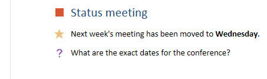
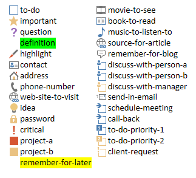

# Use note tags in OneNote pages

*__Applies to:__ Consumer notebooks on OneDrive | Enterprise notebooks on Office 365*

Use the `data-tag` attribute to add and update check boxes, stars, and other built-in note tags on a OneNote page, as shown in the following image.




<a name="attributes"></a>
## Note tag attributes

In the HTML of a OneNote page, a note tag is represented by the `data-tag` attribute. For example:

- An unchecked to-do box:  `<p data-tag="to-do">` 
- A checked to-do box:  `<p data-tag="to-do:completed">` 
- A star:  `<h2 data-tag="important">` 

A `data-tag` value is composed of a shape, and sometimes a status. (*see all [supported values](#built-in-note-tags-for-onenote)*)

| Property | Description |  
|:------|:------|  
| shape | The identifier of the note tag (example: `to-do` or `important`). |  
| status | The status of check-box note tags. This is used only to set check boxes as completed. |  
 

<a name="note-tags"></a>
## Add or update note tags

To add or update a built-in note tag, just use the `data-tag` attribute on a supported element. For example, here's a paragraph marked as important:

```html
<p data-tag="important">...</p>
```

Separate multiple note tags with commas:

```html
<p data-tag="important, critical">...</p>
```

You can define a `data-tag` on the following elements:

- p 
- ul, ol, li (*see more about [note tags on lists](#note-tags-on-lists)*)
- img 
- h1 - h6 
- title 

See [Built-in note tags](#built-in-note-tags-for-onenote) for a list of note tags that you can use with Microsoft Graph. Adding or updating custom tags using Microsoft Graph is not supported.
 
**Examples**

Here's a simple to-do list with the first item completed.

```html 
<p data-tag="to-do:completed" data-id="prep">Till garden bed</p> 
<p data-tag="to-do" data-id="spring">Plant peas and spinach</p>
<p data-tag="to-do" data-id="summer">Plant tomatoes and peppers</p>
```

Note that the `<p>` tags above each include a `data-id` attribute. This makes it easier to update the check-box note tags. For example, the following request marks the spring planting to-do item as completed.

``` 
PATCH https://graph.microsoft.com/v1.0/me/onenote/notebooks/pages/{page-id}/content

Content-Type: application/json
Authorization: Bearer {token}

[
   {
    'target':'#spring',
    'action':'replace',
    'content':'<p data-tag="to-do:completed"  data-id="spring">Plant peas and spinach</p>'
  }
]
```

The following request creates a page that contains all [built-in note tags](#built-in-note-tags-for-onenote).

``` 
POST https://graph.microsoft.com/v1.0/me/onenote/notebooks/pages

Content-Type: text/html
Authorization: Bearer {token}


<!DOCTYPE html>
<html>
  <head>
    <title data-tag="to-do:completed">All built-in note tags</title>
  </head>
  <body>
    <h1 data-tag="important">Paragraphs with built-in note tags</h1>
    <p data-tag="to-do">to-do</p>
    <p data-tag="important">important</p>
    <p data-tag="question">question</p>
    <p data-tag="definition">definition</p>
    <p data-tag="highlight">highlight</p>
    <p data-tag="contact">contact</p>
    <p data-tag="address">address</p>
    <p data-tag="phone-number">phone-number</p>
    <p data-tag="web-site-to-visit">web-site-to-visit</p>
    <p data-tag="idea">idea</p>
    <p data-tag="password">password</p>
    <p data-tag="critical">critical</p>
    <p data-tag="project-a">project-a</p>
    <p data-tag="project-b">project-b</p>
    <p data-tag="remember-for-later">remember-for-later</p>
    <p data-tag="movie-to-see">movie-to-see</p>
    <p data-tag="book-to-read">book-to-read</p>
    <p data-tag="music-to-listen-to">music-to-listen-to</p>
    <p data-tag="source-for-article">source-for-article</p>
    <p data-tag="remember-for-blog">remember-for-blog</p>
    <p data-tag="discuss-with-person-a">discuss-with-person-a</p>
    <p data-tag="discuss-with-person-b">discuss-with-person-b</p>
    <p data-tag="discuss-with-manager">discuss-with-manager</p>
    <p data-tag="send-in-email">send-in-email</p>
    <p data-tag="schedule-meeting">schedule-meeting</p>
    <p data-tag="call-back">call-back</p>
    <p data-tag="to-do-priority-1">to-do-priority-1</p>
    <p data-tag="to-do-priority-2">to-do-priority-2</p>
    <p data-tag="client-request">client-request</p>
    <h1 data-tag="important">Paragraphs with check boxes marked with "completed" status</h1>
    <p data-tag="to-do:completed">to-do:completed</p>
    <p data-tag="discuss-with-person-a:completed">discuss-with-person-a:completed</p>
    <p data-tag="discuss-with-person-b:completed">discuss-with-person-b:completed</p>
    <p data-tag="discuss-with-manager:completed">discuss-with-manager:completed</p>
    <p data-tag="schedule-meeting:completed">schedule-meeting:completed</p>
    <p data-tag="call-back:completed">call-back:completed</p>
    <p data-tag="to-do-priority-1:completed">to-do-priority-1:completed</p>
    <p data-tag="to-do-priority-2:completed">to-do-priority-2:completed</p>
    <p data-tag="client-request:completed">client-request:completed</p>
    <h1 data-tag="important">Multiple note tags</h1>
    <p data-tag="project-a,  client-request:completed">Two note tags:  project-a, client-request:completed</p>
    <p data-tag="idea, send-in-email, question">Three note tags:  idea, send-in-email, question</p>
    <h1 data-tag="important">Using note tags with other elements</h1>
    <p><b>Note tag on a list item:</b></p>
    <ul>
      <li data-tag="to-do-priority-1:completed">Make a to-do list</li>
    </ul>
    <p><b>Note tag on an image:</b></p>
    
    <p><b>Note tag with embedded style:</b></p>
    <p data-tag="important">Next time, <b>don't</b> forget to invite <span style="background-color:yellow">Dan</span>.</p>
  </body>
</html>
``` 

For more information about creating pages, see [Create OneNote pages](onenote-create-page.md). For more about updating pages, see [Update OneNote pages](onenote_update_page.md).


<a name="note-tags-lists"></a>
### Note tags on lists

Here are some guidelines for working with note tags on lists:

- Use `p` elements for to-do lists. They don't display a bullet or number, and they're easier to update.

- To create or update lists that display the **same** note tag for all list items:
  
   <p id="indent">Define `data-tag` on the `ul` or `ol`. To update the entire list, you'll need to redefine `data-tag` on the `ul` or `ol`.</p>

- To create or update lists that display **unique** note tag for some or all list items:
  
   <p id="indent">Define `data-tag` on `li` elements, and don't nest the `li` elements in a `ul` or `ol`. To update the entire list, you'll need to remove the `ul` that's returned in the output HTML and provide only the unnested `li` elements.</p>

- To update specific `li` elements:

   <p id="indent">Target the `li` elements individually and define the `data-tag` on the `li` element. Any individually addressed `li` element can be updated to display a unique note tag, no matter how the list was originally defined.</p>

The guidelines are based on the following rules that are applied by Microsoft Graph:

- The `data-tag` setting for a `ul` or `ol` overrides all settings on child `li` elements. This applies even when the `ul` or `ol` doesn't specify a `data-tag` but its child `li` elements do.

   For example, if you create a `ul` or `ol` that defines `data-tag="project-a"`, all its list items will display the *Project A* note tag. Or if the `ul` or `ol` doesn't define a `data-tag`, none of its items will display a note tag. This override happens regardless of any explicit settings on child `li` elements.

- Unique `data-tag` settings are honored for list items under the following conditions:

   - The `li` elements are not nested in a `ul` or `ol` in a create or update request.

   - An `li` element is individually addressed in an update request.

- Unnested `li` elements sent in input HTML are returned in a `ul` in the output HTML.

- In output HTML, all `data-tag` list settings are defined on `span` elements on the list items.

<br />
The following code shows how some of these rules are applied. The input HTML creates two lists with note tags. The output HTML is what's returned for the lists when you retrieve page content.

**Input HTML**

```html 
<!--To display the same note tag on all list items, define note tags on the ul or ol.--> 
<ul data-tag="project-a" data-id="agenda">
  <li>An item with a Project A note tag</li>
  <li>An item with a Project A note tag</li>
</ul>

<!--To display unique note tags on list items, don't nest li elements in a ul or ol.--> 
<li data-tag="idea" data-id="my-idea">An item with an Idea note tag</li>
<li data-tag="question" data-id="my-question">An item with a Question note tag</li>
```
 
**Output HTML**

```html 
<ul>
  <li><span data-tag="project-a">An item with a Project A note tag</span></li>
  <li><span data-tag="project-a">An item with a Project A note tag</span></li>
</ul>
<br />
<ul>
  <li style="..."><span data-tag="idea">An item with an Idea note tag</span></li>
  <li style="..."><span data-tag="question">An item with a Question note tag</span></li>
</ul>
```

<a name="output-html"></a>
## Retrieve note tags

Built-in note tags are included in the output HTML when you get page content:

`GET ../api/v1.0/pages/{page-id}/content` 

A `data-tag` attribute in the output HTML always includes a shape value, and it only includes a status if it represents a check-box note tag that's set to completed. The following examples show the input HTML used to create some note tags and the output HTML that's returned.

**Input HTML**

```html 
<h1>Status meeting</h1>
<p data-tag="important">Next week's meeting has been moved to <b>Wednesday</b>.</p>
<p data-tag="question">What are the exact dates for the conference?</p>
<p>Upcoming training opportunities. See Katie for more info.</p>
<p data-tag="project-a">Around the room updates.</p>
<ul data-tag="critical">
  <li>Design handouts</li>
  <li>Plan keynote</li>
</ul>
```

**Output HTML**

```html 
<h1 style="...">Status meeting</h1>
<p data-tag="important">Next week's meeting has been moved to <span style="font-weight:bold">Wednesday</span>.</p>
<p data-tag="question">What are the exact dates for the conference?</p>
<p>Upcoming training opportunities. See Katie for more info.</p>
<p data-tag="project-a">Around the room updates.</p>
<ul>
  <li><span data-tag="critical">Design handouts</span></li>
  <li><span data-tag="critical">Plan keynote</span></li>
</ul>
```

Note that the `data-tag` attribute defined at the list level is pushed to its list items. For more information about using note tags with lists, see [Note tags on lists](#note-tags-on-lists).

> **Note:**
> In the output HTML, the definition and remember-for-later note tags are both returned as `data-tag="remember-for-later"`. The `title` element doesn't return any note tag information.

<a name="built-in-tags"></a>
## Built-in note tags for OneNote

OneNote includes the following built-in note tags:



The values you can assign to the `data-tag` attribute are shown below. Custom tags are not supported.

||Tags||
|:---|:---|:-----|
| `shape[:status]` |`to-do`<br />`to-do:completed`|`important`|
|`question`|`definition`|`highlight`|
|`contact`|`address`|`phone-number`|
|`web-site-to-visit`|`idea`|`password`|
|`critical`|`project-a`|`project-b`|
|`remember-for-later`|`movie-to-see`|`book-to-read`|
|`music-to-listen-to`|`source-for-article`|`remember-for-blog`|
|`discuss-with-person-a`<br />`discuss-with-person-a:completed`|`discuss-with-person-b`<br />`discuss-with-person-b:completed`|`discuss-with-manager`<br />`discuss-with-manager:completed`|
|`send-in-email`|`schedule-meeting`<br />`schedule-meeting:completed`|`call-back`<br />`call-back:completed`|
|`to-do-priority-1`<br />`to-do-priority-1:completed`|`to-do-priority-2`<br />`to-do-priority-2:completed`|`client-request`<br />`client-request:completed`|


<a name="request-response-info"></a>
## Response information
Microsoft Graph returns the following information in the response.

| Response data | Description |  
|------|------|  
| Success code | A 201 HTTP status code for a successful POST request, and a 204 HTTP status code for a successful PATCH request. |  
| Errors | Read [Error codes for OneNote APIs in Microsoft Graph](onenote_error_codes.md) to learn about OneNote errors that Microsoft Graph can return. |  


<a name="permissions"></a>
## Permissions

To create or update OneNote pages, you'll need to request appropriate permissions. Choose the lowest level of permissions that your app needs to do its work.

**Permissions for _POST pages_**

- Notes.Create
- Notes.ReadWrite
- Notes.ReadWrite.All  

**Permissions for _PATCH pages_**

- Notes.ReadWrite
- Notes.ReadWrite.All  

For more information about permission scopes and how they work, see [OneNote permission scopes](permissions_reference.md).


<a name="see-also"></a>
## Additional resources

- [Create OneNote pages](onenote-create-page.md)
- [Update OneNote page content](onenote_update_page.md)
- [Integrate with OneNote](integrate_with_onenote.md)
- [OneNote Developer Blog](http://go.microsoft.com/fwlink/?LinkID=390183)
- [OneNote development questions on Stack Overflow](http://go.microsoft.com/fwlink/?LinkID=390182)
- [OneNote GitHub repos](http://go.microsoft.com/fwlink/?LinkID=390178)  
 


