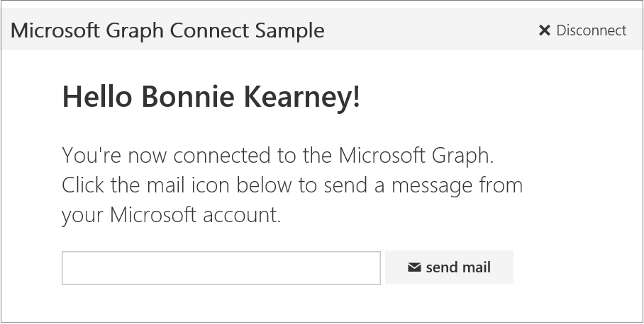

# Get started with Microsoft Graph in a Ruby on Rails app

This article describes the tasks required to get an access token from the Azure AD v2.0 endpoint and call Microsoft Graph. It walks you through building the [Microsoft Graph Ruby on Rails Connect Sample](https://github.com/microsoftgraph/ruby-connect-rest-sample) and explains the main concepts that you implement to use the Microsoft Graph. The article also describes how to access Microsoft Graph by using direct REST calls.

To download a version of the Connect sample that uses the Azure AD endpoint, see [Microsoft Graph Ruby on Rails Connect Sample](https://github.com/microsoftgraph/ruby-connect-rest-sample/tree/last_v1_auth).

The following image shows the app you'll create. 



**Don't feel like building an app?** Use the [Microsoft Graph quick start](https://graph.microsoft.io/en-us/getting-started) to get up and running fast, or download the [Ruby REST Connect sample](https://github.com/microsoftgraph/ruby-connect-rest-sample) that this article is based on.


## Prerequisites

To get started, you'll need: 

- Ruby 2.1 to run the sample on a development server.
- Rails framework (the sample has been tested on Rails 4.2).
- Bundler dependency manager.
- Rack web server interface for Ruby.
- A [Microsoft account](https://www.outlook.com/) or a [work or school account](https://docs.microsoft.com/en-us/office/developer-program/office-365-developer-program-faq#account-types)
- The Microsoft Graph Connect Starter Project for Ruby on Rails. Download the [Microsoft Graph Ruby on Rails Connect Sample](https://github.com/microsoftgraph/ruby-connect-rest-sample). The starter project is located in the _starter_ folder.


## Register the application

Register an app on the Microsoft App Registration Portal. This generates the app ID and secret that you'll use to configure the app for authentication.

1. Sign into the [Microsoft App Registration Portal](https://apps.dev.microsoft.com/) using either your personal or work or school account.

2. Choose **Add an app**.

3. Enter a name for the app, and choose **Create application**.

	The registration page displays, listing the properties of your app.

4. Copy the application ID. This is the unique identifier for your app.

5. Under **Application Secrets**, choose **Generate New Password**. Copy the app secret from the **New password generated** dialog.

	You'll use the application ID and app secret to configure the app.

6. Under **Platforms**, choose **Add platform** > **Web**.

7. Make sure the **Allow Implicit Flow** check box is selected, and enter *http://localhost:3000/auth/microsoft_v2_auth/callback* as the Redirect URI.

	The Allow Implicit Flow option enables the OpenID Connect hybrid flow. During authentication, this enables the app to receive both sign-in info (the id_token) and artifacts (in this case, an authorization code) that the app uses to obtain an access token.

	The redirect URI *http://localhost:3000/auth/microsoft_v2_auth/callback* is the value that the OmniAuth middleware is configured to use once it has processed the authentication request.

8. Choose **Save**.

## Configure the project

1. Download or clone the [Microsoft Graph Ruby on Rails Connect Sample](https://github.com/microsoftgraph/ruby-connect-rest-sample). Open the _starter_ folder in the editor of your choice.
1. If you don't already have bundler and rack, you can install them with the following command.

	```
	gem install bundler rack
	```
2. In the config/environment.rb file, do the following:
    - Replace *ENTER_YOUR_CLIENT_ID* with the client ID of your registered  application.
    - Replace *ENTER_YOUR_SECRET* with the key of your registered application.

3. Install the Rails application and dependencies with the following command.

	```
	bundle install
	```

## Authenticate the user and get an access token

This app uses the authorization code grant flow with a delegated user identity. For a web application, the flow requires the application ID, secret, and redirect URI from the registered app. 

The auth flow can be broken down into these basic steps:

1. Redirect the user for authentication and consent
2. Get an authorization code
3. Redeem the authorization code for an access token

>For more information about this auth flow, see [Web application to web API](https://azure.microsoft.com/en-us/documentation/articles/active-directory-authentication-scenarios/#web-application-to-web-api) and  [Integrate Microsoft identity and the Microsoft Graph into a web application using OpenID Connect](https://azure.microsoft.com/en-us/documentation/samples/active-directory-dotnet-webapp-openidconnect-v2/) in the Azure AD documentation.

We'll be using a stack of three pieces of [Rack](http://rack.github.io/) middleware to enable the app to authenticate against the Microsoft Graph:

- [OmniAuth](https://rubygems.org/gems/omniauth), a generalized Rack framework for multiple-provider authentication.
- [Omniauth-oauth2](https://rubygems.org/gems/omniauth-oauth2), an abstract OAuth2 strategy for OmniAuth. 
- omniauth-microsoft_v2_auth, an OmniAuth strategy that customizes Omniauth-oauth2 to specifically provide authentication against the Azure AD v2.0 endpoint. This project is included in the code sample.

### Specify gem dependencies for authentication

In Gemfile, uncomment the following gems to add them as dependencies.

	```
	gem 'omniauth'
	gem 'omniauth-oauth2'
	gem 'omniauth-microsoft_v2_auth', path: './omniauth-microsoft_v2_auth'
	```

Note that `omniauth-microsoft_v2_auth` is included in the app project, and will be installed from the path specified. 

### Configure the authentication middleware

In `config/initializers/omniauth-microsoft_v2_auth.rb`, uncomment the following lines.

	```
	Rails.application.config.middleware.use OmniAuth::Builder do
	  provider :microsoft_v2_auth,
	  ENV['CLIENT_ID'],
	  ENV['CLIENT_SECRET'],
	  :scope => ENV['SCOPE']
	end
	```
This configures the OmniAuth middleware, including specifying the app ID and app secret to use, as well as the scopes to request for the user. These are the values you specified earlier in `config/environment.rb`.

### Specify routes for authentication

Now we need to specify two routes necessary for the authentication flow. The first route forwards the authentication request to the OmniAuth middleware, and the second specifies the location in the app to which OmniAuth should redirect once authentication has occurred.

In `config/routes.rb`, uncomment the following route directive.

	get '/login', to: 'pages#login'

This directs login requests to the pages controller's `login` method, which in turn redirects the request to the omniauth-microsoft_v2_auth middleware.

	def login
    	redirect_to '/auth/microsoft_v2_auth'
  	end

Next, we need to specify where in the app OmniAuth should redirect once authentication has occurred. Uncomment the following route.

	match '/auth/:provider/callback', to: 'pages#callback', via: [:get, :post]

When OmniAuth has finished authenticating the user, it calls the redirect URL specified in the app registration; in this case, *http://localhost:3000/auth/microsoft_v2_auth/callback*. The route pattern above matches that URL and so routes the request to the page controller's `callback` method.

### Get an access token

Next, we'll add the code that actually starts the authentication process, and retrieves the access token once the user has successfully signed in.

Take a look at `app/views/pages/index.html.erb`, the view for the site root. The view includes a single button, which enables users to sign in.

	<button class="ms-Button" onclick="window.location.href = '/login'">
		<span class="ms-Button-label"><%= t('connect_button') %></span>
	</button>

As shown earlier, the login method redirects to the OmniAuth middleware, which has been configured with the app ID and app secret, as well as the scopes to request for the user. Once the user is successfully authenticated, OmniAuth returns a hash with the access token and other user information to the app.

Now let's add code to handle the OmniAuth callback, and retrieve information from that hash. 

In `app/controllers/pages_controller.rb`, replace the empty `callback` method with the following code.

	```
  	def callback
    	# Access the authentication hash for omniauth
    	# and extract the auth token, user name, and email
    	data = request.env['omniauth.auth']
	
    	@email = data[:extra][:raw_info][:userPrincipalName]
    	@name = data[:extra][:raw_info][:displayName]

		# Associate token/user values to the session
    	session[:access_token] = data['credentials']['token']
		session[:name] = @name
		session[:email] = @email
		
		# Debug logging
		logger.info "Name: #{@name}"
		logger.info "Email: #{@email}"
		logger.info "[callback] - Access token: #{session[:access_token]}"
	end

	```

This method retrieves the authentication hash, and then stores the access token, user name, and email in the current session.

> **Note:** The simple authentication  and token handling in this project is presented for illustrative purposes only. In a production app, you would likely construct a more robust way of handling authentication, including secure token handling and token refresh.

## Call Microsoft Graph

Now you're ready to add code to call Microsoft Graph. 

The view rendered by the `callback` method (`app/views/pages/callback.html.erb`) includes a simple form with a single button. The form posts to  `send_mail`, and includes a single parameter, the email address of the intended recipient.
	
	``` 
	<form action="../../send_mail" method="post">
      <div class="ms-Grid-col ms-u-mdPush1 ms-u-md9 ms-u-lgPush1 ms-u-lg6">
		...
            <div class="ms-TextField">
               <input class="ms-TextField-field" name="specified_email" value="<%= @email %>">
            </div>
            <button class="ms-Button">
            <span class="ms-Button-label"><i class="ms-Icon ms-Icon--mail" aria-hidden="true"></i><%= t('send_mail_button') %></span>
            </button> 
		...
	```

In `app/controllers/pages_controller.rb`, replace the empty `send_mail` method with the following code.

	```
	def send_mail
		logger.debug "[send_mail] - Access token: #{session[:access_token]}"
		
		# Used in the template
		@name = session[:name]
		@email = params[:specified_email]
		@recipient = params[:specified_email]
		@mail_sent = false
		
		send_mail_endpoint = URI("#{GRAPH_RESOURCE}#{SENDMAIL_ENDPOINT}")
		content_type = CONTENT_TYPE
		http = Net::HTTP.new(send_mail_endpoint.host, send_mail_endpoint.port)
		http.use_ssl = true
		
		# If you want to use a sniffer tool, like Fiddler, to see the request
		# you might need to add this line to tell the engine not to verify the
		# certificate or you might see a "certificate verify failed" error
		# http.verify_mode = OpenSSL::SSL::VERIFY_NONE
		
		email_body = File.read('app/assets/MailTemplate.html')
		email_body.sub! '{given_name}', @name
		email_subject = t('email_subject')
		
		logger.debug email_body
	
		email_message = "{
			Message: {
			Subject: '#{email_subject}',
			Body: {
				ContentType: 'HTML',
				Content: '#{email_body}'
			},
			ToRecipients: [
				{
					EmailAddress: {
						Address: '#{@recipient}'
					}
				}
			]
			},
			SaveToSentItems: true
			}"
			
		response = http.post(
			SENDMAIL_ENDPOINT,
			email_message,
			'Authorization' => "Bearer #{session[:access_token]}",
			'Content-Type' => content_type
		)
		
		logger.debug "Code: #{response.code}"
		logger.debug "Message: #{response.message}"
		
		# The send mail endpoint returns a 202 - Accepted code on success
		if response.code == '202'
			@mail_sent = true
		else
			@mail_sent = false
			flash[:httpError] = "#{response.code} - #{response.message}"
		end
		
		render 'callback'
	end
	```

This code constructs the HTTP request, formats the email, and then calls Microsoft Graph to send the email.

To create the email, the code pulls the user name from the session token and the recipient email address from the parameters passed from the form. The code then reads the email body from a template included in the project, interpolates the user name and email address, and attaches the email text as the HTTP request body.

To send the email, the code constructs the HTTP request, attaches the access token as an authorization header, and then posts the request to the send email endpoint.

Finally, the code uses the HTTP response code returned to notify the user whether or not the email was successful.

## Run the app

1. Install the Rails application and dependencies with the following command.

	```
	bundle install
	```
2. To start the Rails application, type the following command.

	```
	rackup -p 3000
	```
3. Go to `http://localhost:3000` in your web browser.

## See also
- Try out the REST API using the [Graph explorer](https://developer.microsoft.com/graph/graph-explorer).
- Explore our other [Microsoft Graph samples](https://github.com/microsoftgraph) on GitHub.


