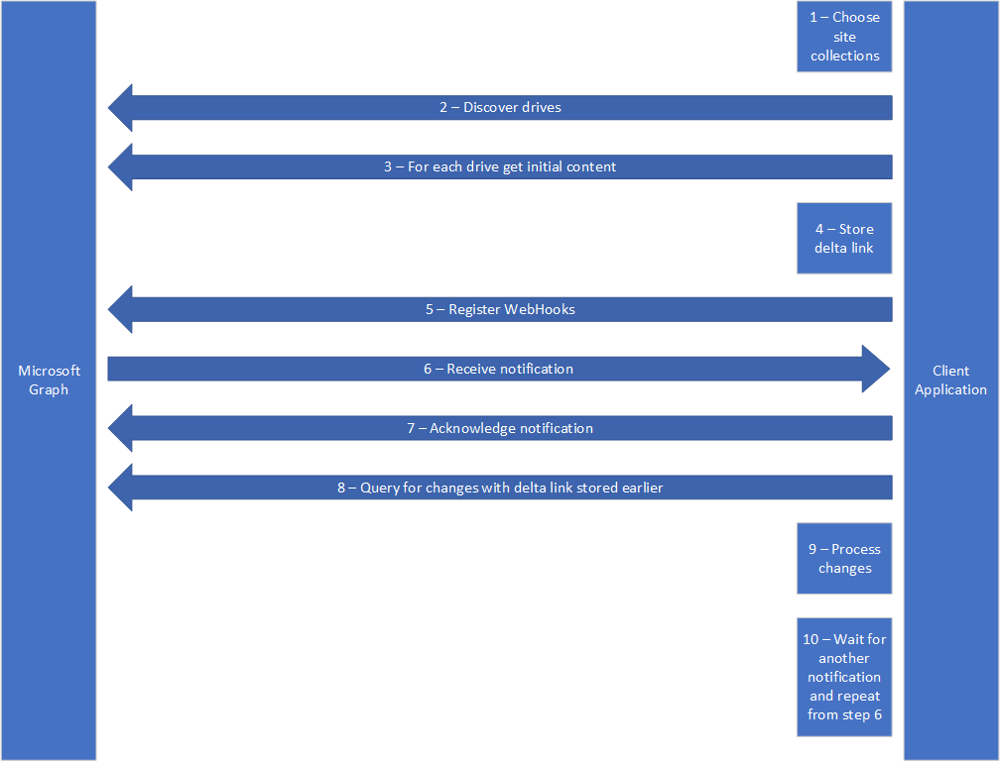

# Best practices for discovering files and detecting changes at scale
Millions and millions of files live in SharePoint and OneDrive.  It is critical to use the right calling patterns when trying to understand all files and changes at scale. Historically, there are many APIs to access files at an atomic level.  Many of these APIs are not efficient at a large scale but work well for a single user interaction. This guidance walks through how to monitor an Office 365 tenant or OneDrive so that your application integrates with Office 365 with maximum performance and efficiency. Applications that typically have this type of need are sync engines, backup providers, search indexers, classification engines, and data loss prevention providers. 

## Recommended calling pattern
For applications that process large amounts of data from SharePoint and OneDrive, you should follow a consistent calling pattern like the following.
1.	**Discover** – Configure the locations that you want to scan. 
2.	**Crawl** – Discover and process the entire set of files that you are interested in.
3.	**Notify** – Monitor changes to those files via notification.
4.	**Process changes** – Reprocess only files that have changed by using delta query.

The pattern will look like the following diagram.  This article goes into detail on each step for implementation.



Each of these elements may have several mechanisms to accomplish them in the Microsoft Graph API and existing SharePoint APIs.  The goal of this article is to give you the best way available today to complete each task.

## Discover locations to scan

Configuring the locations that you want your application to scan is a manual process today.  In many cases, you will want to provide a user-facing application experience for this step; how you expose this capability and whether it is exposed to all users or just administrators is up to you.  You will want to determine which users’ OneDrives and which SharePoint site collections and subsites you are scanning.

Each user’s OneDrive contains a single [drive][] that you can monitor.  SharePoint site collections and subsites may have multiple drives, one for each document library in the site.  You can discover each drive in a site by using the /drives endpoint.  For example, to get all drives in the root site of the tenant you can use:

```
https://graph.microsoft.com/v1.0/sites/root/drives
```

The drive is the starting point for large-scale file activities.  You’ll use these drives to get complete lists of files, connect webhooks for notifications, and use delta query to get sets of changes to items in the drives.

## Crawl and process by using delta query

To get the initial list of files in a drive, make a single [delta query][] call with no parameters.  The delta query gives apps an initial crawl of all content and then subsequent changes from a point in time.  The delta query returns the link necessary to get future changes each time it is called.

For example, if you wanted to get all the files in the default document library in a SharePoint site, you could use this query:

```
/sites/{siteId}/drive/root/delta
```

This API returns pages of results that represent all the files in the drive.  After you’ve retrieved all the pages of files by using the returned @odata.nextLink, you can make the delta query again with the returned @odata.deltaLink to get changes since the last time you called delta query.  Always remember to keep the URL returned by @odata.deltaLink so you can efficiently check for the changes later on.

The links returned by the delta query will look like this:

```
{
    "@odata.context": "https://graph.microsoft.com/v1.0/$metadata#Collection(driveItem)",
    "@odata.deltaLink": "https://graph.microsoft.com/v1.0/me/drive/root/delta?$select=*%2csharepointIds&token=MzslMjM0OyUyMzE7MzsyM2YwNDVhMS1lNmRmLTQ1N2MtOGQ5NS1hNmViZDVmZWRhNWQ7NjM2NzExNzY2MzIxMDcwMDAwOzE5ODAzMzU5ODslMjM7JTIzOyUyMzQ",
    "value": [
        {
            "@odata.type": "#microsoft.graph.driveItem",
            "createdDateTime": "2017-07-27T02:41:36Z",
…
}
```

For a more detailed sample, see the delta query [documentation][].

Delta query returns an array of [driveItems][].  If you know ahead of time that you want specific information, you can include it on a select statement with the delta query.  You can additionally follow up the delta call with a request for a specific driveItem should you need it.  Delta query will still help narrow down the number of items you have to query against for changes, making your application more efficient.

## Get notified of changes by using webhooks

To make best use of the delta query for changes happening on a drive, you need an effective strategy to know when to come back and ask for the changes.  In the past, you may have written your app to poll OneDrive and SharePoint at some fixed interval and enumerated the changes yourself.  With delta query, the enumeration part is done for you, so you just need to know when to come back.  Webhooks allow you to avoid polling the service, and instead receive a notification when something has changed that you’re interested in.  Polling the service repeatedly or at high rates causes your app to be throttled due to excessive calling patterns.

Webhooks are attached by using the subscriptions API for Microsoft Graph.  You can find the full documentation for Microsoft Graph webhooks and the Subscriptions API [on the Microsoft Graph site][].

You will need to create a subscription that is associated with a specific resource (in this case a drive).  Drives support the “update” change type for webhooks.  An “update” indicates that content within the drive has changed or that new content has been added or deleted.  Webhook subscriptions have an associated timeout that needs to be periodically refreshed.  See the earlier-mentioned documentation on how to refresh your subscriptions.  We recommend using delta query with your last change token immediately after you subscribe to webhooks to ensure that you don’t miss any changes that happened between initial crawl and setting up your webhooks.

Even with webhooks sending your application notifications, you may want to provide a periodic delta query to ensure that no changes are missed if it appears to have been a long time since a notification was received.  We recommend no more than once per day for this periodic check.  The delta query still allows you to easily catch up and not miss any changes in the system.

## Process changes

After your application receives a notification through a webhook, you need to acknowledge the notification by immediately sending a 202 – Accepted code back to Microsoft Graph.  You should send this code before beginning any time-consuming processing.  Failing to do so results in additional retries being sent, which your app might view as false notifications.

Follow up the acknowledgement with a delta query for the latest changes, and your app should be up to date.  If you are expecting heavy traffic patterns on a particular drive, you should consider calling delta query at a reduced interval rather than after each change notification.  Also, make sure to store the new value returned in the deltaLink parameter to get a new token for calling the API again.

## What happens when you get throttled? 

In some scenarios, your application may get a 429 or 503 response from Microsoft Graph.  This indicates that your request is currently being throttled.  There could be multiple reasons this is happening.  It is critical that your app responds correctly to throttle requests.

To recover from receiving a 429 or 503 response code, try again after waiting for the duration specified in the Retry-After field in the response header.  If throttling persists, the Retry-After value may become longer over time, allowing the system to recover.  Apps that do not honor the retry after duration before calling back will be blocked due to abusive calling patterns. For more detailed information about how Microsoft Graph resources work with throttling, see the [Microsoft Graph throttling guidance][].

[drive]: https://aka.ms/drivedoc
[delta query]: https://aka.ms/deltadoc
[documentation]: https://aka.ms/deltadoc
[driveItems]: https://aka.ms/driveitemdoc
[on the Microsoft Graph site]: https://aka.ms/webhookdoc
[Microsoft Graph throttling guidance]: https://aka.ms/throttlingdoc
