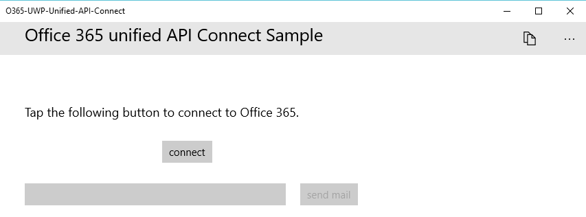

# Get started with Microsoft Graph in a universal Windows 10 app

> **Building apps for enterprise customers?** Your app may not work if your enterprise customer turns on enterprise mobility security features like <a href="https://azure.microsoft.com/en-us/documentation/articles/active-directory-conditional-access-device-policies/" target="_newtab">conditional device access</a>. In this case, you may not know and your customers may experience errors. 

> To support **all enterprise customers** across **all enterprise scenarios**, you must use the Azure AD endpoint and manage your apps using the [Azure portal](https://aka.ms/aadapplist). For more information, see [Deciding between the Azure AD and Azure AD v2.0 endpoints](../concepts/auth_overview.md#deciding-between-the-azure-ad-and-azure-ad-v20-endpoints).

This article describes the tasks required to get an access token from the [Azure AD v2.0 endpoint](https://developer.microsoft.com/en-us/graph/docs/concepts/converged_auth) and call Microsoft Graph. It walks you through the code inside the [Microsoft Graph Connect Sample for UWP (Library)](https://github.com/microsoftgraph/uwp-csharp-connect-sample) samples to explain the main concepts that you have to implement in an app that uses Microsoft Graph.

**Don't feel like building an app?** Use the [Microsoft Graph quick start](https://developer.microsoft.com/graph/quick-start) to get up and running fast, or download the [Microsoft Graph Connect Sample for UWP (Library)](https://github.com/microsoftgraph/uwp-csharp-connect-sample) that this article is based on. Also note that we have a [REST version of this sample](https://github.com/microsoftgraph/uwp-csharp-connect-rest-sample).

## Sample user interface

The sample contains a very simple user interface, consisting of a top command bar, a **connect button**, a **send mail** button, and a text box that is automatically populated with the signed-in user's e-mail address but that can be edited.

The **send mail** button is disabled when the user has not connected:



The top command bar contains a disconnect button when the user has connected:


All of the sample's UI strings are stored in the Resources.resw file inside the Assets folder.

## Prerequisites

To get started, you'll need: 

- A [Microsoft account](https://www.outlook.com/) or a [work or school account](https://docs.microsoft.com/en-us/office/developer-program/office-365-developer-program-faq#account-types)
- Visual Studio 2017 
- The [Microsoft Graph Starter Project for UWP (Library)](https://github.com/microsoftgraph/uwp-csharp-connect-sample/tree/master/starter). Both templates contain empty classes that you'll add code to. They also contains resource strings. To get this project, clone or download the [Microsoft Graph Connect Sample for UWP (Library)](https://github.com/microsoftgraph/uwp-csharp-connect-sample) and then open the solution inside the **starter** folder.


## Register the app
 
1. Sign into the [App Registration Portal](https://apps.dev.microsoft.com/) using either your personal or work or school account.
2. Select **Add an app**.
3. Enter a name for the app, and select **Create application**.
	
	The registration page displays, listing the properties of your app.
 
4. Under **Platforms**, select **Add platform**.
5. Select **Native Application**.
6. Copy both the Client Id (App Id) and Redirect URI values to the clipboard. You'll need to enter these values into the sample app.

	The app id is a unique identifier for your app. The redirect URI is a unique URI provided by Windows 10 for each application to ensure that messages sent to that URI are only sent to that application. 

7. Select **Save**.

## Configure the project

1. Open the solution file for the starter project in Visual Studio.
2. Open the project's **App.xaml** file and locate the `Application.Resources` node. Replace the application ID and redirect URI placeholders with the corresponding values of the app you registered.


```xml
    <Application.Resources>
        <!-- Add your Client Id here. -->
        <x:String x:Key="ida:ClientID">ENTER_YOUR_CLIENT_ID</x:String>
		<!-- Add your Redirect URI here. -->
        <x:String x:Key="ida:ReturnUrl">ENTER_YOUR_REDIRECT_URI</x:String>
    </Application.Resources>
```

## Send an email with Microsoft Graph

Open the MailHelper.cs file in your starter project. This file contains the code that constructs and sends an email. It consists of a single method -- ``ComposeAndSendMailAsync`` -- that constructs and sends a POST request to the **https://graph.microsoft.com/v1.0/me/microsoft.graph.SendMail** endpoint. 

The ``ComposeAndSendMailAsync`` method takes three string values -- ``subject``, ``bodyContent``, and ``recipients`` -- that are passed to it by the MainPage.xaml.cs file. The ``subject`` and ``bodyContent`` strings are stored, along with all other UI strings, in the Resources.resw file. The ``recipients`` string comes from the address box in the app's interface. 

The first task inside the ``ComposeAndSendMailAsync`` method is to get the current user's photo from Microsoft Graph. This line calls the `GetCurrentUserPhotoStreamAsync` method:

```
            // Get current user photo
            Stream photoStream = await GetCurrentUserPhotoStreamAsync();
```

This is what the complete `GetCurrentUserPhotoStreamAsync` method looks like:

```
        // Gets the stream content of the signed-in user's photo. 
        // This snippet doesn't work with consumer accounts.
        public async Task<Stream> GetCurrentUserPhotoStreamAsync()
        {
            Stream currentUserPhotoStream = null;

            try
            {
                var graphClient = AuthenticationHelper.GetAuthenticatedClient();
                currentUserPhotoStream = await graphClient.Me.Photo.Content.Request().GetAsync();

            }

            // If the user account is MSA (not work or school), the service will throw an exception.
            catch (ServiceException)
            {
                return null;
            }

            return currentUserPhotoStream;

        }
```

If the user doesn't have a photo, this logic gets another image file that has been included with the project:

```
            // If the user doesn't have a photo, or if the user account is MSA, we use a default photo

            if (photoStream == null)
            {
                StorageFile file = await Windows.ApplicationModel.Package.Current.InstalledLocation.GetFileAsync("test.jpg");
                photoStream = (await file.OpenReadAsync()).AsStreamForRead();
            }
```

Now that we have an image stream, we can upload the file to OneDrive by calling the `UploadFileToOneDriveAsync` method:

```
            MemoryStream photoStreamMS = new MemoryStream();
            // Copy stream to MemoryStream object so that it can be converted to byte array.
            photoStream.CopyTo(photoStreamMS);

            DriveItem photoFile = await UploadFileToOneDriveAsync(photoStreamMS.ToArray());
```

This is what the complete `UploadFileToOneDriveAsync` method looks like:

```
        // Uploads the specified file to the user's root OneDrive directory.
        public async Task<DriveItem> UploadFileToOneDriveAsync(byte[] file)
        {
            DriveItem uploadedFile = null;

            try
            {
                var graphClient = AuthenticationHelper.GetAuthenticatedClient();
                MemoryStream fileStream = new MemoryStream(file);
                uploadedFile = await graphClient.Me.Drive.Root.ItemWithPath("me.png").Content.Request().PutAsync<DriveItem>(fileStream);

            }


            catch (ServiceException)
            {
                return null;
            }

            return uploadedFile;
        }
```

We can also use this stream to create a `MessageAttachmentsCollectionPage` object that we can pass along with the message:

```
            MessageAttachmentsCollectionPage attachments = new MessageAttachmentsCollectionPage();
            attachments.Add(new FileAttachment
            {
                ODataType = "#microsoft.graph.fileAttachment",
                ContentBytes = photoStreamMS.ToArray(),
                ContentType = "image/png",
                Name = "me.png"
            });
```

We can get a sharing link for the newly uploaded OneDrive file by calling the `GetSharingLinkAsync` method. The `bodyContent` string contains a placeholder for the sharing link:

```
            // Get the sharing link and insert it into the message body.
            Permission sharingLink = await GetSharingLinkAsync(photoFile.Id);
            string bodyContentWithSharingLink = String.Format(bodyContent, sharingLink.Link.WebUrl);
```

This is what the complete `GetSharingLinkAsync` method looks like:

```
        public static async Task<Permission> GetSharingLinkAsync(string Id)
        {
            Permission permission = null;

            try
            {
                var graphClient = AuthenticationHelper.GetAuthenticatedClient();
                permission = await graphClient.Me.Drive.Items[Id].CreateLink("view").Request().PostAsync();
            }

            catch (ServiceException)
            {
                return null;
            }

            return permission;
        }
```

Since the user can potentially pass more than one address, the next task is to split the ``recipients`` string into a set of `EmailAddress` objects that can then be used to construct the list of `Recipients` objects that will be passed in the POST body of the request:

```
            // Prepare the recipient list
            string[] splitter = { ";" };
            var splitRecipientsString = recipients.Split(splitter, StringSplitOptions.RemoveEmptyEntries);
            List<Recipient> recipientList = new List<Recipient>();

            foreach (string recipient in splitRecipientsString)
            {
                recipientList.Add(new Recipient { EmailAddress = new EmailAddress { Address = recipient.Trim() } });
            }
```

The last task is to construct a `Message` object and send it to the **me/microsoft.graph.SendMail** endpoint through the `GraphServiceClient`. Since the ``bodyContent`` string is an HTML document, the request sets the **ContentType** value to HTML.

```
            try
            {
                var graphClient = AuthenticationHelper.GetAuthenticatedClient();

                var email = new Message
                {
                    Body = new ItemBody
                    {
                        Content = bodyContentWithSharingLink,
                        ContentType = BodyType.Html,
                    },
                    Subject = subject,
                    ToRecipients = recipientList,
					Attachments = attachments
                };

                try
                {
                    await graphClient.Me.SendMail(email, true).Request().PostAsync();
                }
                catch (ServiceException exception)
                {
                    throw new Exception("We could not send the message: " + exception.Error == null ? "No error message returned." : exception.Error.Message);
                }


            }

            catch (Exception e)
            {
                throw new Exception("We could not send the message: " + e.Message);
            }
```

The complete class will look like this:

```
    public class MailHelper
    {
        /// <summary>
        /// Compose and send a new email.
        /// </summary>
        /// <param name="subject">The subject line of the email.</param>
        /// <param name="bodyContent">The body of the email.</param>
        /// <param name="recipients">A semicolon-separated list of email addresses.</param>
        /// <returns></returns>
        public async Task ComposeAndSendMailAsync(string subject,
                                                            string bodyContent,
                                                            string recipients)
        {

            // Get current user photo
            Stream photoStream = await GetCurrentUserPhotoStreamAsync();


            // If the user doesn't have a photo, or if the user account is MSA, we use a default photo

            if (photoStream == null)
            {
                StorageFile file = await Windows.ApplicationModel.Package.Current.InstalledLocation.GetFileAsync("test.jpg");
                photoStream = (await file.OpenReadAsync()).AsStreamForRead();
            }

            MemoryStream photoStreamMS = new MemoryStream();
            // Copy stream to MemoryStream object so that it can be converted to byte array.
            photoStream.CopyTo(photoStreamMS);

            DriveItem photoFile = await UploadFileToOneDriveAsync(photoStreamMS.ToArray());

            MessageAttachmentsCollectionPage attachments = new MessageAttachmentsCollectionPage();
            attachments.Add(new FileAttachment
            {
                ODataType = "#microsoft.graph.fileAttachment",
                ContentBytes = photoStreamMS.ToArray(),
                ContentType = "image/png",
                Name = "me.png"
            });

            // Get the sharing link and insert it into the message body.
            Permission sharingLink = await GetSharingLinkAsync(photoFile.Id);
            string bodyContentWithSharingLink = String.Format(bodyContent, sharingLink.Link.WebUrl);

            // Prepare the recipient list
            string[] splitter = { ";" };
            var splitRecipientsString = recipients.Split(splitter, StringSplitOptions.RemoveEmptyEntries);
            List<Recipient> recipientList = new List<Recipient>();

            foreach (string recipient in splitRecipientsString)
            {
                recipientList.Add(new Recipient { EmailAddress = new EmailAddress { Address = recipient.Trim() } });
            }

            try
            {
                var graphClient = AuthenticationHelper.GetAuthenticatedClient();

                var email = new Message
                {
                    Body = new ItemBody
                    {
                        Content = bodyContentWithSharingLink,
                        ContentType = BodyType.Html,
                    },
                    Subject = subject,
                    ToRecipients = recipientList,
                    Attachments = attachments
                };

                try
                {
                    await graphClient.Me.SendMail(email, true).Request().PostAsync();
                }
                catch (ServiceException exception)
                {
                    throw new Exception("We could not send the message: " + exception.Error == null ? "No error message returned." : exception.Error.Message);
                }


            }

            catch (Exception e)
            {
                throw new Exception("We could not send the message: " + e.Message);
            }
        }


        // Gets the stream content of the signed-in user's photo. 
        // This snippet doesn't work with consumer accounts.
        public async Task<Stream> GetCurrentUserPhotoStreamAsync()
        {
            Stream currentUserPhotoStream = null;

            try
            {
                var graphClient = AuthenticationHelper.GetAuthenticatedClient();
                currentUserPhotoStream = await graphClient.Me.Photo.Content.Request().GetAsync();

            }

            // If the user account is MSA (not work or school), the service will throw an exception.
            catch (ServiceException)
            {
                return null;
            }

            return currentUserPhotoStream;

        }

        // Uploads the specified file to the user's root OneDrive directory.
        public async Task<DriveItem> UploadFileToOneDriveAsync(byte[] file)
        {
            DriveItem uploadedFile = null;

            try
            {
                var graphClient = AuthenticationHelper.GetAuthenticatedClient();
                MemoryStream fileStream = new MemoryStream(file);
                uploadedFile = await graphClient.Me.Drive.Root.ItemWithPath("me.png").Content.Request().PutAsync<DriveItem>(fileStream);

            }


            catch (ServiceException)
            {
                return null;
            }

            return uploadedFile;
        }

        public static async Task<Permission> GetSharingLinkAsync(string Id)
        {
            Permission permission = null;

            try
            {
                var graphClient = AuthenticationHelper.GetAuthenticatedClient();
                permission = await graphClient.Me.Drive.Items[Id].CreateLink("view").Request().PostAsync();
            }

            catch (ServiceException)
            {
                return null;
            }

            return permission;
        }

    }
``` 

 
You've now performed the steps required for interacting with Microsoft Graph: app registration, user authentication, and making the requests. 

## Run the app
1. Press F5 to build and run the app. 

2. Sign in with your personal or work or school account and grant the requested permissions.

3. Choose the **Send email** button. When the mail is sent, a Success message is displayed below the button. the mail message includes the photo as an attachment and also provides a sharing link to the uploaded file in OneDrive.

## Next steps
- Try out the REST API using the [Graph explorer](https://developer.microsoft.com/en-us/graph/graph-explorer).
- Find examples of common operations for both REST and SDK operations in the [Microsoft Graph UWP Snippets Sample (SDK)](https://github.com/microsoftgraph/uwp-csharp-snippets-sample) and the [Microsoft Graph UWP Snippets Sample (REST)](https://github.com/microsoftgraph/uwp-csharp-snippets-rest-sample), or explore our other [UWP samples](https://github.com/microsoftgraph?utf8=%E2%9C%93&query=uwp) on GitHub.

## See also
- [Microsoft Graph .NET Client Library](https://github.com/microsoftgraph/msgraph-sdk-dotnet)
- [Azure AD v2.0 protocols](https://azure.microsoft.com/en-us/documentation/articles/active-directory-v2-protocols/)
- [Azure AD v2.0 tokens](https://azure.microsoft.com/en-us/documentation/articles/active-directory-v2-tokens/)

