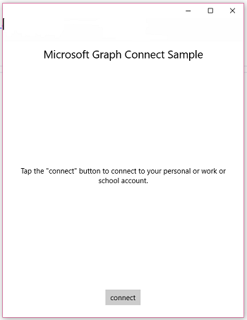
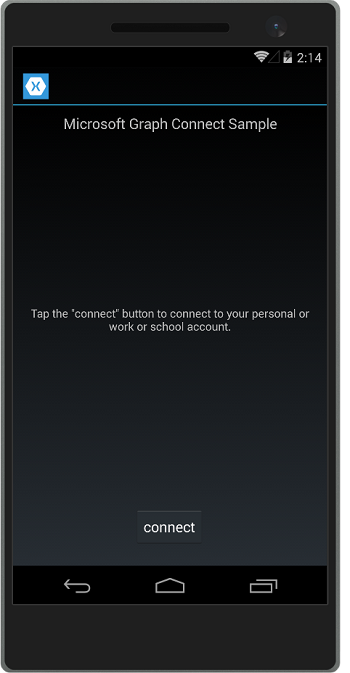
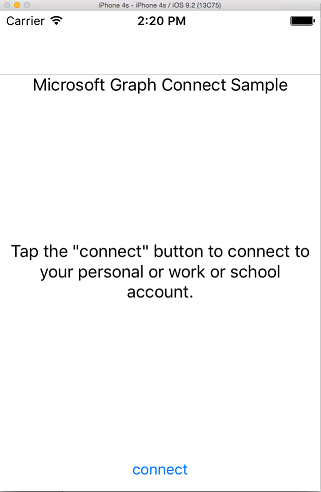
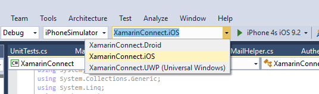

# Get started with Microsoft Graph in a Xamarin Forms app

> **Building apps for enterprise customers?** Your app may not work if your enterprise customer turns on enterprise mobility security features like <a href="https://azure.microsoft.com/documentation/articles/active-directory-conditional-access-device-policies/" target="_newtab">conditional device access</a>. In this case, you may not know and your customers may experience errors. 

This article describes the tasks required to get an access token from the [Azure AD v2.0 endpoint](https://developer.microsoft.com/graph/docs/concepts/converged_auth) and call Microsoft Graph. It walks you through the code inside the [Microsoft Graph Connect Sample for Xamarin Forms](https://github.com/microsoftgraph/xamarin-csharp-connect-sample) sample to explain the main concepts that you have to implement in an app that uses Microsoft Graph. The article also describes how to access Microsoft Graph by using the [Microsoft Graph Client Library](http://www.nuget.org/packages/Microsoft.Graph/).

This is the app you'll create.

| UWP | Android | iOS |
| --- | ------- | ----|
|  |  |  |

**Don't feel like building an app?** Use the [Microsoft Graph quick start](https://developer.microsoft.com/graph/quick-start) to get up and running fast, or download the [Microsoft Graph Connect Sample for Xamarin Forms](https://github.com/microsoftgraph/xamarin-csharp-connect-sample) that this article is based on.

## Prerequisites

To get started, you'll need: 

- A [Microsoft account](https://www.outlook.com/) or a [work or school account](https://docs.microsoft.com/en-us/office/developer-program/office-365-developer-program-faq#account-types)
- Visual Studio 2015 
- [Xamarin for Visual Studio](https://www.xamarin.com/visual-studio)
- Windows 10 ([development mode enabled](https://msdn.microsoft.com/library/windows/apps/xaml/dn706236.aspx))
- The [Microsoft Graph Connect Starter Project for Xamarin Forms](https://github.com/microsoftgraph/xamarin-csharp-connect-sample/tree/master/starter). This template contains several classes that you'll add code to. It also contains complete views and resource strings. To get this project, clone or download the [Microsoft Graph Connect Sample for Xamarin Forms](https://github.com/microsoftgraph/xamarin-csharp-connect-sample) and open the **XamarinConnect** solution inside the **starter** folder. 

If you want to run the iOS project in this sample, you'll need the following:

- The latest iOS SDK
- The latest version of Xcode
- Mac OS X Sierra(10.12) & above 
- [Xamarin.iOS](https://docs.microsoft.com/visualstudio/mac/installation)
- A [Xamarin Mac agent connected to Visual Studio](https://developer.xamarin.com/guides/ios/getting_started/installation/windows/connecting-to-mac/)


## Register the app
 
1. Sign into the [App Registration Portal](https://apps.dev.microsoft.com/) using either your personal or work or school account.
2. Select **Add an app**.
3. Enter a name for the app, and select **Create**.
	
	The registration page displays, listing the properties of your app.
 
4. Under **Platforms**, select **Add platform**.
5. Select **Native Application**.
6. Copy the Application Id value and the Custom Redirect URI value (under the **Native Application** header) that was created for you when you added the **Native Application** platform. This URI should contain your Application Id value and be in this form: `msal[Application Id]://auth` You'll need to enter these values into the sample app.

	The app id is a unique identifier for your app. 

7. Select **Save**.

## Configure the project

1. Open the solution file for the starter project in Visual Studio.
2. Open the **App.cs** file inside the **XamarinConnect (Portable)** project and locate the `ClientId` field. Replace the application ID placeholder with the application id of the app you registered.

	```
	public static string ClientID = "ENTER_YOUR_CLIENT_ID";
	public static string RedirectUri = "msal" + ClientID + "://auth";
	public static string[] Scopes = { "User.Read", "Mail.Send", "Files.ReadWrite" };
	```
	The `Scopes` value stores the Microsoft Graph permission scopes that the app will need to request when the user authenticates. Note that the `App` class constructor uses the ClientID value to instantiate an instance of the MSAL `PublicClientApplication` class. You'll use this class later to authenticate the user.
	
	```
	IdentityClientApp = new PublicClientApplication(ClientID);
	```

3. Open the UserDetailsClient.iOS\info.plist file in a text editor. Unfortunately you can't edit this file in Visual Studio. Locate the `<string>msalENTER_YOUR_CLIENT_ID</string>` element under `CFBundleURLSchemes` key.

4. Replace `ENTER_YOUR_CLIENT_ID` with the application id value that you got when you registered your app. Be sure to retain `msal` before the application id. The resulting string value should look like this: `<string>msal[application id]</string>`.

5. Open the UserDetailsClient.Droid\Properties\AndroidManifest.xml file. Locate this element: `<data android:scheme="msalENTER_YOUR_CLIENT_ID" android:host="auth" />`.

6. Replace `ENTER_YOUR_CLIENT_ID` with the application id value that you got when you registered your app. Be sure to retain `msal` before the application id. The resulting string value should look like this: `<data android:scheme="msal[application id]" android:host="auth" />`.

## Send an email with Microsoft Graph

Open the MailHelper.cs file in your starter project. This file contains the code that constructs and sends an email. It consists of a single method -- ``ComposeAndSendMailAsync`` -- that constructs and sends a POST request to the **https://graph.microsoft.com/v1.0/me/microsoft.graph.SendMail** endpoint. 

The ``ComposeAndSendMailAsync`` method takes three string values -- ``subject``, ``bodyContent``, and ``recipients`` -- that are passed to it by the MainPage.xaml.cs file. The ``subject`` and ``bodyContent`` strings are stored, along with all other UI strings, in the AppResources.resx file. The ``recipients`` string comes from the address box in the app's interface. 

**Using declarations**

Make sure you have these declarations at the top of the file:

```
using System;
using System.Collections.Generic;
using System.Linq;
using System.Reflection;
using System.Threading.Tasks;
using Microsoft.Graph;
```

The first task inside the ``ComposeAndSendMailAsync`` method is to get the current user's photo from Microsoft Graph. This line calls the stubbed-out `GetCurrentUserPhotoStreamAsync` method:

```
            // Get current user photo
            Stream photoStream = await GetCurrentUserPhotoStreamAsync();
```

This is what the complete `GetCurrentUserPhotoStreamAsync` method looks like:

```
        // Gets the stream content of the signed-in user's photo. 
        // This snippet doesn't work with consumer accounts.
        public async Task<Stream> GetCurrentUserPhotoStreamAsync()
        {
            Stream currentUserPhotoStream = null;

            try
            {
                var graphClient = AuthenticationHelper.GetAuthenticatedClient();
                currentUserPhotoStream = await graphClient.Me.Photo.Content.Request().GetAsync();

            }

            // If the user account is MSA (not work or school), the service will throw an exception.
            catch (ServiceException)
            {
                return null;
            }

            return currentUserPhotoStream;

        }
```

If the user doesn't have a photo, this logic gets another image file that has been included with the project:

```
            // If the user doesn't have a photo, or if the user account is MSA, we use a default photo

            if (photoStream == null)
            {
                var assembly = typeof(MailHelper).GetTypeInfo().Assembly;
                photoStream = assembly.GetManifestResourceStream("XamarinConnect.test.jpg");
            }
```

Now that we have an image stream, we can upload the file to OneDrive by calling the stubbed-out `UploadFileToOneDriveAsync` method:

```
            MemoryStream photoStreamMS = new MemoryStream();
            // Copy stream to MemoryStream object so that it can be converted to byte array.
            photoStream.CopyTo(photoStreamMS);

            DriveItem photoFile = await UploadFileToOneDriveAsync(photoStreamMS.ToArray());
```

This is what the complete `UploadFileToOneDriveAsync` method looks like:

```
        // Uploads the specified file to the user's root OneDrive directory.
        public async Task<DriveItem> UploadFileToOneDriveAsync(byte[] file)
        {
            DriveItem uploadedFile = null;

            try
            {
                var graphClient = AuthenticationHelper.GetAuthenticatedClient();
                MemoryStream fileStream = new MemoryStream(file);
                uploadedFile = await graphClient.Me.Drive.Root.ItemWithPath("me.png").Content.Request().PutAsync<DriveItem>(fileStream);

            }


            catch (ServiceException)
            {
                return null;
            }

            return uploadedFile;
        }
```

We can also use this stream to create a `MessageAttachmentsCollectionPage` object that we can pass along with the message:

```
            MessageAttachmentsCollectionPage attachments = new MessageAttachmentsCollectionPage();
            attachments.Add(new FileAttachment
            {
                ODataType = "#microsoft.graph.fileAttachment",
                ContentBytes = photoStreamMS.ToArray(),
                ContentType = "image/png",
                Name = "me.png"
            });
```

We can get a sharing link for the newly uploaded OneDrive file by calling the stubbed-out `GetSharingLinkAsync` method. The `bodyContent` string contains a placeholder for the sharing link:

```
            // Get the sharing link and insert it into the message body.
            Permission sharingLink = await GetSharingLinkAsync(photoFile.Id);
            string bodyContentWithSharingLink = String.Format(bodyContent, sharingLink.Link.WebUrl);
```

This is what the complete `GetSharingLinkAsync` method looks like:

```
        public static async Task<Permission> GetSharingLinkAsync(string Id)
        {
            Permission permission = null;

            try
            {
                var graphClient = AuthenticationHelper.GetAuthenticatedClient();
                permission = await graphClient.Me.Drive.Items[Id].CreateLink("view").Request().PostAsync();
            }

            catch (ServiceException)
            {
                return null;
            }

            return permission;
        }
```

Since the user can potentially pass more than one address, the next task is to split the ``recipients`` string into a set of `EmailAddress` objects that can then be used to construct the list of `Recipients` objects that will be passed in the POST body of the request:

```
            // Prepare the recipient list
            string[] splitter = { ";" };
            var splitRecipientsString = recipients.Split(splitter, StringSplitOptions.RemoveEmptyEntries);
            List<Recipient> recipientList = new List<Recipient>();

            foreach (string recipient in splitRecipientsString)
            {
                recipientList.Add(new Recipient { EmailAddress = new EmailAddress { Address = recipient.Trim() } });
            }
```

The last task is to construct a `Message` object and send it to the **me/microsoft.graph.SendMail** endpoint through the `GraphServiceClient`. Since the ``bodyContent`` string is an HTML document, the request sets the **ContentType** value to HTML.

```
            try
            {
                var graphClient = AuthenticationHelper.GetAuthenticatedClient();

                var email = new Message
                {
                    Body = new ItemBody
                    {
                        Content = bodyContentWithSharingLink,
                        ContentType = BodyType.Html,
                    },
                    Subject = subject,
                    ToRecipients = recipientList,
					Attachments = attachments
                };

                try
                {
                    await graphClient.Me.SendMail(email, true).Request().PostAsync();
                }
                catch (ServiceException exception)
                {
                    throw new Exception("We could not send the message: " + exception.Error == null ? "No error message returned." : exception.Error.Message);
                }


            }

            catch (Exception e)
            {
                throw new Exception("We could not send the message: " + e.Message);
            }
```

The complete class will look like this:

```
    public class MailHelper
    {
        /// <summary>
        /// Compose and send a new email.
        /// </summary>
        /// <param name="subject">The subject line of the email.</param>
        /// <param name="bodyContent">The body of the email.</param>
        /// <param name="recipients">A semicolon-separated list of email addresses.</param>
        /// <returns></returns>
        public async Task ComposeAndSendMailAsync(string subject,
                                                            string bodyContent,
                                                            string recipients)
        {

            // Get current user photo
            Stream photoStream = await GetCurrentUserPhotoStreamAsync();


            // If the user doesn't have a photo, or if the user account is MSA, we use a default photo

            if (photoStream == null)
            {
                var assembly = typeof(MailHelper).GetTypeInfo().Assembly;
                photoStream = assembly.GetManifestResourceStream("XamarinConnect.test.jpg");
            }

            MemoryStream photoStreamMS = new MemoryStream();
            // Copy stream to MemoryStream object so that it can be converted to byte array.
            photoStream.CopyTo(photoStreamMS);

            DriveItem photoFile = await UploadFileToOneDriveAsync(photoStreamMS.ToArray());

            MessageAttachmentsCollectionPage attachments = new MessageAttachmentsCollectionPage();
            attachments.Add(new FileAttachment
            {
                ODataType = "#microsoft.graph.fileAttachment",
                ContentBytes = photoStreamMS.ToArray(),
                ContentType = "image/png",
                Name = "me.png"
            });

            // Get the sharing link and insert it into the message body.
            Permission sharingLink = await GetSharingLinkAsync(photoFile.Id);
            string bodyContentWithSharingLink = String.Format(bodyContent, sharingLink.Link.WebUrl);


            // Prepare the recipient list
            string[] splitter = { ";" };
            var splitRecipientsString = recipients.Split(splitter, StringSplitOptions.RemoveEmptyEntries);
            List<Recipient> recipientList = new List<Recipient>();

            foreach (string recipient in splitRecipientsString)
            {
                recipientList.Add(new Recipient { EmailAddress = new EmailAddress { Address = recipient.Trim() } });
            }

            try
            {
                var graphClient = AuthenticationHelper.GetAuthenticatedClient();

                var email = new Message
                {
                    Body = new ItemBody
                    {
                        Content = bodyContentWithSharingLink,
                        ContentType = BodyType.Html,
                    },
                    Subject = subject,
                    ToRecipients = recipientList,
                    Attachments = attachments
                };

                try
                {
                    await graphClient.Me.SendMail(email, true).Request().PostAsync();
                }
                catch (ServiceException exception)
                {
                    throw new Exception("We could not send the message: " + exception.Error == null ? "No error message returned." : exception.Error.Message);
                }


            }

            catch (Exception e)
            {
                throw new Exception("We could not send the message: " + e.Message);
            }
        }

        // Gets the stream content of the signed-in user's photo. 
        // This snippet doesn't work with consumer accounts.
        public async Task<Stream> GetCurrentUserPhotoStreamAsync()
        {
            Stream currentUserPhotoStream = null;

            try
            {
                var graphClient = AuthenticationHelper.GetAuthenticatedClient();
                currentUserPhotoStream = await graphClient.Me.Photo.Content.Request().GetAsync();

            }

            // If the user account is MSA (not work or school), the service will throw an exception.
            catch (ServiceException)
            {
                return null;
            }

            return currentUserPhotoStream;

        }

        // Uploads the specified file to the user's root OneDrive directory.
        public async Task<DriveItem> UploadFileToOneDriveAsync(byte[] file)
        {
            DriveItem uploadedFile = null;

            try
            {
                var graphClient = AuthenticationHelper.GetAuthenticatedClient();
                MemoryStream fileStream = new MemoryStream(file);
                uploadedFile = await graphClient.Me.Drive.Root.ItemWithPath("me.png").Content.Request().PutAsync<DriveItem>(fileStream);

            }


            catch (ServiceException)
            {
                return null;
            }

            return uploadedFile;
        }

        public static async Task<Permission> GetSharingLinkAsync(string Id)
        {
            Permission permission = null;

            try
            {
                var graphClient = AuthenticationHelper.GetAuthenticatedClient();
                permission = await graphClient.Me.Drive.Items[Id].CreateLink("view").Request().PostAsync();
            }

            catch (ServiceException)
            {
                return null;
            }

            return permission;
        }


    }
``` 

You've now performed the three steps required for interacting with Microsoft Graph: app registration, user authentication, and making a request. 

## Run the app
1. Select the project that you want to run. If you select the Universal Windows Platform option, you can run the sample on the local machine. If you want to run the iOS project, you'll need to connect to a [Mac that has the Xamarin tools](https://developer.xamarin.com/guides/ios/getting_started/installation/windows/connecting-to-mac/) installed on it. (You can also open this solution in Xamarin Studio on a Mac and run the sample directly from there.) You can use the [Visual Studio Emulator for Android](https://www.visualstudio.com/features/msft-android-emulator-vs.aspx) if you want to run the Android project. 

    

2. Press F5 to build and debug. Run the solution and sign in with either your personal or work or school account.
    > **Note** You might have to open the Build Configuration Manager to make sure that the Build and Deploy steps are selected for the UWP project. 

3. Sign in with your personal or work or school account and grant the requested permissions.

4. Choose the **Send mail** button. When the mail is sent, a Success message is displayed. This mail message includes the photo as an attachment and also provides a sharing link to the uploaded file in OneDrive.

## Next steps
- Try out the REST API using the [Graph explorer](https://developer.microsoft.com/graph/graph-explorer).
- Find examples of common operations in the [Microsoft Graph SDK Snippets Library for Xamarin.Forms](https://github.com/microsoftgraph/xamarin-csharp-snippets-sample), or explore our other [Xamarin samples](https://github.com/microsoftgraph?utf8=%E2%9C%93&query=xamarin) on GitHub.

## See also
- [Microsoft Graph .NET Client Library](https://github.com/microsoftgraph/msgraph-sdk-dotnet)
- [Azure AD v2.0 protocols](https://azure.microsoft.com/documentation/articles/active-directory-v2-protocols/)
- [Azure AD v2.0 tokens](https://azure.microsoft.com/documentation/articles/active-directory-v2-tokens/)
