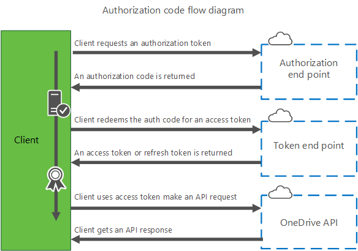

# Authorization and sign-in for OneDrive in Microsoft Graph

To use the OneDrive API via Microsoft Graph, you need to have an access token that authorizes your app with a particular set of permissions for a user.
In this section, you'll learn how to:

1. Register your application to get an application ID.
2. Sign your user in with the specified [scopes](#authentication-scopes) using the token flow or code flow.
3. Sign the user out (optional).

The OneDrive API uses the standard [OAuth 2.0](http://oauth.net/2/) authorization framework to authorize apps and generate access tokens. 
You must provide an access token for every authenticated API call by using an HTTP header:

```
Authorization: bearer {token}
```

**Note:** The recommended authorization framework is using the Azure AD v2.0 endpoint.
However, some enterprise scenarios may require using the original Azure AD endpoint. 
For more information see [App authentication with Microsoft Graph](https://graph.microsoft.io/en-us/docs/authorization/auth_overview).

## Register your app

The first step is to register an app with Microsoft and provide some details about your app.
You can register your application and receive a new app ID from the [Microsoft Application Registration Portal](https://apps.dev.microsoft.com).

For detailed steps on how to register your application, see [registering your app for OneDrive API](app-registration.md).

## Sign users in
Your app must initiate the sign-in process by contacting the Azure Active Directory authorization endpoint with a specified scope.
The flow follows standard OAuth 2.0 authorization flows and requires calls from a web browser or web-browser control.
The result of the authorization flow will return an access token and optionally other tokens which your app can use to access the API.

## Authentication scopes

Scopes determine what type of access the app is granted when the user is signed in.
All scopes support single sign-on on the web, which means that if a user is already signed in to OneDrive, then the user can skip the authentication flow and go straight to the authorization flow.

| Scope name          | Description                                                                                                           |
| ------------------- | --------------------------------------------------------------------------------------------------------------------- |
| offline_access      | Enables your app to work offline even when the user isn't active. Requires the use of code-flow.                      |
| files.read          | Grants read-only permission to all of a user's OneDrive files.                                                        |
| files.read.all      | Grants read-only permission to all of a user's OneDrive files, including files shared with the user.                  |
| files.readwrite     | Grants read and write permission to all of a user's OneDrive files.                                                   |
| files.readwrite.all | Grants read and write permission to all of a user's OneDrive files, including files shared with the user.             |

As an example, a typical application might request the following scopes:

```
files.readwrite offline_access
```

## Supported Authentication flows

While Azure Active Directory supports multiple authorization flows, the most common two are outlined here:

* [Token flow](#token-flow)
* [Code flow](#code-flow)

## Token flow

The most straightforward authorization flow is the token flow.
This flow is useful for quickly obtaining an access token to use the OneDrive API in an interactive fashion. 
This flow does not provide a refresh token, and therefore is not a good fit for longterm access to resources.


To start the sign-in process with the token flow, use a web browser or web-browser control to load a URL request.

```
GET https://login.microsoftonline.com/common/oauth2/v2.0/authorize?client_id={client_id}&scope={scope}
    &response_type=token&redirect_uri={redirect_uri}
```

### Required query string parameters

| Parameter name    | Value    | Description                                                                                            |
| ----------------- | -------- | ------------------------------------------------------------------------------------------------------ |
| *client_id*       | string   | The client ID value created for your application.                                                      |
| *redirect_uri*    | string   | The redirect URL that the browser is sent to when authentication is complete.                          |
| *response_type*   | string   | The type of response expected from the authorization flow. For this flow, the value must be **token**. |
| *scope*           | string   | A space-separated list of scopes your application requires.                                            |


### Response

Upon successful authentication and authorization of your application, the web browser is redirected to the redirect URL provided with additional parameters added to the URL.

```
https://myapp.com/auth-redirect#access_token=EwC...EB
  &authentication_token=eyJ...3EM&token_type=bearer&expires_in=3600
  &scope=onedrive.readwrite&user_id=3626...1d
```

Values for `access_token`, `authentication_token`, and `user_id` are truncated
in the previous example. The values for `access_token` and `authentication_token`
are quite long.

You can use the value of `access_token` to make requests to the Microsoft Graph.

## Code flow

The code flow for authentication is a three-step process with separate calls to authenticate and authorize the application and to generate an access token to use the OneDrive API.
This also allows your application to receive a refresh token that will enable long-term use of the API in some scenarios, to allow access when the user isn't actively using your application.





### Step 1. Get an authorization code
To start the sign-in process with the code flow, use a web browser or web-browser control to load this URL request.

```
GET https://login.microsoftonline.com/common/oauth2/v2.0/authorize?client_id={client_id}&scope={scope}
  &response_type=code&redirect_uri={redirect_uri}
```

#### Required query string parameters
| Parameter name   | Value    | Description                                                                                           |
| ---------------- | -------- | ----------------------------------------------------------------------------------------------------- |
| *client_id*      | string   | The client ID created for your app.                                                                   |
| *scope*          | string   | A space-separated list of scopes that your app requires.                                              |
| *redirect_uri*   | string   | The redirect URL that the browser is sent to when authentication is complete.                         |
| *response_type*  | string   | The type of response expected from the authorization flow. For this flow, the value must be **code**. |

#### Response

Upon successful authentication and authorization of your application, the web browser will be redirected to your redirect URL with additional parameters added to the URL.

```
https://myapp.com/auth-redirect?code=df6aa589-1080-b241-b410-c4dff65dbf7c
```

### Step 2. Redeem the code for access tokens
After you have received the `code` value, you can redeem this code for a set of tokens that allow you to authenticate with the OneDrive API.
To redeem the code, make the following request:

```
POST https://login.microsoftonline.com/common/oauth2/v2.0/token
Content-Type: application/x-www-form-urlencoded

client_id={client_id}&redirect_uri={redirect_uri}&client_secret={client_secret}
&code={code}&grant_type=authorization_code
```

#### Required request body parameters
The request body is a properly encoded URL string, with some required parameters.

| Parameter name  | Value  | Description                                                                                                                              |
|:----------------|:-------|:-----------------------------------------------------------------------------------------------------------------------------------------|
| *client_id*     | string | The client ID value created for your application.                                                                                        |
| *redirect_uri*  | string | The redirect URL that the browser is sent to when authentication is complete. This should match the *redirect_uri* in the first request. |
| *client_secret* | string | The client secret created for your application.                                                                                          |
| *code*          | string | The authorization code you received in the first authentication request.                                                                 |

**Note**  For web apps, the domain portion of the redirect URI must match the domain portion of the redirect URI that you specified in the [Microsoft Developer Center][app-portal].

#### Response
If the call is successful, the response for the POST request contains a JSON string that includes several properties, including `access_token`, `token_type`, and `refresh_token` (if you requested the **wl.offline_access** scope).

<!-- {"blockType": "resource", "@odata.type": "oauth2.tokenResponse", "optionalProperties": ["token_type", "scope"] } -->
```json
{
  "token_type":"bearer",
  "expires_in": 3600,
  "scope":"wl.basic onedrive.readwrite",
  "access_token":"EwCo...AA==",
  "refresh_token":"eyJh...9323"
}
```

You can now store and use the `access_token` provided to make authenticated requests to Microsoft Graph.

**Important:** Treat the values of `access_token` and `refresh_token` in this response as securely as you would a user's password.

The access token is valid for only the number of seconds that is specified in the **expires_in** property.
You can request a new access token by using the refresh token (if available), or by repeating the authentication request from the beginning.

### Step 3. Get a new access token or refresh token
If your app has requested the `offline_access` scope this step will return a **refresh_token** that can be used to generate additional access tokens after the initial token has expired.

To redeem the refresh token for a new access token, make the following request:

```http
POST https://login.microsoftonline.com/common/oauth2/v2.0/token
Content-Type: application/x-www-form-urlencoded

client_id={client_id}&redirect_uri={redirect_uri}&client_secret={client_secret}
&refresh_token={refresh_token}&grant_type=refresh_token
```

#### Required request body parameters
The request body is a properly encoded URL string, with some required parameters.

| Parameter name  | Value  | Description                                                                                                                                         |
|:----------------|:-------|:----------------------------------------------------------------------------------------------------------------------------------------------------|
| *client_id*     | string | The client ID created for your application.                                                                                                         |
| *redirect_uri*  | string | The redirect URL that the browser is sent to when authentication is complete. This should match the *redirect_uri* value used in the first request. |
| *client_secret* | string | The client secret created for your application.                                                                                                     |
| *refresh_token* | string | The refresh token you received previously.                                                                                                          |

**Note**  For web apps, the domain portion of the redirect URI must match the domain portion of the redirect URI that you specified in the [Microsoft Developer Center][app-portal].

#### Response
If the call is successful, the response for the POST request contains a JSON string that includes several properties including `access_token`, `authentication_token` and `refresh_token` if you requested the **offline_access** scope.

<!-- {"blockType": "example", "@odata.type": "oauth2.tokenResponse", "name": "oauth-response-example" } -->
```json
{
  "token_type":"bearer",
  "expires_in": 3600,
  "scope": "wl.basic onedrive.readwrite wl.offline_access",
  "access_token":"EwCo...AA==",
  "refresh_token":"eyJh...9323"
}
```

You can now store and use the `access_token` to make authenticated requests to Microsoft Graph.

**Important:** Treat the values of `access_token` and `refresh_token` in this response as securely as you would a user's password.

The access token is valid for only the number of seconds that is specified in the **expires_in** property.
You can request a new access token by using the refresh token (if available) or by repeating the authentication request from the beginning.

## Sign the user out
To sign a user out, perform the following steps:

1. Delete any cached `access_token` or `refresh_token` values you've previously received from the OAuth flow.
2. Perform any sign out actions in your application (for example, cleaning up local state, removing any cached items, etc.).
3. Make a call to the authorization web service using this URL:

```
GET https://login.microsoftonline.com/common/oauth2/v2.0/logout?post_logout_redirect_uri={redirect-uri}
```

This call will remove any cookies that enable single sign-on to occur and ensure that next time your app launches the authorization flow, the user will be required to sign in again.
Using this logout flow does not revoke any content previously granted to an applicaiton.

### Required query string parameters

| Parameter name | Value  | Description                                                                                                                                                 |
|:---------------|:-------|:------------------------------------------------------------------------------------------------------------------------------------------------------------|
| *redirect_uri* | string | The redirect URL that the browser is sent to when authentication is complete. This must match exactly the redirect_uri value used in the get token request. |

After removing the cookie, the browser will be redirected to the redirect URL you provided.
When the browser loads your redirect page, no authentication query string parameters will be set, and you can infer the user has been logged out.


## Revoking Access

Microsoft account users can revoke an app's access to their account by visiting the [Microsoft account manage consent](https://account.live.com/consent/Manage) page.

When consent for an app is revoked, any refresh token previously provided to your application will no longer be valid.
You will need to repeat the authentication flow to request a new access and refresh token from scratch.

[app-portal]: http://go.microsoft.com/fwlink/p/?LinkId=193157

## Related topics

The following topics contain high-level overviews of other concepts that apply to the OneDrive API.

* [Develop with the OneDrive API](index.md)
* [App authentication with Microsoft Graph](https://graph.microsoft.io/en-us/docs/authorization/auth_overview)

<!-- {
  "type": "#page.annotation",
  "description": "Learn how to authenticate your app with Microsoft Account and get access to OneDrive",
  "keywords": "authentication,oauth,microsoft account,msa,onedrive,api",
  "section": "documentation"
} -->
